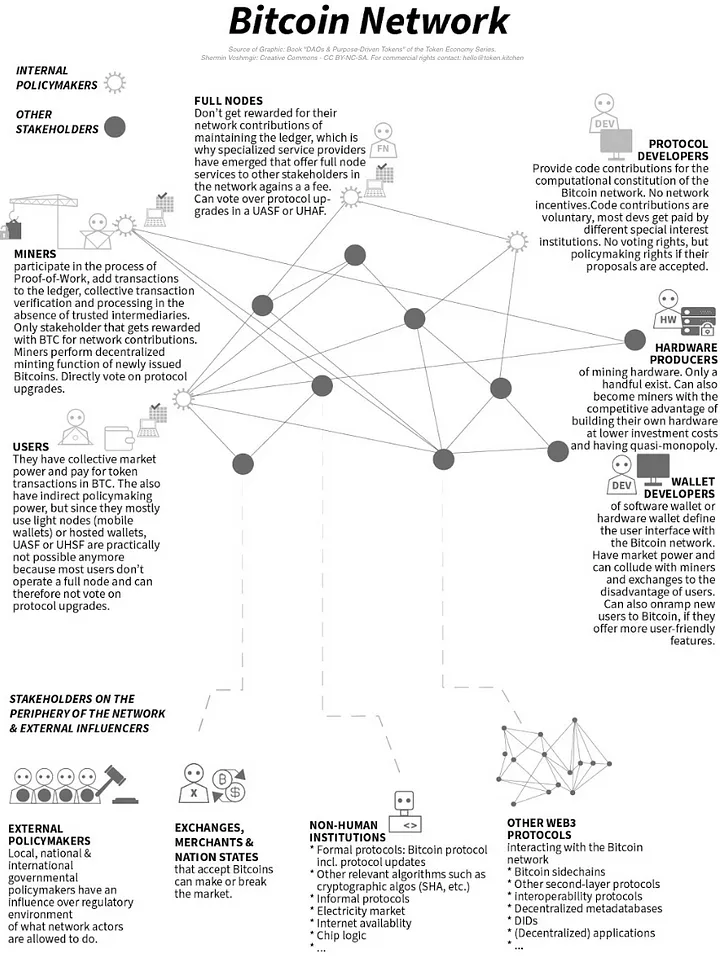
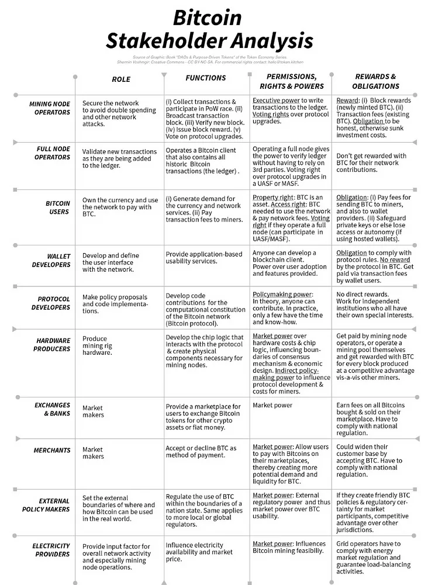
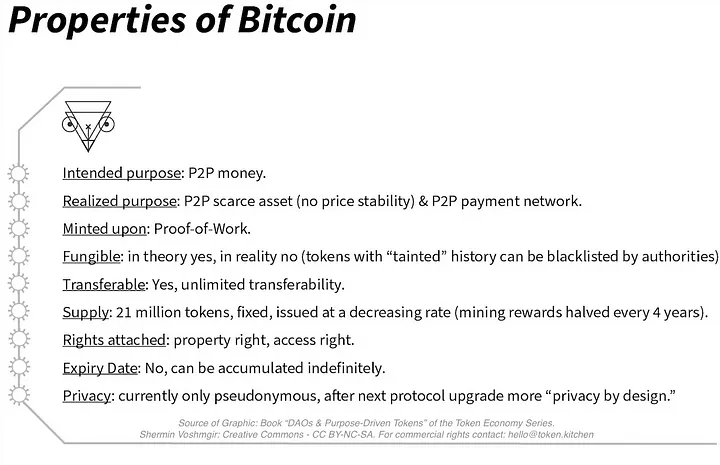
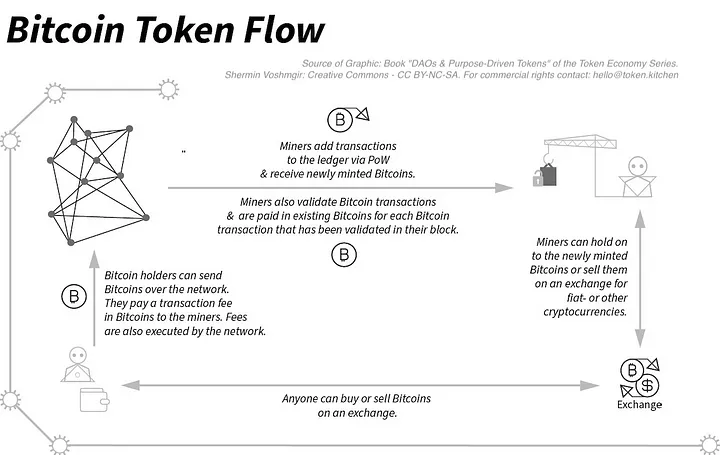

# 比特币网络分析

<!-- more -->

## P2P货币与支付网络

[][1][][2][Shermin Voshmgir][3] 
发布 [Token Kitchen][5] · 阅读 37 · 2024.3.2

TLDR：本文节选自本书[DAOs & Purpose-Driven Tokens][8]，我不仅分析了比特币这种货币，还分析了整个比特币支付网络，包括其利益相关者以及随着时间推移在不同网络利益相关者之间出现的权力结构。分析的重点不在于技术细节，而在于比特币网络的社会和经济动态。为了便于阅读，我缩短了本章的篇幅。

  
  
"比特币网络"摘自<a href="https://www.amazon.com/Token-Economy-DAOs-Purpose-Driven-Tokens/dp/9899157082/ref=tmm_pap_swatch_0?_encoding=UTF8&qid=1707743722&sr=1-1" target="_blank">DAOs & Purpose-Driven Tokens</a>, 代币经济系列，Shermin Voshmgir

分析涵盖以下主题：
- [比特币网络分析](#比特币网络分析)
  - [P2P货币与支付网络](#p2p货币与支付网络)
- [目的与起源](#目的与起源)
- [政治原则](#政治原则)
- [功能设计](#功能设计)
- [利益相关者](#利益相关者)
- [代币类型和代币属性](#代币类型和代币属性)
- [经济机制](#经济机制)
- [治理、协议升级与网络分裂](#治理协议升级与网络分裂)
- [权力结构](#权力结构)
- [网络的目的与现实](#网络的目的与现实)
  - [参考资料](#参考资料)

# 目的与起源

如白皮书所述，比特币的初衷是提供一个[P2P 电子现金系统][10]，在没有传统金融中介的情况下，通过互联网解决双重消费问题，而且结算费用低于现行金融系统。亟待解决的难题是：不受信任的互联网行为者如何能够集体行动？在没有中介的情况下，不受信任的互联网参与者如何就交易的真实性达成一致？

几十年来，许多学者和从业者一直在研究这个问题。自 20 世纪 80 年代以来，各种形式的私人数字货币，特别是加密的 P2P 货币，已经在不同的发展阶段被公开讨论或实验过。然而，在没有可信中间人保证支付最终性的情况下，P2P 网络从未有过实际应用，也无法真正避免重复消费问题。

2008 年 11 月 1 日，中本聪首次现身，在[密码学邮件列表][11]上发表了《比特币白皮书》，宣布并概述了比特币的意图。他提出的解决双重消费问题的方案是：(a) 将 P2P 网络的概念与经济反垃圾邮件机制（"工作证明"）和数字签名相结合，以容错和抗攻击的方式协调支付验证；(b) 用新铸造的比特币奖励网络参与者的网络贡献。

白皮书发布后，立即引发了邮件列表参与者的许多问题，两周后，中本聪向邮件列表中的特定个人分发了一份[初步源代码][12]，其中指明了应用解决方案。据目前所知，这些人开始在幕后为改进第一版代码做出贡献。2009 年 1 月 3 日，中本聪挖出了"[创世区块][13]"。它的第一笔交易（又名[coinbase transaction][14]）中包含了一条特殊信息： "泰晤士报 2009 年 1 月 3 日 英国首相濒临第二次救助银行"。这条信息参考了当天"[泰晤士报][15]"的标题。创世区块的开采标志着比特币网络的正式启动。几天后，[中本聪][16] 在邮件列表中公开发布了 0.1 版源代码，允许其他人开始使用并为网络做出贡献。当时正值全球金融危机的高峰期，加上 "工作证明"（Proof-of-Work）这一开创性的创新，再加上中本聪真实身份的神秘性，这一切可能导致了比特币在当时以及随后几年中引发的炒作和追捧。

中本聪最初推出比特币网络的目的似乎是作为一个测试网络。在 2009 年部署 0.1 版比特币协议时，还不清楚工作证明所依赖的经济稳健性假设是否经得起操纵尝试。人们期望通过更多的研究和开发来完善比特币协议，并最终推出最终的网络。然而，一旦测试网络上线，中本聪的经济假设被证明是稳定的，比特币网络和比特币资产就会引起更多的兴趣，最终也会产生经济效益。随着时间的推移，比特币协议不断得到改进，但从未脱离测试网络阶段。最终，协议的改进成为了如何更新协议的政治意识形态的主题。除此之外，既得经济利益也开始出现，这使得网络升级更加政治化。

在某种程度上，中本聪对比特币的创新设想确实在比特币网络本身中得到了实现，但它也开始随着受比特币代码库启发而开发和部署的每一个新的区块链协议而得到实现。比特币协议的开源性质允许其他创新者复制和调整比特币代码库，并启动他们自己的数字价值公共结算网络，这些网络具有可扩展性、隐私性或多功能性。可以说，比特币引发了另类 P2P 网络研究与开发的复兴，Web3 的概念也由此逐渐产生（更多相关内容请参阅代币经济系列丛书中的另一本书《Web3 基础设施》）。

中本聪的在线存在和贡献于 2010 年突然停止。这位比特币的化名创造者停止为比特币的发展做出贡献的确切原因仍然是个谜。比特币社区接管了项目的发展，形成了一个充满活力的生态系统，对货币、金融和技术世界产生了改变游戏规则的影响。

# 政治原则

由于中本聪的身份不明，我们只能根据邮件列表和类似网络来源的信息线索来推测比特币诞生背后的真正动机。最初讨论这些想法的[密码学邮件列表][17]的目的是研究 "密码系统的技术方面、密码系统的社会反响以及密码学的政治，如出口管制或限制密码学的法律"。通过阅读该列表上的对话，我们可以得出这样的印象：中本聪的动机比人们想象的更偏向于工程学，而不是教条主义。

可以肯定的是，许多最终为比特币协议的改进和发展做出贡献的人都有自己的政治意识形态，这些意识形态往往植根于[cypherpunk 运动][18]（关注互联网隐私和互联网无政府状态）和/或[自由主义运动][19]（其成员经常将奥地利经济学作为一种替代货币政策）。

如今，在更广泛的比特币社区中，政治信仰的光谱各不相同：或多或少是自由主义，或多或少是隐私导向，在解释中本聪的初衷时或多或少是教条主义。一些教条式的信念，如"（链的）不变性"，只是在比特币部署之后才在加密货币叙事中占据主导地位，但白皮书本身从未明确提及。

-   **去中介化、去中心化和抵制审查**： 在构思比特币时，去中心化管理和运营似乎是核心原则。网络的点对点维护被认为是保证不受国家审查的一种手段（详见本书[20]）。
-   **开源、公共和无许可基础设施**： 中本聪将比特币协议创建为开放源代码，以提供对协议演变的分布式控制。网络的维护和使用也被设计成公共和无许可的。我们的想法是，任何有足够技能的人都可以以公开的方式为协议的演进做出贡献（即成为开发者），任何人都可以将网络用作支付系统（即成为用户），或者成为采矿节点操作员并将交易写入分类账，而无需向网络中的其他人请求许可。
-   **可逆交易**：“不可逆转性”一词成为许多早期加密爱好者的教条，但在最初的比特币白皮书中并未使用。中本聪只写了让交易不可逆转，这似乎是一个相当实际的决定，而不是一个教条主义的决定，因为在分布式网络中，逆转意外交易将无法就分类账的历史保持明确的共识。在早期的比特币开发者中，让比特币交易不可逆转是一个极具争议的话题--每个参与决策的人都清楚其中的利弊得失（更多内容请参阅[书][21]）。
-   **隐私**： 隐私被视为一项重要的政治原则。然而，公开发布所有交易的行为--使网络节点能够达成分布式共识--是规避双重支出问题所需的关键设计特征（更多内容请参阅[书][22]）。

# 功能设计

尽管事后看来，比特币区块链架构的概念可能听起来很直观，但这一技术金融系统架构在刚推出时却改变了游戏规则。早期的贡献者和早期的采用者花了一些时间来思考系统的功能设计，并理解为什么有必要以这种方式设计系统。

所有参与节点需要共同完成的主要功能是，在没有中间人检查私人维护的分类账的情况下，以某种方式就真实的金融交易达成共识，同时避免双重消费问题。

问题是 我们怎样才能在功能上分布式地验证发送者是否真正拥有他们想要花费的比特币，以及这些比特币是否在之前或同时被花费过？这就需要在功能设计上做出一定的选择，使分布式共识成为可能：

- **货币不能用数字文件表示：**  
    （书中有更多细节）。
- **识别令牌持有者和数字签名：**
    （更多详情请见本书）。
- **点对点分布式时间戳：** 
    (更多详情，请参阅本书）。

这种功能设计的结果是建立了一个集体维护和集体管理的会计网络，所有用户都可以平等地（几乎）实时访问所有历史比特币交易的相同数据集。

对网络的贡献将以新发行的比特币作为奖励。比特币的发行和分配规则已编入比特币协议。比特币交易是公开可验证的，因此任何人都可以追溯所有历史交易的源头。

  
  
"比特币利益相关者分析"，摘自<a href="https://www.amazon.com/Token-Economy-DAOs-Purpose-Driven-Tokens/dp/9899157082/ref=tmm_pap_swatch_0?_encoding=UTF8&qid=1707743722&sr=1-1" target="_blank">DAOs & Purpose-Driven Tokens</a>, Token Economy Series, Shermin Voshmgir

# 利益相关者

一系列利益相关者通过贡献网络服务、消费网络服务、提供外部服务或从外部影响网络来影响比特币网络。并非所有的利益相关者都是一开始就设想到的。正如我们将看到的，它们是随着比特币应用的经济和政治现实的发展而出现的。

**挖矿节点操作员（又称 "矿工"）**： 挖矿节点参与 "工作证明 "过程，执行实现网络目的的主要功能：在没有可信中介的情况下进行集体交易验证和处理。挖矿节点操作员需要下载客户端软件（或根据协议规范编写自己的客户端代码），并将其安装到计算机（客户端）上。他们还需要下载包含所有比特币历史交易的数据集。下载完成后，这台计算机/节点/客户端就可以通过 "工作证明 "过程与其他挖矿节点进行通信和协调，争夺创建新区块的权利，将交易添加到分类账中，并攫取区块奖励。除了区块奖励，矿工还可以赚取交易费。矿工节点是唯一可以积极投票决定网络规则变更的利益相关者群体。

**在白皮书中，全节点运营商（又称 "全节点"）：** 并未被视为独立的利益相关者。多年来，随着运营挖矿节点成为一项有利可图的业务，并开始需要 CPU 形式的昂贵专用硬件，从而可以在寻找工作证明谜题的伪随机数的竞争中胜出，他们就出现了。越来越多的人开始操作只包含所有比特币历史交易数据集的比特币客户端，但不参与工作证明过程。操作一个只包含完整分类账数据的节点不需要特殊用途的硬件，在任何拥有标准处理硬件的家用电脑上都可以完成。它允许操作员在接收比特币和将比特币添加到分类账时验证交易的完整性，而无需依赖任何第三方服务。验证交易是一项独立于比特币挖矿的功能，但它并没有独立的网络代币激励，因为在设计比特币协议时并没有考虑到这种功能上的独立性。最终，全节点运营商的数量减少了，只有那些经常发送和接收比特币付款的个人和机构才开始运营自己的全节点，以获得独立性、安全性和更快的交易验证。在编写本书时，运行全节点已成为一种软件服务，通常外包给专门的服务提供商。管理自己完整节点的人和机构越来越少。这重新带来了委托代理问题，而这正是比特币创造者最初想要消除的问题。

**矿池：** 是另一个利益相关者群体，在协议制定之初并没有设想到。多年来，随着个体矿工开始合作，矿池应运而生。他们将自己的 [CPU（中央处理器）][24]汇集起来，这样矿工集体的累计哈希能力就会比参与矿池的每个矿工单独拥有的哈希能力更强。这样，矿池参与者就有机会成为最快解开谜题并将交易区块写入分类账的实体，而无需操作自己的完整节点。只有矿池运营商需要维护所有历史交易的整个数据集。

**轻节点（或 SPV 节点）：** 中本聪在白皮书中设想，某些计算机，如智能手机和其他小型设备，将无法维护整个分类账，只能参与 "简化支付验证 "或 "SPV "过程。轻节点在设计上只能存储所有交易区块的区块头副本。它们无法自主验证交易，只能相信其他节点提供的信息，因为这些节点的计算机上运行着完整的分类账。

**用户又称比特币持有者**： 任何拥有比特币的个人或机构都是比特币网络的用户，可以通过使用带有比特币钱包的比特币客户端以点对点方式发送和接收比特币。发送比特币的行为需要支付网络交易费，该费用以比特币形式直接支付给采矿节点运营商。在比特币诞生初期，所有用户都操作完整的节点，也参与工作证明过程。最后，一些用户不再参与挖矿过程，只操作全节点发送和接收比特币。随着比特币和手机的普及，越来越多的比特币持有者开始迁移到手机钱包（轻节点），或者开始通过特殊的硬件设备（硬件钱包）管理他们的比特币。在所有这些情况下，他们都能完全控制自己的私钥，从而完全控制自己的资产。但如今，大多数比特币持有者都将比特币的管理外包给第三方金融服务提供商，他们无法控制自己的私钥，因此也无法控制自己的比特币。因此，如今大多数比特币支付不再是点对点的。比特币主要通过中介服务（如商家、交易所和银行）发送和接收，比特币持有者并不操作自己的比特币节点。

**托管钱包运营商（交易所和银行）**： 在比特币概念提出之初，人们假定每个人都会在自己的硬件设备上操作自己的比特币客户端。如前所述，现实的发展却大相径庭。如今，大多数比特币拥有者并不开采比特币。相反，他们从集中式金融服务提供商（如集中式交易所或传统银行）那里购买比特币，这些服务提供商在自己的私人服务器上管理客户的比特币。除非这些客户把他们的比特币提取到他们自己托管的钱包中，否则他们只能通过服务提供商运营的托管钱包访问他们的比特币--无法访问私钥，因此无法自主控制他们的资产。这违背了比特币作为 P2P 货币的初衷。雪上加霜的是，这些服务提供商往往不再运行比特币完整节点来验证发送和接收交易。相反，他们使用 "Blockdeamon"（全节点服务提供商）或 "[Fireblocks][25]"（钱包即服务提供商）等公司的专业服务。这不仅重新引入了委托代理问题--当交易所及其服务提供商破产或被黑客攻击时，还意味着除了比特币网络交易费外，比特币发送者现在还需要向管理其比特币的银行或交易所支付额外的管理费，而银行或交易所则向全节点运营商和钱包服务提供商支付服务费。

**软件和硬件钱包开发商**： 钱包是为比特币用户提供用户界面的比特币应用程序。这些钱包可以是软件钱包，也可以是硬件钱包，并收取服务费。软件钱包可以下载到电脑和移动设备上，而硬件钱包是特殊用途的设备，大小如 U 盘。软件和硬件钱包都是个人比特币（和其他加密资产）的钥匙链。硬件钱包被认为比在普通电脑或手机上操作的软件钱包安全得多。任何钱包的主要目的都是将个人私钥（允许访问和控制个人的比特币）离线保存，远离互联网。在比特币早期，人们将私钥保存在电脑或移动设备上。这种方式存在风险，因为恶意软件或黑客有可能入侵这些设备并窃取私钥。为了解决这个问题，独立开发者开始为非技术用户创建硬件钱包。它们使比特币用户能够以主权和安全的方式管理他们的比特币。随着替代加密货币的出现，对具有多区块链功能的钱包的需求也在增加，因为用户不可能为他们拥有的每种不同代币使用不同的应用程序。如今，钱包提供商越来越多地提供与交易所、其他 DeFi 协议和 CeFi 服务的接口。作为通往更多传统金融服务的 "上行 "和 "下行 "通道，它们也获得了市场力量。钱包提供商可以影响创新、行业标准和用户采用--塑造用户的行为和其他服务提供商的做法。

**代币交易所和银行**： 比特币最初因测试原因而部署时，许多网络功能尚未概念化或实现，例如用比特币兑换其他货币或资产。最初的创始人和贡献者可能从未想到会有足够多的人对兑换比特币或使用比特币支付感兴趣，至少在可预见的未来不会。然而，随着越来越多的人开始尝试使用比特币网络--安装自己的节点、参与工作证明（Proof-of-Work）和挖掘比特币--将比特币兑换成其他数字货币（如林登币（虚拟现实平台 "第二人生" 的货币））或法定货币的需求不断增长。第二人生 "已经有了将虚拟货币林登币兑换成美元的手段。它很快成为比特币持有者通过林登币将比特币兑换成美元的网关。最终，以这种或那种形式提供专门兑换服务的其他网站开始出现。它们成为比特币的做市商，首次允许不懂技术的局外人购买比特币，而无需操作挖矿节点，通过 "工作证明" 过程赚取比特币。购买比特币的可能性提高了对比特币资产的需求，并影响了比特币的价格。各种形式的交易所开始出现--首先是集中式交易所，最后是去中心化交易所。如今，许多传统银行也提供比特币托管服务。2024 年初，以比特币为基础的交易所交易基金在美国获得授权并推出（有关交易所的更多信息，请参阅代币经济系列丛书的另一本书《货币、NFTs 和 DeFi》）。

**接受比特币的商家**： 任何接受比特币作为支付方式的商家都是采用比特币进行日常支付的市场制造者。他们有能力决定比特币作为交易媒介的市场成败。如今，这些商户既可以运营自己的全节点和钱包，也可以使用第三方服务提供商进行全节点运营和钱包管理，在这种情况下，他们失去了对比特币的自主权。商家是否采用比特币还取决于比特币在商家所在国家的法律地位。通货膨胀率高或国家接受比特币的国家往往比其他国家有更多的商家采用比特币--无论是合法的还是非法的。

**外部决策者**： 尽管以民族国家为基础的政策制定者是比特币生态系统的外部因素，但他们在民族国家的范围内监管比特币的市场可行性，并可以制裁比特币开发者、用户、交易所、商家和其他内部和外部服务提供商。政策制定者通过不监管（给创业者带来不确定性）、对比特币友好的监管或通过禁止性监管来决定当地比特币市场的成败。诚然，比特币网络在地理上是分散的，不可能只在一个国家受到以民族国家为基础的立法的单方面审查，但网络边缘的用户和服务运营商总是会受到当地立法者的制裁。挖矿节点运营商、用户、服务提供商以及与现实世界对接的做市商都会受到以民族国家为基础的监管，并可能被胁迫不接受比特币作为支付方式、不将比特币兑换成其他货币、不开发代码、不运营节点或不购买比特币。

**链分析公司**：[Chainanalysis][26] 等区块链数据分析服务的出现也改变了比特币生态系统的动态。这些私营公司分析比特币网络的所有公开交易数据，并将其与外部数据点关联起来。它们可以识别经济数据流、个人消费模式，最终还可以识别可能与反洗钱法规等相关的特殊利益钱包的身份。这使得匿名交易变得几乎不可能。利用基于链分析的标记技术，监管机构可以胁迫银行和集中式代币交易所根据反洗钱和类似法规冻结资产，并影响比特币的可替代性和普遍接受度。

**协议开发者** 是为改进比特币协议做出贡献的个人。他们是比特币网络的内部决策者。开发者将网络规则概念化为代码，通过各种社交媒体渠道进行讨论，最终提出可被矿工社区采纳（或不被采纳）的比特币改进建议。比特币协议没有针对开发者贡献的本地奖励机制，因为它是作为一个开源项目发展起来的。由于缺乏开发代码的直接激励机制，现在许多比特币开发者的资金都来自私人和机构，而这些私人和机构都有自己的特殊利益。从长远来看，比特币网络的去中心化发展面临严峻挑战。

**硬件生产商与芯片逻辑**：中本聪预期任何人都可以使用标准计算机的中央处理单元参与工作量证明（即挖掘比特币），尽管在白皮书中预计硬件需求会随时间增长。然而，事实发生得比预期更快、更不同。芯片逻辑作为操作挖矿节点所需的硬件组件之一，与比特币软件交互，确定比特币协议的边界，并影响难度率。硬件芯片逻辑的研发进展对比特币挖矿的成本和收益产生影响，因此也影响到比特币生态系统作为一个整体。一些节点运营商意识到，使用具有更好的图形处理单元（GPU）和中央处理单元（CPU）的特殊游戏计算机可以使他们在创建区块的竞争中获得竞争优势。专门的公司开始生产特殊用途的挖矿硬件设备。节点运营商开始使用这些围绕 ASIC 芯片构建的特殊设备，这些设备在更低的能源消耗下具有更大的哈希能力。如今，拥有普通计算机的人几乎没有机会参与工作量证明。挖矿设备生产商对处理硬件的技术进化和成本具有很大的市场影响力，这最终会影响到比特币生态系统的微观和宏观经济参数 —— 挖矿的收益以及转嫁给比特币用户的交易成本。因此，这些硬件生产商也在挖矿池的运营中获得了与其他矿工的竞争优势，因为他们可以以更低的成本进行操作。

**电力市场**：与硬件生产商类似，全球电力市场的动态影响着比特币网络的微观和宏观经济状况。 可用性、成本和监管条件影响比特币挖矿的成本和收益。 另一方面，电力提供商可能会受到与比特币挖矿相关的容量问题的影响。 如果管理得当，比特币挖矿运营商可以平衡电网的超负荷，同时受益于较低的能源成本。 矿池运营商的一种可能性是与可再生能源生产商（例如风能和太阳能）合作，这些生产商通常会产生大量过剩产能，并且很难将过剩产能添加到电网中。

**第二层协议**： 如“Lightning网络”、“Liquid网络”或“Roostock”，正在开发中以提升比特币主网的功能。闪电网络是一种支付通道网络，旨在允许用户在主比特币网络之外进行更快速、低成本的交易，用户可以开启支付通道，发送多个交易而无需每个交易都记录在主链上。Liquid 是比特币的联合侧链 —— 它提供更快的确认时间和保密交易，使其在高频交易和交易所之间结算方面非常有用。Rootstock 是一个智能合约协议，为比特币网络增加了智能合约功能，允许开发者在比特币之上构建去中心化应用程序。所有这些网络都增强了比特币生态系统的功能，并影响了比特币的普遍采用。

**替代的Web3生态系统**：替代加密货币的出现创造了可能比比特币网络更快、更多功能或更匿名的替代系统。更多注重隐私保护的加密货币仍然是边缘现象，主要是因为全球范围内对它们的监管制裁。另一方面，以太坊网络和类似的区块链网络创建了更多功能的Web3基础设施，用于结算各种基于代币的应用程序，这使得一定程度的创新潜力流失了比特币。特别是稳定币 —— 这些稳定币大多在以太坊网络上发行 —— 具有最大的市场交易量，因此为以太坊矿工创造了收益机会。各种替代区块链网络的出现不仅为比特币带来了竞争，而且加强了一般的加密货币/Web3采用，以及研究和开发。其他网络中的任何创新都可能对比特币生态系统中的协议开发产生积极影响，反之亦然。

# 代币类型和代币属性

与后来出现的许多 DAO 不同，比特币网络只有一种网络代币。比特币最初的目的是作为交易成本较低的 P2P 电子现金，使小额支付成为可能。虽然比特币网络已被证明是一个强大的 P2P 数字价值结算网络，并为 P2P 网络创新的复兴铺平了道路，但比特币并没有被证明适用于日常支付--因为交易费用相对较高，而且相对于其他货币的汇率也会波动。因此，如今很多人把比特币称为数字黄金，而不是数字货币。要理解为什么最初的代币没有达到预期目的，分析一下比特币的特性会有所帮助：

  
  
"比特币属性"摘自<a href="https://www.amazon.com/Token-Economy-DAOs-Purpose-Driven-Tokens/dp/9899157082/ref=tmm_pap_swatch_0?_encoding=UTF8&qid=1707743722&sr=1-1" target="_blank">DAOs & Purpose-Driven Tokens，</a>代币经济系列，Shermin Voshmgir

- **根据铸造**： 每次在工作证明（Proof-of-Work）上铸造一个新的交易区块时，新铸造的比特币就会进入生态系统。如前所述，它们归属于获得区块奖励的挖矿节点。
- **过期日期/事件**： 比特币永远不会过期，也没有可能被烧毁的自动事件。比特币可以无休止地存储和囤积，只有在两种情况下才会无法获得： (a)如果用户丢失了用于验证自己是所有者并签署交易的私钥，或者(b)一旦比特币离开区块链网络，进入商家、交易所或银行等中心化服务提供商的托管钱包，并且被这些托管服务提供商管理不善或因政府胁迫而被冻结。目前还不清楚这些集中管理的比特币在幕后到底发生了什么。
- **附带权利**： 比特币代表一种财产权（具有货币某些方面的网络资产）。比特币还代表着网络服务的访问权和使用权，因为比特币是唯一可以支付交易费用的公认货币。
- **可转让**： 比特币可以无条件转让。
- **隐私**： 如前所述，由于多种因素的综合作用，比特币在设计上具有有限的私密性： (i)比特币只是一串数字签名，可以追溯到原始交易，(ii)比特币身份的匿名性，以及(iii)所使用的加密原语。比特币交易的匿名性与现金的匿名性完全不同，这也影响了比特币的实际可替代性（关于隐私的更多信息，请参阅代币经济系列丛书的另一本书《Web3 基础设施》）。
- **可互换性**： 理论上，每个比特币都可以与其他任何单位的比特币互换，因此是可互换的，这是任何货币的核心前提。在实践中，由于上述交易的假名性质，比特币（或者更准确地说，特定的未支出交易，又名[UTXOs][28]）可能会被网络边缘的托管服务提供商制裁，而这些服务提供商受到来自国家监管的监管压力。
- **稳定性**： 比特币协议中没有维护价格稳定的条款，这就是近年来出现许多稳定代币倡议的原因（请在代币经济系列丛书的另一本书《货币、NFTs 和 DeFi》中阅读更多关于汇率稳定和稳定代币的内容）。

  
  
"比特币代币流 "摘自<a href="https://www.amazon.com/Token-Economy-DAOs-Purpose-Driven-Tokens/dp/9899157082/ref=tmm_pap_swatch_0?_encoding=UTF8&qid=1707743722&sr=1-1" target="_blank">DAOs & Purpose-Driven Tokens，</a>《代币经济丛书》，Shermin Voshmgi

# 经济机制

比特币的代币分配和供应在协议中进行了规定，并在协议首次实施和部署之前由中本聪进行了定义。第一批比特币是在 2009 年的创世区块中铸造的。所有新铸造的比特币过去和现在都是通过 "工作证明" 流程严格分配的。没有任何代币被预先挖出或分配给创始人或投资者，如今许多 DAO 都是这种情况。

- **货币政策**： 比特币代币的数量过去和现在都限制在略低于 2100 万 BTC。每个区块发行的 BTC 数量每 21 万个区块减少 50%，大约每四年减少一次。在撰写本文时，比特币网络中成功创建区块的奖励是每个区块 6.25 BTC。下一次区块奖励 "减半 "将在 2024 年进行。据估计，最后一个 BTC 将在 2140 年被开采和铸造出来，届时区块奖励将低于 1"[中本聪][30]"--BTC 的最小面值。从那时起，只有交易费才会支付给那些提供网络安全的人，我们将拭目以待。考虑到沉没代币，当需求超过新代币的供应量时，固定代币供应量与发行率下降的结合通常被认为会导致通货紧缩的价格发展。比特币的供应量由每年新铸造的比特币数量减去所有沉没或烧毁的比特币数量决定。
-   **网络税**： 如前所述，挖矿节点运营商也收取交易费，可以说是网络税，但不是支付给一个共同的税收池，而是直接支付给获胜的矿工。收取的费用根据几个网络参数确定：(i) 交易的紧迫性，(ii) 网络拥堵，(iii) 交易规模，(iv) 一般市场条件，如比特币汇率。费用可由发起比特币交易的用户设定，并直接支付给创建交易区块的矿工。因此，矿工倾向于优先处理费用较高的交易，因为这会增加他们的潜在收益。当比特币网络出现大量交易需求时，每个区块中的可用空间就会变得有限。如果用户希望自己的交易能快速得到确认，他们可以选择支付更高的费用，以激励矿工优先处理他们的交易。以字节为单位的交易规模在费用计算中也起着作用。较大的交易有更多的输入和输出，需要更多的区块空间，因此需要支付更高的费用。当比特币价值大幅上涨时，用户可能更愿意为交易目的支付更高的费用，以获得更快的交易确认。从技术上讲，发送比特币无需支付交易费。但是，如果用户设定的费用可能被矿工认为过低--这取决于市场情况--他们的交易可能需要更长时间才能得到确认，特别是在网络高度拥堵的时候，甚至可能完全被放弃。在这种情况下，他们最终会在比特币的内存池（未确认交易的内存池）中等待，直到网络拥堵缓解，矿工愿意将其纳入。许多比特币钱包和加密交易所都提供费用估算工具，帮助用户根据当前网络状况估算适当的费用。钱包运营商在创建比特币交易时提供预先确定的选项，可以自行设置费用，和/或从预先确定的费用集（如低、中或高）中进行选择。他们的用户界面选项可以影响比特币费用市场。
-   **货币政策变化**： 比特币协议中没有改变比特币货币政策的规定。事实上，比特币的意识形态以其稀缺性和 "通货紧缩 "的货币政策为荣。虽然理论上改变比特币网络的货币政策是可能的，但这需要采矿节点运营商达成社会共识，而这是不太可能的。更高的供应量很可能会推低比特币的价格，并可能减少矿工的利润--除非其他不可预见的因素发挥作用。
-   **国库和资源分配**： 正如我们在分析其他用例时将看到的那样，如今许多 DAO 都会在国库智能合约中收集网络税收，并将其重新分配给为 DAO 做出贡献的各类利益相关者。比特币网络从未有过类似中央金库的东西来为其持续运营、研究或开发提供资金。比特币是由社区贡献者免费构建的，这在当时是开源和自由软件开发的标准做法。因此，代码开发和维护最初仅由自愿代码贡献者进行。比特币爱好者社区无意中通过社交媒体免费提供了营销服务。全节点操作员对系统也很重要，但由于前面提到的原因，他们从来没有直接的经济激励，而往往是出于内在动力来操作全节点。以新发行的比特币代币和网络税形式进行的资源分配，只是为了激励那些为网络执行和网络安全做出工作证明贡献的挖矿节点操作者。这在网络中造成了相当大的权力不对称，有利于挖矿节点运营商。本章稍后将对此进行详细讨论。
-   **工作证明的难度适配器**： 为了弥补硬件速度的增加和运行挖矿节点的兴趣随时间的推移而变化，同时阻止潜在的 51% 攻击，工作证明的难度 "由移动平均值决定，目标是每小时的平均区块数。如果生成速度过快，难度就会增加"。

# 治理、协议升级与网络分裂

比特币协议定义了网络的所有计算规则，即比特币节点如何相互协调，并就哪些比特币交易有效达成一致。该协议还定义了验证交易的经济奖励、如何生成交易并将其归属于所有者，以及比特币代币（又称货币）的属性。它还定义了如何引用身份和签署交易，以及由谁决定网络升级。对这些规则的任何修改都需要一个社会治理过程，这在协议中有松散的定义。因此，围绕比特币网络的社会治理过程，多年来形成了一系列非正式的社会实践。

具体流程如下： 为了启动协议改进工作，开发人员通过邮件列表、论坛和改进建议库（也称为 "比特币改进建议 "或 "BIP"）进行协调，任何人都可以为协议升级提出建议。他们通过封闭和开放的社交媒体渠道讨论这些实施建议，任何人都可以在 "bitcoin-talk "等讨论区或 "r/bitcoin "和 "r/CryptoCurrency "等子版块发表意见。

当比特币开发者社区围绕如何升级协议的社会辩论结束后，所有运行协议的挖矿节点需要决定是否同意升级。它们可以通过调整协议规则（根据新规则更新软件并在计算机上运行）来表示同意，也可以通过继续运行旧协议来表示不同意。累计工作量证明最多的网络，也被称为 "最长链"，拥有更多的 "散列能力 "或 "网络能力"，总是被网络节点认为是有效的。这基本上意味着，获胜的分类账版本是由网络的多数 "投票 "决定的。挖矿节点操作员通过升级协议与否进行投票，一票等于一个 CPU。

挖矿节点运营商是唯一可以直接决定是否实际采用新网络规则的利益相关者群体。然而，简单代币持有者并非完全无能为力。他们可以通过出售代币来反抗。如果他们运营着一个节点并完全控制着自己的私钥，他们可以通过 "用户激活分叉 "与其他用户和矿工进行经济上的协调。有人认为，用户激活的分叉反映了强烈的用户信号，而简单地出售代币反映的信号时滞较大，短期内可能较弱。

比特币协议在 2009 年首次部署后，进行了[多次][31]升级，在社区规模尚小、协议仍需更多微调的早期，升级更为频繁。随着比特币社区的发展壮大，政治化程度越来越高，参与者的利益或网络力量也越来越大，协议升级变得越来越难。相反，大多数网络参与者会同意采用新规则--也就是协议的 "分叉"。由于这些协议升级，网络在多个时间点发生了分裂。

在软件工程中，"fork "一词指的是将现有的代码库复制和修改成不同的版本。虽然任何代码库都可以被分叉，但该术语通常用于自由和开源软件开发，在这种情况下，分叉无需事先获得原始开发团队的许可，也不会违反版权法。该词有时也指现有项目开发者社区的分裂，而不仅仅是代码的分裂。比特币社区在各种情况下使用分叉一词：

**外部分叉：** 是指人们利用比特币代码库创建自己的社区。他们复制和修改代码，目的是部署自己的网络，拥有自己的价值观、优先级，并从零开始创建一个全新的社区。例如"[Zcash][32]"或"[莱特币][33]"。

**内部分叉：** 是协议变更的结果，目的是改进网络功能，而不创建新的社区。在这种情况下，有两种可能的协议变更--"软分叉 "和 "硬分叉"--尽管网络分裂成两个不同的社区也可能是这种分叉的结果。

**在比特币网络中，"硬分叉"是指** 一种不向后兼容的协议变更。现有的节点操作员社区通常会分成两个不同的社区--一个操作旧的分类账（那些不接受升级的节点），另一个接管新的协议（那些接受规则的节点）。在投票发生的区块之前，两条链上的分类账历史都是一样的，从那时起，网络历史就走上了不同的道路。没有更新到新版本协议的节点将无法处理新分类账上的交易。所有根据旧协议验证交易的节点都将把根据新协议生成的区块视为无效。因此，希望采用新协议的节点需要升级其软件。

**在比特币网络中，"软分叉 "是指**一种向后兼容的协议变更。没有更新协议的节点如果不违反新的协议规则，仍然可以处理交易。网络中的所有节点都接受运行升级协议的矿工产生的区块。运行旧版本协议的矿工所产生的区块仍然可以产生区块，只是不包含软分叉所引入的功能。如果旧版本矿工的区块被部分网络拒绝，他们可能也会倾向于升级。因此，与硬分叉相比，软分叉的投票过程更加渐进，需要数周时间。

由于硬分叉要求所有矿工立即将客户端升级到新协议，这会导致网络突然分裂。因此，许多协议升级都被设计成软分叉。在硬分叉的情况下，任何在旧网络中拥有代币的人也将在新的少数派网络中拥有同等数量的代币，然后他们可以出售或持有这些代币。不过，这需要至少有一家代币交易所将少数网络的新代币上市；否则，就没有市场，网络也会逐渐被遗忘。出于政治或经济原因的蓄意分离是分叉网络的另一个例子。它们通常伪装成政治分离，实际上只是为了攫取经济价值（如"[比特币黄金][34]"的情况）。["比特币钻石][35]"和"[比特币铂金][36]"）。这种分叉通常是不可取的，因为它们会分裂每个网络的用户社区和开发者力量。矿工们还必须选择继续用自己的硬件支持哪个网络。

比特币诞生初期，技术协议更新相当频繁。这些更新并没有引起太多争议--较短的链最终因缺乏支持而死亡，代币也没有市场价值。如果少数链有足够多的追随者，或者政治叙事强大到足以维持自己的经济，那么更政治化的协议变更决定有时会导致网络分裂。例如，"比特币区块大小之争 "在社区中引发了激烈而持久的讨论，导致了几次链的硬分叉，产生了 "比特币现金 "等持不同政见的链。这种政治化的硬分叉是一种黑天鹅事件，可能会产生意想不到的市场动态，并影响个人代币的价值，这取决于哪个网络从长远来看获得了更大的吸引力。

由于网络延迟，网络中的 **时空分裂** 可能会意外发生。如果两个矿工同时为同一个区块找到两个不同的有效解决方案，网络就有可能暂时分裂。当这种情况发生时，网络中的节点就会在网络的不同部分拥有两个不同版本的分类账。这就形成了两个平行的区块链网络。比特币协议有解决这些暂时分裂的规定，这样只有一个网络分支存活下来： 它总是将计算能力最强的那条链认定为有效，两条链中的一条最终会变得 "更长"。

# 权力结构

要掌握比特币网络的动态，就必须了解利益相关者所追求的不同利益，以及网络内部权力结构的现实情况。至于不同的偏好和利益： 代币持有者和开发者可能更喜欢能降低交易费用的升级。而矿工则很可能认为这样的建议没有吸引力，因为交易费是他们的收入来源。他们可能会倾向于能够产生更大区块奖励的协议升级，这将增加比特币的日供应量，因此可能不符合任何其他利益相关者的长期利益。当我们谈论当今比特币权力结构的现实时，需要考虑以下几个方面：

**执行权力**： 与其他 Web3 网络或应用程序级 DAO 相比，比特币网络的功能非常有限，主要由单个矿工和矿池根据协议中定义的计算规则执行。他们通过共同验证比特币交易并将交易块添加到分类账中来执行比特币交易。与其他 DAO 不同的是，没有通过基金会或其他特殊目的公司实体以及为其工作的分包商对网络进行日常行政管理。

**政策制定权**： 虽然从理论上讲，任何人都可以提出比特币改进建议，但在全球范围内，只有相对较少的人有能力了解当前代码的复杂性并提出规则修改建议。只有全职的协议开发人员才能处理比特币的复杂性，了解比特币加密经济的复杂性，从而提出有意义的修改规则的建议。在撰写本书时，根据 [GitHub 上的提交][37]，大约有 300 名协议开发人员或多或少地为比特币的改进做出了积极贡献。鉴于全球有几十亿人可以使用这种基础设施，决策的去中心化程度是值得怀疑的。包容只是理论层面上的可能。比特币没有激励开发者的原生机制，这进一步造成了权力的不对称。在比特币诞生初期，个人意识形态和声誉是人们贡献代码的理由，但如今，矿池运营商和比特币大持有者等私营公司拥有经济实力，可以为协议开发者提供资金，并追求自身的最大利益。这让一小部分 "技术牧师 "掌握了大量的政策制定权，至少在编码技能、高等数学技能和金融市场知识在全球范围内的学校普及之前，真正的政策制定包容性才不会只是浅层次的叙述。为衡量政治包容的实际水平，有必要制定代码可理解性指数。

**投票权**： 如前所述，只有采矿节点运营商才能直接决定比特币网络协议的变更。只有那些有技术、有能力操作挖矿节点的人才能影响网络的政治命运。由于他们的投票权取决于他们的哈希值，他们的投票权与他们愿意在硬件和能源上投入的资金直接相关。矿池的情况则有些不同。虽然任何人都可以成为矿池的共同投资者并分享利润，但这些共同投资者可能会也可能不会参与矿池运营商的决策过程，这取决于矿池运营商与中央处理器贡献者或共同投资者之间的合同协议。另一方面，用户没有直接投票决定协议变更的可能性，但他们可以利用自己的市场力量集体胁迫采矿节点运营商接受协议升级，否则他们是不会接受的。这种通过集体市场力量进行胁迫的策略被称为 UASF（用户激活软分叉）或 UAHF（用户激活硬分叉）。这一过程需要用户之间的大量协调和一定程度的技术知识。要参与 UASF 或 UAHF，用户需要操作一个完整节点或轻型节点，以便能够进行技术协调，从而进行政治协调。由托管服务提供商（如交易所或银行）管理代币的用户不能参与 UASF 或 UAHF。由于矿池的主导地位和市场集中度不断提高，矿池运营商比个人用户更有能力进行政治协调，因为他们是一个规模更小、更集中的群体。这使得矿池运营商与普通比特币用户相比拥有不成比例的权力--普通比特币用户更加分散，通常也没有那么好的协调能力。

**市场力量**： 任何比特币持有者都有进入或退出系统的市场力量。通过出售所持有的比特币，用户可以通过大规模出逃影响市场价格。这意味着，拥有更多比特币的用户对市场价格的影响更大。如前所述，他们还可以通过 UASF 或 UAHF 行使间接投票权，这可能会对市场产生影响。挖矿节点运营商和钱包开发商在交易费用方面都有市场支配力： 挖矿节点运营商有权根据用户愿意支付的费用金额接受或拒绝交易。钱包提供商控制着用户界面，用户可以选择不同的费用或自行设定费用。尽管理论上比特币交易可以在不收费的情况下发送，但实际上，大多数钱包和交易所都有默认的收费政策，自动对发送的交易收取小额费用。虽然有些钱包和交易所允许用户设置自己的自定义费用，但并非所有钱包和交易所都这样做。这意味着钱包提供商可以与矿工勾结，让技术不熟练的用户更难避免支付费用。商家通过接受比特币作为交易媒介来决定市场的成败。交易所也是如此，它们可以将比特币上市或退市。外部政策制定者通过监管对其管辖范围内的公民、居民和公司拥有最终强制力，并在其管辖范围内决定比特币市场的成败。硬件生产商通过矿工所需的输入要素的能力和价格影响市场动态，电力市场也是如此。作为比特币网络补充的第二层协议和应用程序可以使比特币生态系统更具吸引力。相互竞争的 Web3 协议会使比特币网络的开发者、节点运营商和用户流失。

**信息与协调能力**： 经验表明，协议升级过程中的社区动态与地区或国家选举背景下传统媒体或社交媒体上的公众讨论非常相似。问题在于，比特币社区是否有足够的制度化机制来确保利益相关者的声音被听到，同时平衡每个人的利益。信息和专业知识是实际参与决策和控制政策执行的关键。如果某些利益相关者比其他利益相关者更善于协调，就会造成信息不对称和权力失衡。在我看来，比特币社区的信息传播和协调是由狂野的西部文化主导的，主要由那些拥有技术诀窍、财力或在聊天室里声音最大的人驱动。例如，比特币社区中有许多直言不讳的意识形态主义者--他们通常被称为 "比特币 Maxis "或 "比特币 Maximalists"--一个非常响亮的少数派，影响着社区内部和外部的政治话语。比特币中的信息也与所有历史分类账数据相关。由于大多数用户使用托管钱包或轻节点来管理他们的比特币，因此他们总是依赖第三方服务器向网络广播交易。这些第三方服务了解其客户或其转发的轻节点的全部交易历史。这种情况不仅会造成信息不对称、委托代理问题和决策不对称，还会造成隐私问题。比特币持有者和钱包服务提供商是否运营自己的全节点（或任何节点）会影响信息流、协调能力和潜在的控制权。

# 网络的目的与现实

- **双重消费挑战**： 比特币协议绝对做到了这一点。它实现了许多研究人员和开发人员之前没有实现的目标。它解决了在没有集中可信机构的情况下互联网上的双重消费问题。比特币协议还引发了 P2P 网络发展的复兴。
- **P2P电子现金**： 虽然比特币协议解决了双重消费问题，但由于其价格波动持续且相对较高，比特币在日常支付中并不实用。至少，在通胀率相对温和、货币相对稳定的经济体中，比特币不是一个有吸引力的选择。中本聪没有在协议中提供稳定机制，只提供了稀缺机制。由于汇率稳定是货币作为交换媒介的典型特征，比特币成为一种数字资产，与黄金等稀缺商品更为相似--这就是为什么有人将其称为数字黄金。
- **费用**： 比特币协议的目的是降低汇款的交易成本，特别是国际转账和小额支付。由于比特币的采用和投机程度出乎意料，再加上货币和财政政策机制不完善，平均交易费用比最初预计的要高得多。这就使得日常汇款或小额支付无法低价进行。如果建立在比特币协议之上的第二层协议解决方案能够以更低的成本提供更多的交易带宽，这种情况可能会有所改变。在撰写本书时，比特币生态系统要实现最初的价值主张还有很长的路要走。
- **隐私**： 如前所述，比特币可以在网络边缘受到制裁，在这里，无许可的比特币网络与集中式交易所和商家相交，而这些交易所和商家可以受到政府的制裁。通过这些中心化机构的后门，比特币（以及随后出现的类似加密货币）失去了匿名性，因此也失去了抗审查性和可替代性。但是，即使没有交易所和商家，也有很多方法可以在不经意间揭露自己使用 BTC 的身份，例如，如果一个人的地址之前曾作为捐赠地址在社交媒体或其他公共传播渠道上公布过。中本聪解决了这些隐私问题，并希望人们为每笔比特币交易创建一个新的钱包，从而创建一个新的公钥。为每笔交易创建一个新钱包是不切实际的，因此比特币钱包开发者开始将此作为一项功能来实现。然而，这被证明是一种不充分的隐私策略，因为即使是不太复杂的链分析也可以很容易地暴露大多数用户的身份，更不用说可以访问其他相关数据集的政府机构了。比特币缺乏完全自主的隐私保护功能，这引发了围绕隐私保护的 P2P 支付解决方案的创新循环--既有比特币社区内部的创新，也有从一开始就更加注重隐私保护的比特币分叉（请在代币经济系列的另一本书《Web3 基础设施》中阅读更多关于代币隐私保护的内容）。
- **经济假设**： 工作证明 "概念化所依据的经济假设似乎建立在简单博弈论而非协作博弈论的基础之上。结果，比特币网络变成了一个比最初设想的更加中心化的系统。因此，一些人认为，比特币的共识机制可以被描述为 "委托工作证明"，它已经成为少数矿池的寡头垄断，这可能并不反映比特币创造者中本聪的初衷。
- **利益相关者和权力结构**： 比特币协议的历史演变就是最好的证明，由于社会经济网络的复杂性，很难预见其未来的发展。设计 DAO 所依据的假设必须始终被认为是不完整的。如前所述，比特币白皮书只设想了两种参与维护网络的节点运营商：挖矿节点运营商和轻节点运营商（又称 SPV 节点）。全节点运营商和矿池运营商只是在协议部署后才出现，但在中本聪概述的经济计算中从未被考虑在内。交易所、链分析公司、全节点服务提供商或钱包即服务提供商也是如此。所有这些意料之外的利益相关者的出现改变了网络的政治和经济动态，极大地影响了网络内部的权力结构。

## 参考资料

这个[链接][38] 将引导您访问一个网站，该网站包含用于各章研究的所有原始资料的参考文献，还应该为那些有兴趣深入研究本章所介绍主题的人提供一份阅读清单。

[1]: /@sherminvoshmgir?source=post_page-----c21d07b0e3b8--------------------------------
[2]: https://medium.com/token-kitchen?source=post_page-----c21d07b0e3b8--------------------------------
[3]: /@sherminvoshmgir?source=post_page-----c21d07b0e3b8--------------------------------
[4]: /m/signin?actionUrl=https%3A%2F%2Fmedium.com%2F_%2Fsubscribe%2Fuser%2F836f5cc46276&operation=register&redirect=https%3A%2F%2Fmedium.com%2Ftoken-kitchen%2Fbitcoin-network-analysis-c21d07b0e3b8&user=Shermin+Voshmgir&userId=836f5cc46276&source=post_page-836f5cc46276----c21d07b0e3b8---------------------post_header-----------
[5]: https://medium.com/token-kitchen?source=post_page-----c21d07b0e3b8--------------------------------
[6]: /m/signin?actionUrl=https%3A%2F%2Fmedium.com%2F_%2Fvote%2Ftoken-kitchen%2Fc21d07b0e3b8&operation=register&redirect=https%3A%2F%2Fmedium.com%2Ftoken-kitchen%2Fbitcoin-network-analysis-c21d07b0e3b8&user=Shermin+Voshmgir&userId=836f5cc46276&source=-----c21d07b0e3b8---------------------clap_footer-----------
[7]: /m/signin?actionUrl=https%3A%2F%2Fmedium.com%2F_%2Fbookmark%2Fp%2Fc21d07b0e3b8&operation=register&redirect=https%3A%2F%2Fmedium.com%2Ftoken-kitchen%2Fbitcoin-network-analysis-c21d07b0e3b8&source=-----c21d07b0e3b8---------------------bookmark_footer-----------
[8]: https://www.amazon.com/Token-Economy-DAOs-Purpose-Driven-Tokens/dp/9899157082/ref=tmm_pap_swatch_0?_encoding=UTF8&qid=1707743722&sr=1-1
[9]: https://www.amazon.com/Token-Economy-DAOs-Purpose-Driven-Tokens/dp/9899157082/ref=tmm_pap_swatch_0?_encoding=UTF8&qid=1707743722&sr=1-1
[10]: https://bitcoin.org/bitcoin.pdf
[11]: https://www.mail-archive.com/cryptography@metzdowd.com/maillist.html
[12]: https://bitcointalk.org/index.php?topic=382374.0
[13]: https://www.blockchain.com/explorer/blocks/btc/000000000019d6689c085ae165831e934ff763ae46a2a6c172b3f1b60a8ce26f
[14]: https://cointelegraph.com/explained/what-is-a-coinbase-transaction
[15]: https://www.thetimes.co.uk/
[16]: https://www.metzdowd.com/pipermail/cryptography/2009-January/014994.html
[17]: https://www.metzdowd.com/mailman/listinfo/cryptography
[18]: https://en.wikipedia.org/wiki/Cypherpunk
[19]: https://www.libertarianism.org/articles/libertarian-movement-and-libertarian-party
[20]: https://www.amazon.com/Token-Economy-DAOs-Purpose-Driven-Tokens/dp/9899157082/ref=tmm_pap_swatch_0?_encoding=UTF8&qid=1707743722&sr=1-1
[21]: https://www.amazon.com/Token-Economy-DAOs-Purpose-Driven-Tokens/dp/9899157082/ref=tmm_pap_swatch_0?_encoding=UTF8&qid=1707743722&sr=1-1
[22]: https://www.amazon.com/Token-Economy-DAOs-Purpose-Driven-Tokens/dp/9899157082/ref=tmm_pap_swatch_0?_encoding=UTF8&qid=1707743722&sr=1-1
[23]: https://www.amazon.com/Token-Economy-DAOs-Purpose-Driven-Tokens/dp/9899157082/ref=tmm_pap_swatch_0?_encoding=UTF8&qid=1707743722&sr=1-1
[24]: https://en.wikipedia.org/wiki/Central_processing_unit
[25]: https://www.fireblocks.com/
[26]: https://www.chainalysis.com
[27]: https://www.amazon.com/Token-Economy-DAOs-Purpose-Driven-Tokens/dp/9899157082/ref=tmm_pap_swatch_0?_encoding=UTF8&qid=1707743722&sr=1-1
[28]: https://en.wikipedia.org/wiki/Unspent_transaction_output
[29]: https://www.amazon.com/Token-Economy-DAOs-Purpose-Driven-Tokens/dp/9899157082/ref=tmm_pap_swatch_0?_encoding=UTF8&qid=1707743722&sr=1-1
[30]: https://en.bitcoin.it/wiki/Satoshi_(unit)
[31]: https://blog.bitmex.com/a-complete-history-of-bitcoins-consensus-forks-2022-update/
[32]: https://z.cash/
[33]: https://litecoin.org/
[34]: https://bitcoingold.org/
[35]: https://www.bitcoindiamond.org/
[36]: https://bitcoinplatinum.github.io/
[37]: https://github.com/bitcoin/bitcoin/commits
[38]: https://bit.ly/BitcoinP2PMoney
