# 新以太坊如何运作？

当以太坊用权益证明(Proof-of-Stake，简称PoS)取代工作量证明(Proof-of-Work，简称PoW)共识时，我们称之为“合并(The Merge)”。从那时起，以太坊就不再需要矿工来执行工作证明并向区块链添加新区块。相反，它使用“验证者”，验证者通过质押ETH获得验证和将新区块添加到区块链的权利。

PoS取代PoW使以太坊变得更加节能。事实上，PoS使以太坊的能源消耗减少了 99.95%。这意味着全球能源削减 0.2%。那是巨大的！下图（[图片来源](https://blog.ethereum.org/2021/05/18/country-PoWer-no-more)）是单笔交易消耗的能量对比。

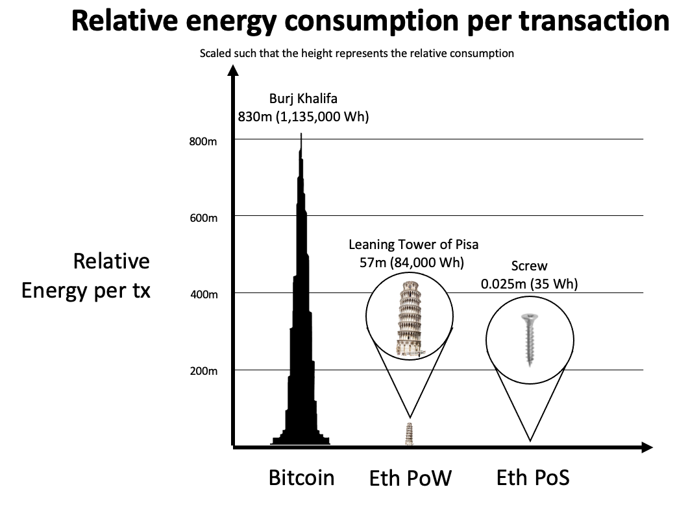

合并(The Merge)从一开始就是Vitalik对以太坊的愿景。他多年来一直在撰写[相关文章](https://www.amazon.com/Proof-Stake-Ethereum-Philosophy-Blockchains/dp/164421248X)，分享他对过渡到PoS的想法。最终，经过六年的研究、实验和坚持，合并实现了。
真正令人惊奇的是，没有任何用户注意到合并升级的转变。为了解释这是如何实现的，我们需要从头开始......

我们可以将区块链划为三层：网络层、共识层和应用层。

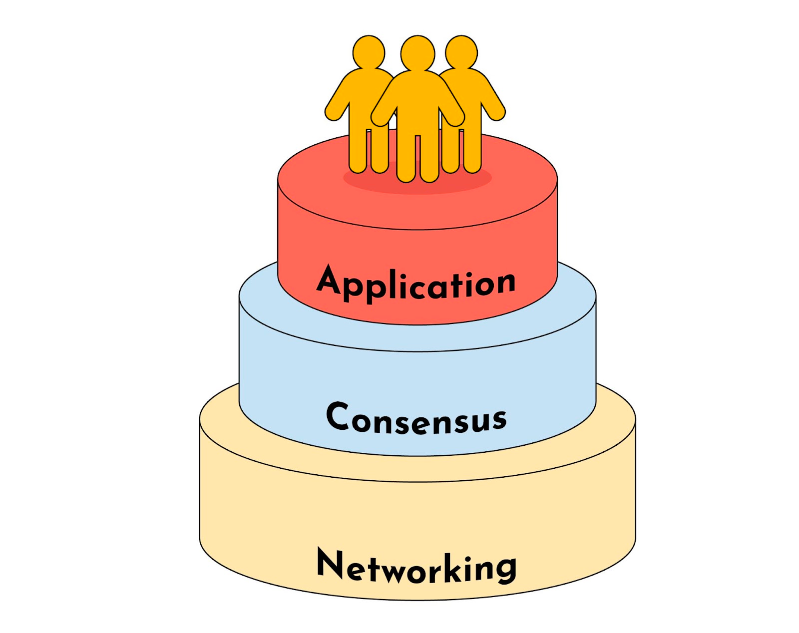

在这种情况下，网络层和共识层进行了升级，但应用层保持不变。这使得交易、智能合约和应用程序能够像往常一样继续工作——与此同时，以太坊的整个后端引擎正在发生变化。

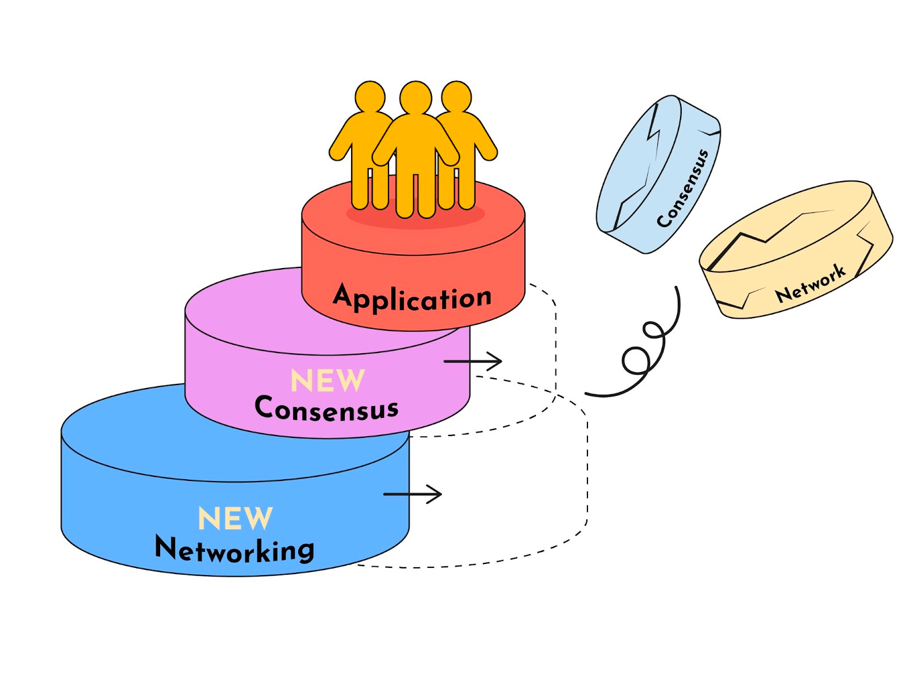

这就像是在半空中更换飞机的发动机。

值得提出的是，以太坊的核心开发人员能够实现这一目标。在不停止网络的情况下将PoW转换为PoS是一项巨大的技术壮举。
那么，首先，什么是PoS呢？这就是我们将在博客文章的其余部分中探讨的内容，包括合并是如何架构设计和执行的，以及它将对以太坊产生哪些长期影响。
以下是将要介绍的内容概述：

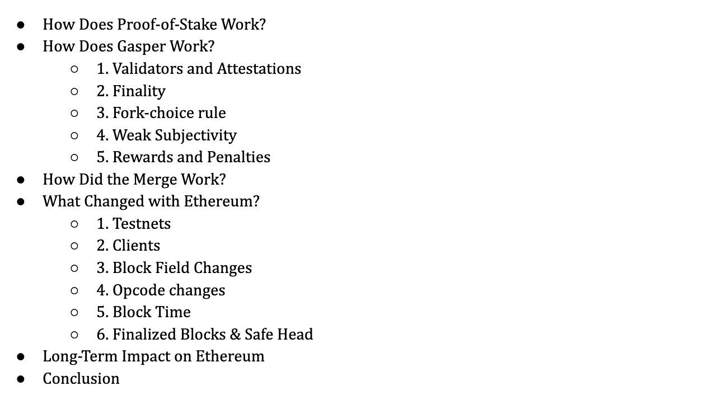

你的收获：消除对合并的误解。系好安全带，这将是一段漫长的旅程。

## 权益证明如何运作？

PoS是一种“共识机制”；即，当一组分布式节点想要就某件事达成一致时使用的算法。就区块链而言，去中心化节点使用共识算法来确认添加到区块链的下一个有效区块。

要更深入地解释共识算法，您可以阅读我的[博客](https://www.preethikasireddy.com/PoSt/lets-take-a-crack-at-understanding-distributed-consensus)——本节的其余部分假设您对共识算法及其使用方式有基本的了解。

虽然PoW和PoS通常被称为“共识算法”，但这在技术上是不准确的。它们实际上是**抵抗女巫攻击的机制**，是共识算法的重要组成部分，但不是全部。另一个非常重要的部分是分叉选择规则，我们稍后会谈到。

“抵抗女巫攻击”是确保恶意用户无法创建多个帐户并通过欺诈性投票来颠覆网络的共识算法（这个过程称为女巫攻击）。PoW使用算力作为抵抗女巫攻击的机制。换句话说，你需要硬件来解决工作量证明哈希，因此每个“投票”都由硬件单元支持。另一方面，PoS使用金钱作为抵抗女巫攻击的机制。在这种情况下，每一票都由金钱（权益）支撑。

**分叉选择规则**（Fork-choice rule）是关于共识算法如何选择“正确”的链。

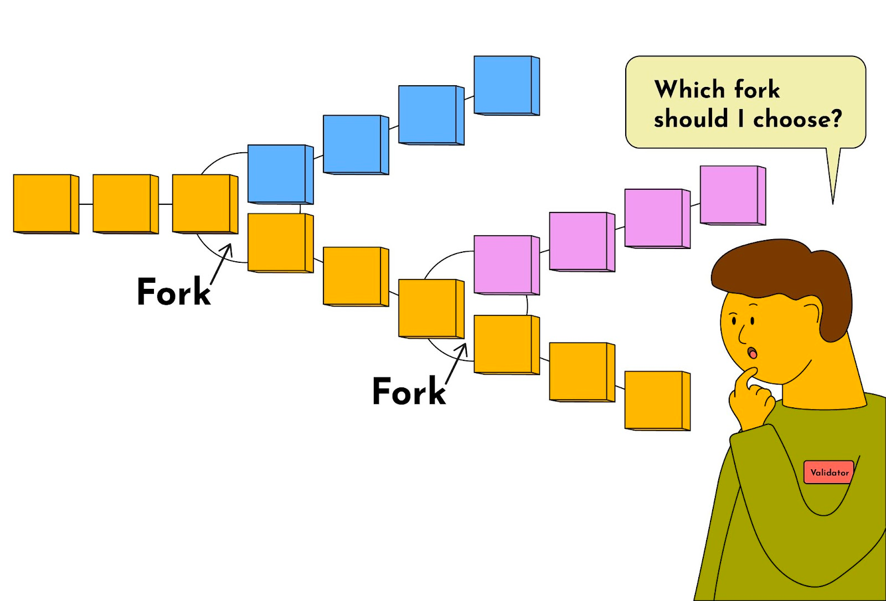

比特币使用 **“最长链”**（longest chain）原则，这意味着最长的区块链将被其余节点接受为有效的链。最长的链由该链上累积的工作量证明难度决定。

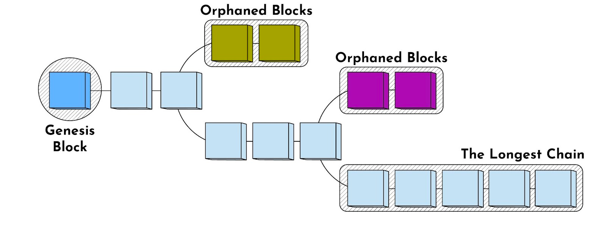

随着向PoS的过渡，以太坊现在关注链的 **“权重”**（weight），该权重由验证者投票的累积总和决定。

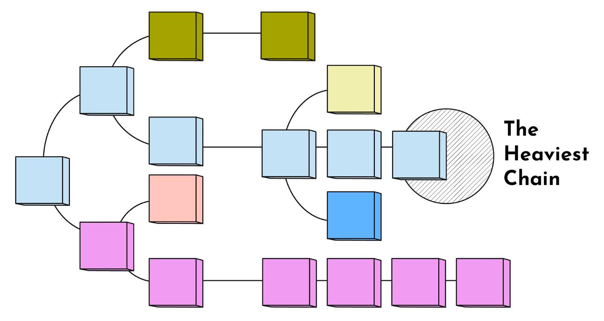

除了抵抗女巫攻击和分叉选择规则之外，以太坊共识算法还需要定义验证者如何获得奖励和惩罚，以及接受和拒绝哪些区块。

PoW中的奖励是每个区块产生的新币所带来的区块奖励。节点的惩罚是没能正确解决问题但已消耗的算力。如果节点没有解决哈希,它将失去计算哈希所花费的资金。

在PoS中，验证者通过“投票”选出下一个有效区块。但投票是可以自由进行的（与PoW不同），因此如果验证者出错，则需要明确的惩罚。这就是使PoS变得更加复杂的原因——它的惩罚必须使用博弈论在算法中明确定义。

就像你想象的那样，要正确做到这一点非常具有挑战性。

完成上述问题的算法叫"Gasper"。它定义了验证者的激励措施、如何将新块添加到链中以及如何决定规范链。

以下是你需要了解的关于Gasper的内容。

## Gasper如何工作？

Gasper为以太坊网络中的所有节点创建了一种机制，这种机制让新加到区块链的交易块达成一致。在这种情况下，“节点”被称为“验证者”，这些验证者通过投票决定下一个区块，这被称为“证明”。

### 1. 验证者和证明

“验证者”是负责投票决定下一步添加哪个区块的用户。任何人都可以通过将 **32个ETH**存入 **“存款合约”**(deposit contract)（这是一种专门用于收集和跟踪验证者的特殊合约）中，然后运行执行客户端和共识客户端来成为验证者。

将ETH存入存款合约后，用户会加入 **“激活队列”**（activation queue）排队成为验证者。

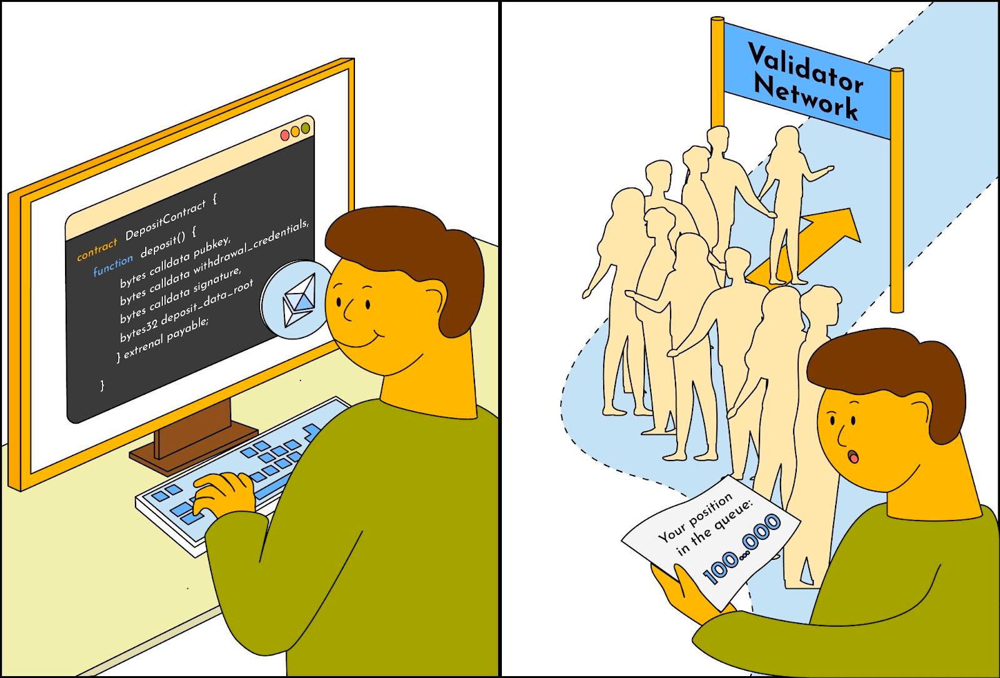

这样做是为了限制任何一个时间新验证者进入网络的速度。限制进入和退出速率的目标有两个:

1. 验证者投票时的通信开销非常高，因此，在确保投票能按时传递的情况下可以处理的验证者数量是有限的。
2. 防止大量恶意验证者执行某些恶意操作，然后离开网络逃避处罚。

一旦验证者被激活，那么，他作为“验证者”的职责就开始了。

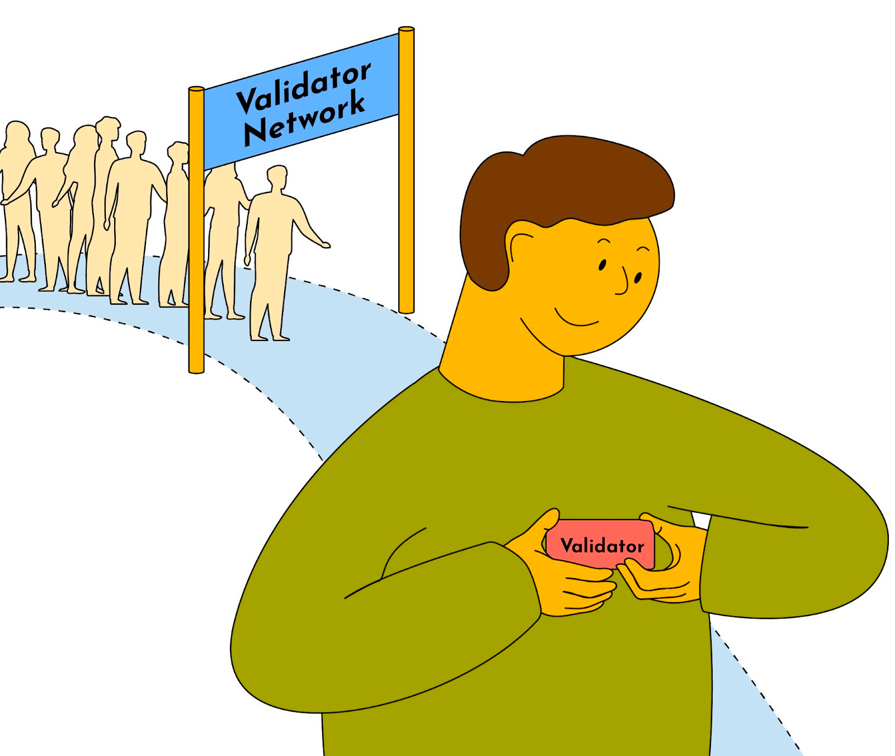

每个共识算法都需要一段时间来对网络中的事件（例如投票）进行排序。Gasper算法把时间划分为 **"slots"**和**"epochs"**。**一个slot为12秒，一个epoch由32个slot组成**（即6.4分钟）。

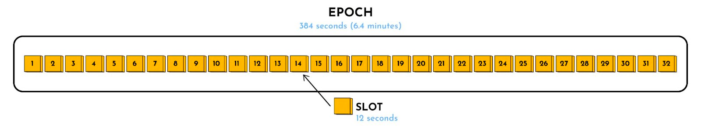

> 备注：2048个epoch（约9.1天）称为eek("Ethereum week")。需要很长时间的操作可以用eek来衡量。

对于每个槽，都会随机选择一个验证者作为 **“区块提议者”**（block proposer）。作为区块提议者的验证者负责从待处理的交易中构造一个新区块。然后，它将该块发送给网络中的其他验证者，这些验证者对该块是否有效进行投票。

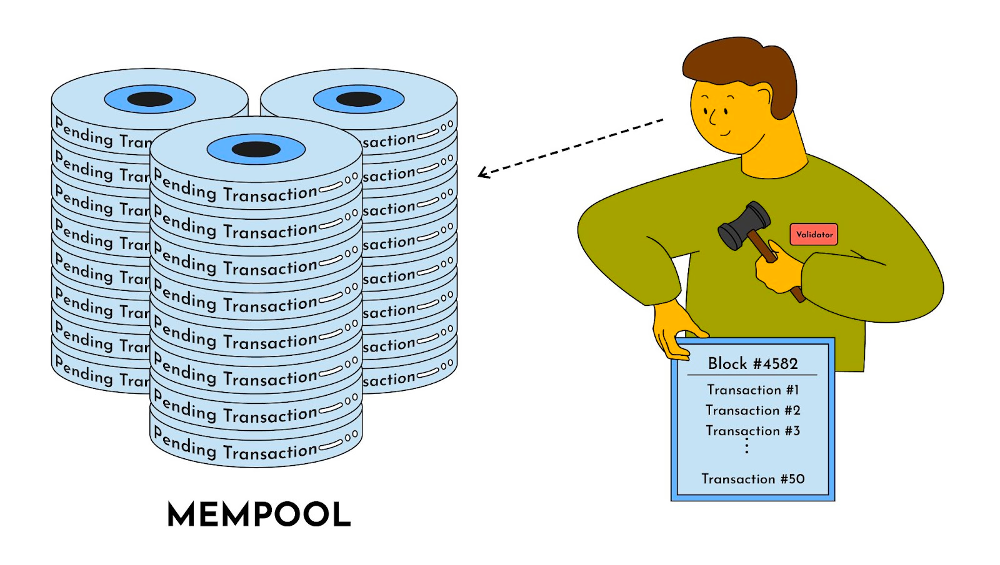

不过，并不是每个验证者都会为每个区块投票。相反，对于每个epoch，验证者都会被分配给一个 **“委员会”**(committee)。每个委员会都随机分配到一个slot，他们需要在这个slot中证明确定提议的区块是否有效。

委员会分布在一个epoch的32个slot中，这意味着由1/32的总验证者去证明每个slot区块的有效性，每个委员会最多允许2048个验证者。换句话说，在一个epoch中，每个验证者只能证明一个区块，即他所属的委员会被分配到的slot中的区块。

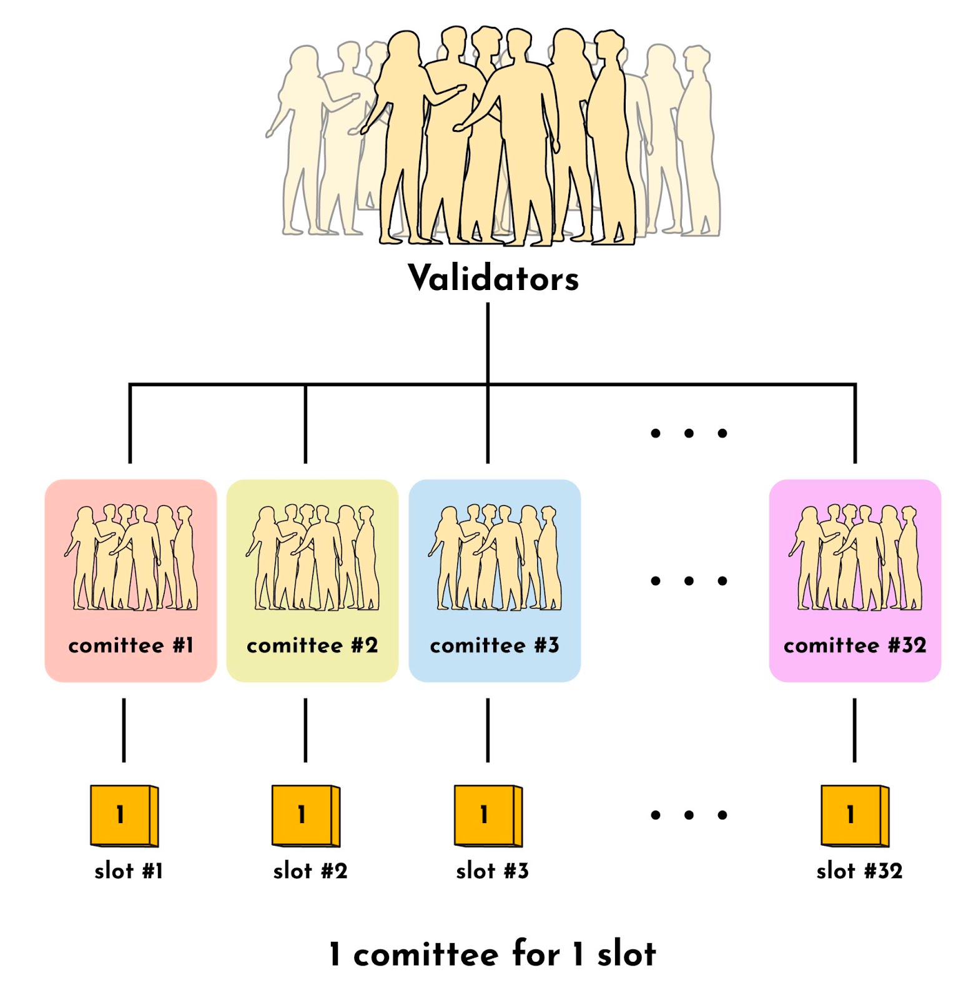

‍请注意，一小部分验证者也会被随机选择加入同步委员会，这与上面提到的委员会不同。加入同步委员会需要验证者帮助轻客户端同步并确定链的头部，他们可以为此获得额外的奖励。然而，作为验证者，您大约每22个月才会成为同步委员会的成员，所以这不是每天都要承担的责任。

验证者不仅仅证明当前的头区块。他们还证明了另外两个称为 **“检查点”**（checkpoint）的块。每个epoch都有一个检查点，用于在该epoch开始时标识最新的区块。

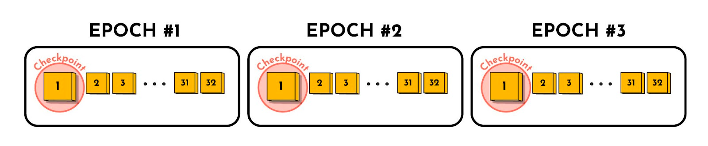

验证者在每个epoch验证两个检查点：**“源检查点”**（source）和 **“目标检查点”**（target）。

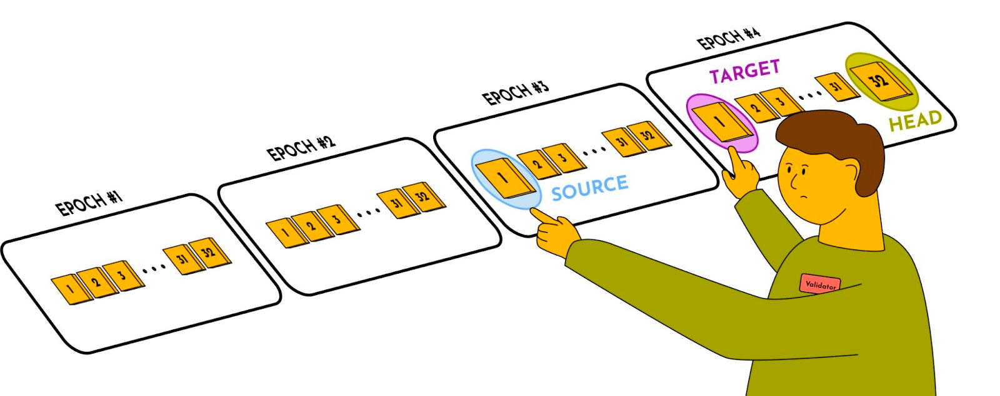

除了区块头、源检查点和目标检查点外，验证者还会验证以下信息：
    
* aggregation_bits（聚合位）：验证者的位列表，列表位置对应验证者在其委员会中的下标；值 (0/1) 表示验证者是否签署了数据（即它们是否处于活动状态并同意区块提议者）
* data（数据）：与证明相关的详细信息（定义如下）
* signature（签名）：聚合各个验证者签名的BLS签名

其中，data包含如下信息：
* slot（槽）：证明所指的槽位号
* index（下标）：验证者所属委员会的位置
* beacon_block_root（信标区块根）：验证者在链头看到的区块的根哈希
* source（源）：验证者认为最新的合理区块（justified block）
* target（目标）：验证者认为在当前epoch中的第一个区块

数据构建完后，验证者就可以将聚合位中对应自己的位从0改成1，以表明他们参与了投票。

最后，验证者使用私钥对证明签明并将其广播到网络。

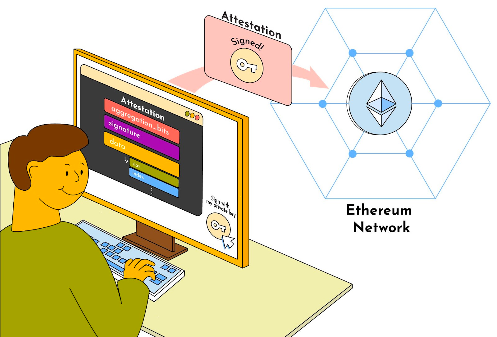

但是，将每个验证者都将自己的数据传递给网络中的每个其他验证者不是会产生大量开销吗？是的。这就是为什么不让每个验证者监听其他验证者，而是将各个验证者的证明在广播之前聚合在 **“子网”**（subnets）中。

如果将网络划分为更小的、单独的网络，这些网络就成为子网。它只是网络中的网络。子网通过收集和缩短数据到达目的地的路径，使通信更加高效。

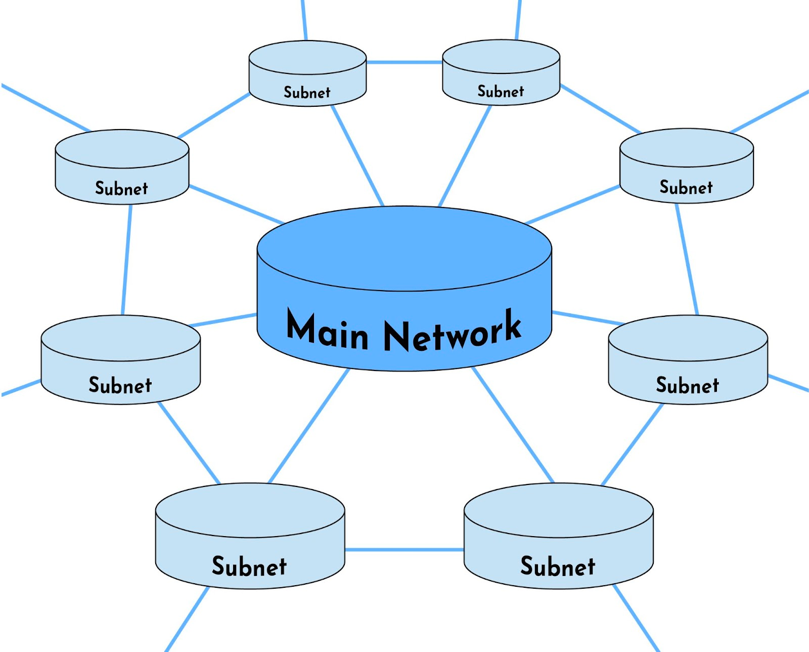

还记得我们之前说把验证者分为委员会吗？每个委员会又进一步分为**64个子网**。这使得聚合发生。

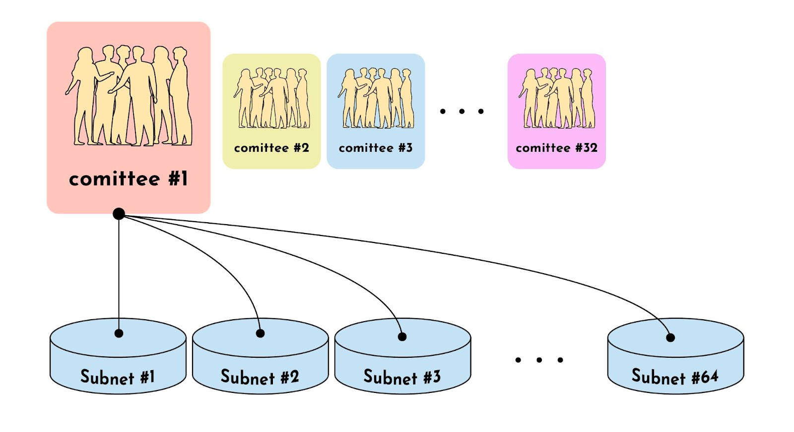

在每个epoch中，每个子网中的会有一个验证者被选择作为聚合者。聚合者收集所有与其自身具有等效数据的证明。每个匹配证明的发送者都记录在聚合位（aggregation_bits）中。这意味着可以通过组合与聚合者数据一致的所有验证者的签名形成一个新的签名。然后聚合者将聚合证明广播到更大的网络。

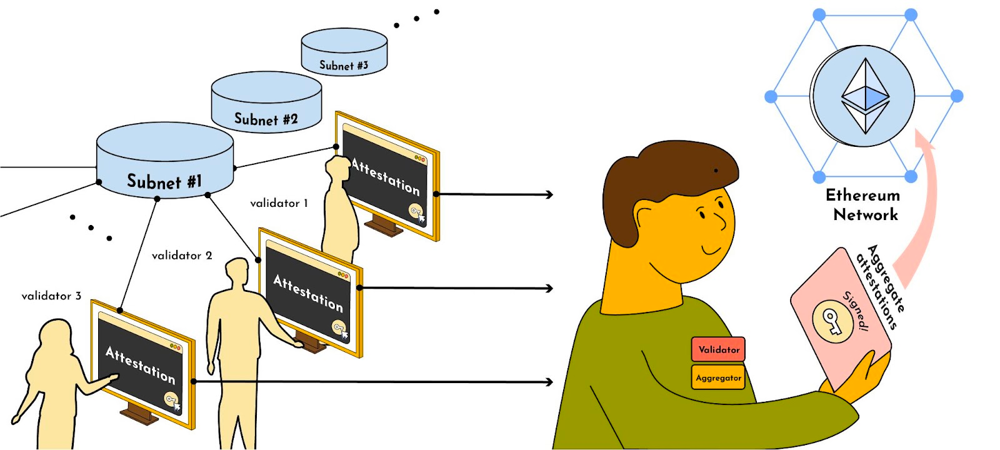

当验证者被选为区块提议者时，他们将子网的聚合证明打包到最近一个slot的区块中。

总体来说，验证者的职责包括以下内容：
* 验证一个区块（每个epoch完成一次）
* 聚合同一委员会中验证者的证明（在偶尔被选为聚合者时）
* 被选中时创建区块（在小概率被选为区块提议者时）

由于上述这些证明，区块链达成了共识。

### 2. 最终确定（finality，即不再改变）
快速回顾一下：验证者对区块提议者创建的区块进行投票——如果他们认为这是一个有效的区块。但我们什么时候确定一个区块应该包含在链中呢？

这就是我们谈论 **“最终确定”**（finality）时的意思。如果一个区块达到最终确定，它就无法恢复，除非出现严重的共识失败。

在比特币中，等待六次区块确认后我们知道一个区块是“最终的”。换句话说，如果在当前块之上构建了六个块，我们认为当前块已最终确认。一个区块在六次确认后被重组的概率非常小，这在统计上可以忽略不计。

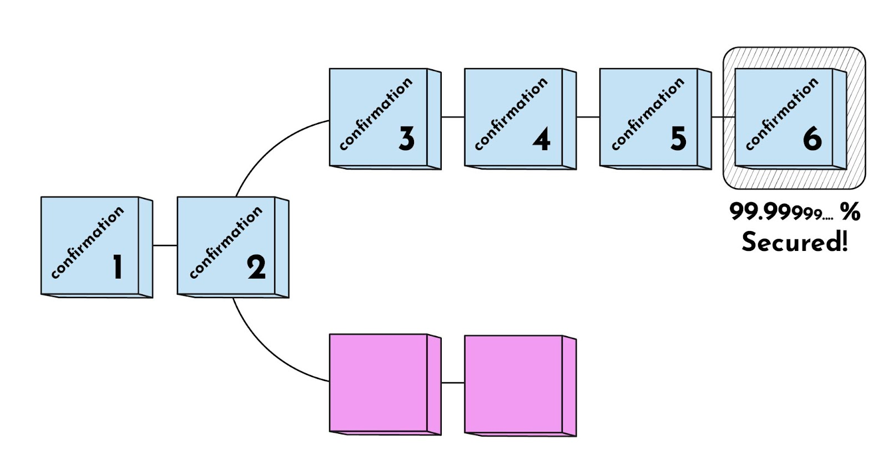

在Gasper中，我们用和比特币不同的方式确定最终区块（或固化块）。我们使用以下逻辑确定最终性。
* 如果2/3的质押以太币（ether）投票支持该区块，那么它就变成 **“证明”**（justified）了的。被证明了的块不太可能被恢复，但在某些条件下可以恢复。
* 当另一个块在已经证明了的块之上被证明时，它会升级为 **“最终确定”**（finality）。最终确定一个区块是将该区块包含在标准链（canonical chain）中。除非攻击者销毁数百万以太币，否则无法恢复。

块不会在每个slot中达到**证明**“justified”和**最终确定**“finality”状态。相反，它们发生在每个epoch的第一个区块，即“检查点”区块。

当检查点块升级为“证明”（justified）时，它必须能链接到前一个检查点。也就是说，质押ETH总量的2/3必须投票认定检查点B是检查点A的后代。因此，前一个检查点区块被“最终确定”，而最近的区块被“证明”。

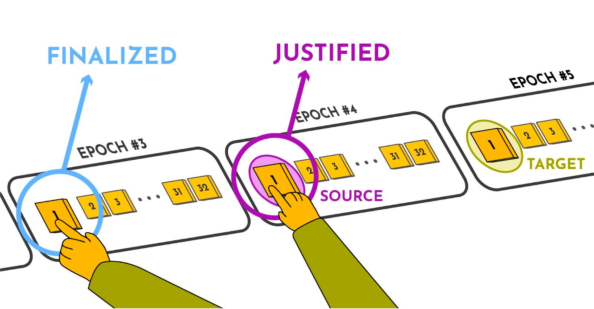

因此，攻击者无法创建替代的最终确定链，除非：
* 拥有或操纵总质押2/3的以太币（因为需要总质押2/3才能确定一条链）
* 销毁至少总质押1/3的以太币（因为如果2/3的ETH用于最终确定两条不同的链，这意味着1/3的以太币被恶意投票，这将被罚没（slashed））
  
现在您已经了解了验证者如何通过投票确定哪些区块达到最终确定，我们可以继续讨论分叉选择规则。

### 3. 分叉选择规则（Fork-choice rule）
由于节点以去中心化的方式进行通信，一些节点会在不同时间收到不同区块的消息。这导致不同的节点在不同的区块上构建。这就导致了 **“分叉”**（fork）。

当分叉出现时，验证者的工作就是选择“正确”的分叉。这称为“分叉选择”规则。

在比特币中，正确的分叉是具有最大算力的分叉。

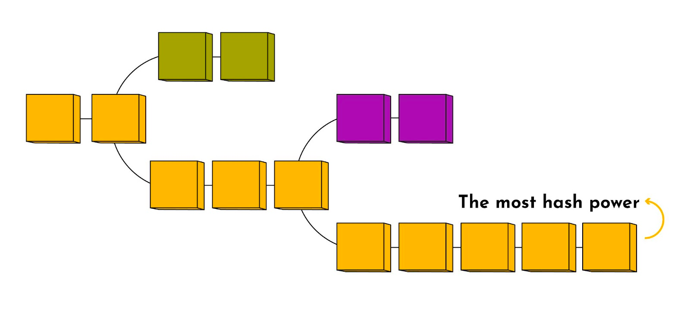

在Gasper中，分叉选择规则称为 **“LMD-GHOST”**，它代表 **"latest message-driven greedy heaviest observed sub-tree"**。这意味着我们选择累积证明权重最大的分叉作为规范分叉。

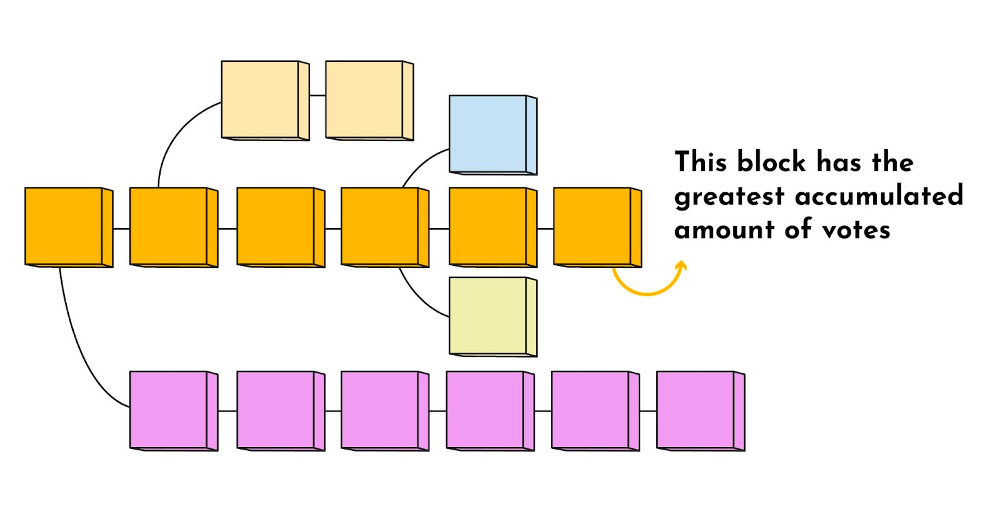

到目前为止，我们了解了区块是如何投票，如何最终确定，以及验证者如何选择在哪个分叉上构建。这为我们提供了一个区块链，它由一组去中心化的参与者创建并对添加哪个区块到链上达成一致。

PoS共识机制的一个大问题是它们容易受到 **“远程攻击”**（long-range attacks）——也就是说，一群攻击者可以从创世开始构建一个分叉，对用户隐藏一段时间，然后突然发布它。这可能会导致两条不同的链都有“最终确定”的区块，用户不知道哪个是正确的链。

这在PoW是不可能的，因为它需要不可逾越的哈希算力来生成之前所有的区块并超过主链。但在PoS中不存在哈希算力这样的东西，因为投票只是数据的数字化表示，所以部分验证者完全有可能创建一个看起来且行为都与主链相似的新区块链，并欺骗其他人相信这个替代的区块链。

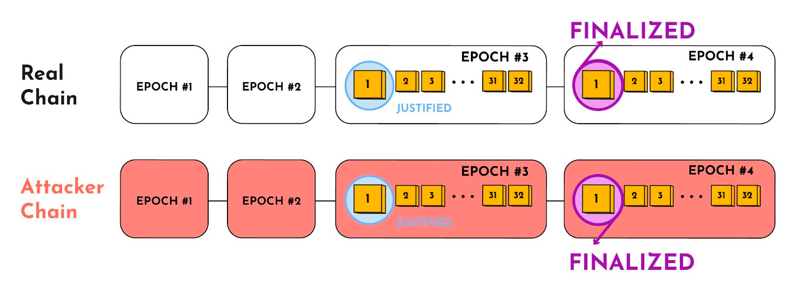

那么，以太坊时如何防止这种情况发生？答案就是：“弱主观性”。

### 4.弱主观性（Weak Subjectivity） 

在检查点中，每个网络中的每个节点都同意某个区块（及其之前的每个区块）属于规范链。这称为 **“弱主观性检查点”**（weak subjectivity checkpoint）。如果节点发现一个区块与弱主观性检查点冲突，那么它会拒绝该区块。最新的弱主观性检查点就像整个网络的新创世块。

回想一下，在任何区块链中，创世块通常是每个人在其上构建未来块的第一个块。同样，弱主观性检查点就像每个人都同意属于规范链的创世块 - 因此，每个人都建立在弱主观性点之上。

尝试同步到信标链规范头的新节点必须使用最新的弱主观性检查点作为其同步的起点。

这就是对弱主观性的主要批评的来源：节点只需要相信他们从可信来源（例如，区块浏览器或其他节点）了解到最新的弱主观性检查点。对于那些感兴趣的人，Vitalik 在[这篇文章](https://blog.ethereum.org/2014/11/25/proof-stake-learned-love-weak-subjectivity)中解释了他同意这一点的理由。

### 5、奖惩措施（Rewards and Penalties）
最后一个难题是奖励和惩罚。如果您已经完成了这一步，请休息一下并返回到本部分。准备好后，我们就开始吧。

由于共识机制是在去中心化的环境中采用的，我们不能相信节点（即验证者）会诚实地履行其职责。因此，我们引入激励措施来奖励良好行为并惩罚不良行为。因此，破坏网络的唯一方法是大多数节点浪费数百万以太币作恶。

PoW的一大特点是它的简单性。如果矿工算出正确的哈希值，他们将获得区块奖励，他们还可以获得新区块所含交易的交易费用。区块奖励来自新创建的代币，交易费用来自用户支付使用网络的费用。协议中没有明确的罚金或处罚。

现在以太坊过渡到PoS，其经济模型变得更加复杂。这是因为惩罚必须整合到协议中，这与PoW不同，PoW的惩罚是消耗矿工所花费的算力。

在我们了解Gasper中的奖励和惩罚如何运作之前，我们应该澄清协议如何定义验证者的“余额”。

信标链维护每个验证者两条单独的余额记录：

* **实际余额**（Actual balance）：这是每个验证者的实际余额。这包括他们向存款合约存入的存款，加上他们因参与协议而获得的奖励，减去不参与的处罚。实际余额从32ETH开始，且会根据验证者产生的奖励和惩罚而经常变化。

* **有效余额**（Effective balance）：这是从实际余额中得出的数字，但它在每个epoch仅更改一次，并且以整以太币计价（无小数），这使得在计算一个epoch内的奖励时更加高效。它的上限也是32个ETH，因此验证者的实际余额可能是100个ETH，但他的奖励和惩罚是关于有效余额的函数，有效余额上限为32ETH。

有效余额还用于选为区块提议者或参与同步委员会的概率计算。有效余额越高就越有可能被选中当作区块提议者或参与同步委员会（从而获得额外奖励）。

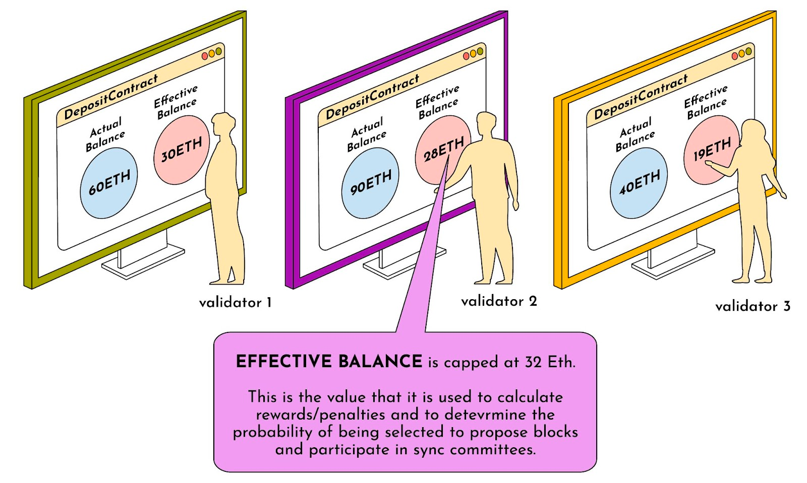

实际的计算很复杂，超出了本文的范围，但您可以在[此处](https://eth2book.info/altair/part2/incentives/balances#hysteresis)阅读。

#### 奖励
奖励很简单。验证者在以下情况下会获得以太币奖励：

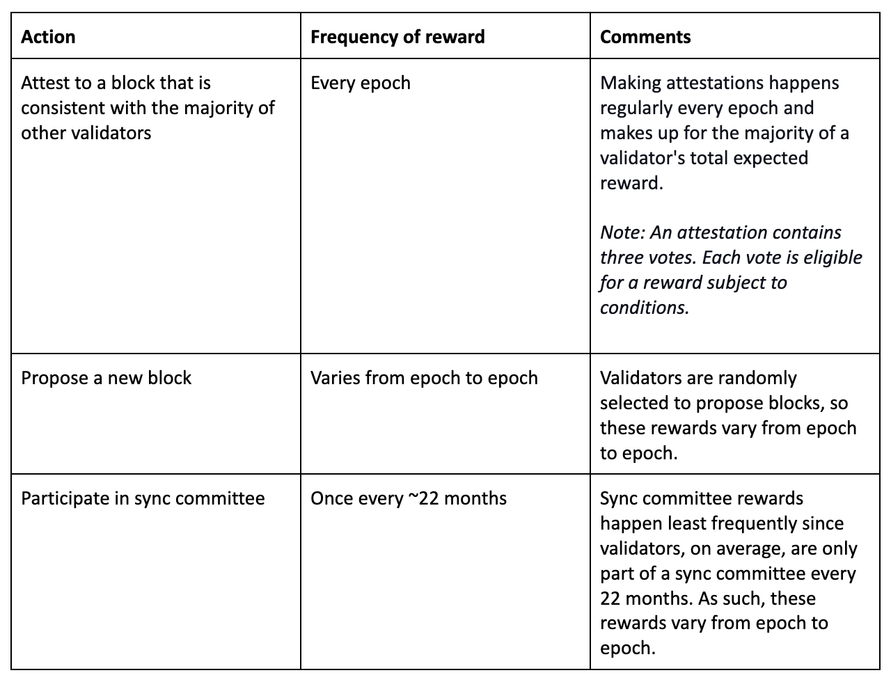

现在我们了解了验证者有哪些奖励，让我们再看看他们的奖励是如何计算的。

验证者收到的金额基于一个称为 **“基本奖励”**（base reward）的参数 - 该参数来自验证者在每个epoch收到的平均奖励。计算基本奖励的函数是：

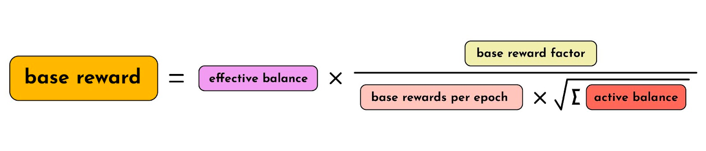

* 基本奖励的系数（base reward factor）是64
* 每个epoch的基本奖励（Base rewards per epoch）是4
* 活跃余额（active balance）之和是所有活跃验证者的质押总额

因此，基本奖励与验证者的有效余额成正比，与网络上验证者的数量成反比。换句话说，随着越来越多的验证者进入网络，每个验证者获得的奖励会减少。

此外，与有效余额为最大值32ETH的验证者相比，有效余额低于32ETH的验证者（由于离线被处罚或因作恶被罚没）的奖励将会减少。

以下是用于计算验证者奖励的五个主要组成部分：

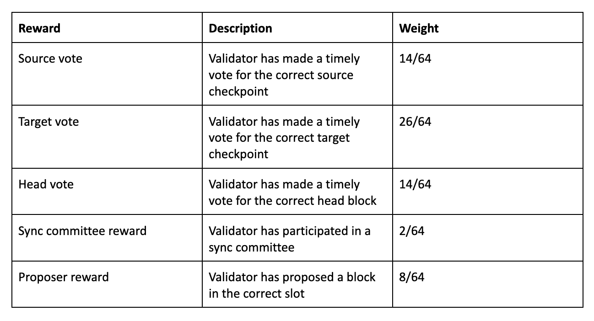

在上表中，您还可以看到每个部分都有各自的权重。

最终奖励的计算方法是将基本奖励乘以适用于该验证者的权重总和除以64。

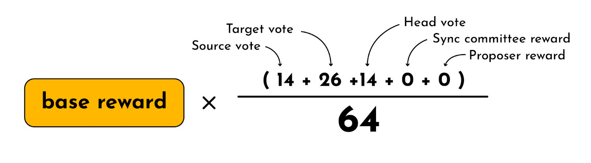

让我们仔细看一下这些部分的具体含义。

**Source、Target和Head投票奖励**

回想一下，一个证明包含三票（源检查点、目标检查点、区块头）。每张投票都有资格获得奖励。验证者只会因“正确”的证明而获得奖励——这意味着他们的投票同意当前的区块提议者。此外，还有一个额外的权重，该权重取决于验证者在提出区块后进行证明的速度，值为基本奖励除以“纳入延迟”（inclusion delay）。（译者注：纳入延迟是衡量验证者提交的证明在链上实际被记录所花费时间的指标。这个指标反映了验证者证明的及时性。计算公式为验证者提交的证明在预期slot与实际记录在链上的slot之间的差值，然后对这些差值求平均。[来源](https://foresightnews.pro/article/detail/32979)）

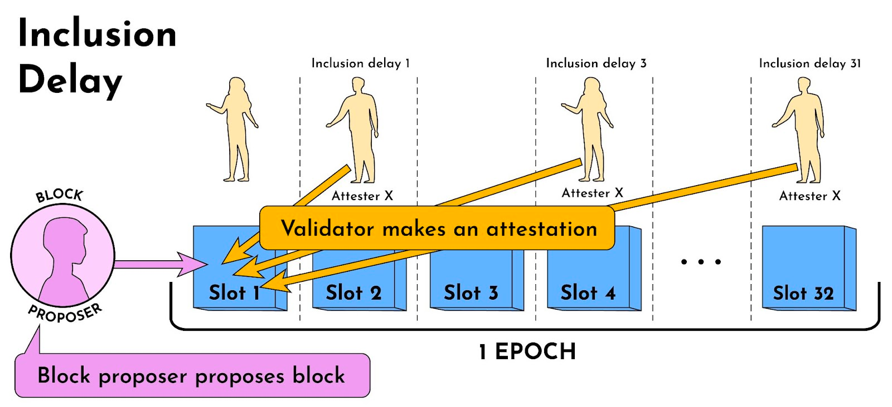

例如，如果验证者在提议的区块的一个slot内进行证明，则验证者将获得基本奖励 * 1/1。如果在下一个slot证明，验证者将收到基本奖励 * 1/2，依此类推。

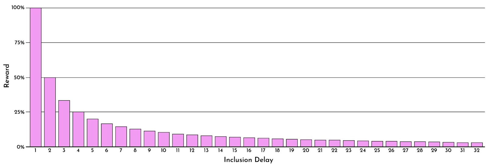
[图片来源](https://kb.beaconcha.in/attestation)

值得注意的是，验证奖励与参与比例成正比。因此，对于每个源、目标或头部投票，验证者的奖励将根据进行相同投票的总权益比例进行调整。这样做是为了激励一个验证者通过转发消息和聚合投票来帮助其他验证者。

**区块提议者奖励**

第四个组成部分是区块提议者奖励。区块提议者的奖励为(8/64) * 基本奖励，用于他们在区块中包含的每个有效证明，以及在区块中包含同步委员会的输出。这意味着随着更多验证者证明该区块，区块提议者将获得更多奖励。

或者，就像V神说的
> "The proposer reward for a duty is the attester reward for that duty, multiplied by the proPoSer reward as a fraction of everything but the proposer reward."

换句话说，区块提议者因在区块中包含源、目标、头和同步委员会投票而获得奖励，就像验证者因源、目标、头和同步委员会对区块进行投票而获得奖励一样。区块提议者在区块内包含投票信息的奖励只占验证者投票奖励很小的比例。例如，验证者进行源投票将获得 (基本奖励 * (14 / 64))，而提议者将获得 (基本奖励 * (14 / 64)) * (8 / (64 - 8))。这意味着提议者获得的投票收益是证明者获得的收益的 1/7。

**同步委员会奖励**

第五个部分是同步委员会奖励。每256个epoch（27.3小时），就会选择512名验证者参与同步委员会。换个角度来看，如果我们假设总共有300,000个验证者，那么我们可以预期一个验证者每22个月就会被选中一次。

当验证者被选为同步委员会时，它的回报是非常大的。同步委员会奖励的详细分类超出了本文的范围，但如果您有兴趣了解更多信息，可以参见[eth2book](https://eth2book.info/altair/part2/incentives/rewards/)。

下面这个图详细介绍了我们上面描述的各种职责的奖励：

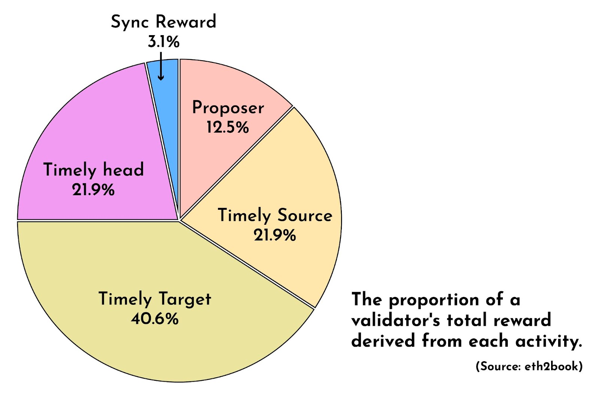

#### 惩罚

上文讲了很多奖励相关的内容，那么，我们如何阻止不负责任的或作恶的行为？这就是惩罚和罚没的用途。

正如我们之前提到的，验证者的职责是进行验证、提出区块并参与同步委员会。

**验证惩罚**

验证者会因缺失、迟到或不正确的验证而受到处罚。这里的计算方式很简单：他们的罚金与参与得到的奖励相同。

但是如果大多数验证者不参与验证会发生什么？如果信标链已经超过四个epoch而没有最终确定，那么它就会进入"不作为惩罚"（inactivity leak）模式。回想一下，我们需要2/3的验证者来最终确定一个区块，因此如果太多验证者缺席，那么我们就无法最终确定区块。

这是紧急情况，不作为惩罚需要得到解决。如何解决呢？通过取消对活跃证明者的所有奖励并惩罚不活跃的验证者。随着时间的推移，不活跃的惩罚会成倍增加。这样可以逐渐减少不活跃验证者在网络中的质押额，直到他们控制小于1/3的总质押。这样剩余的活跃验证者就可以最终确定这条链了。

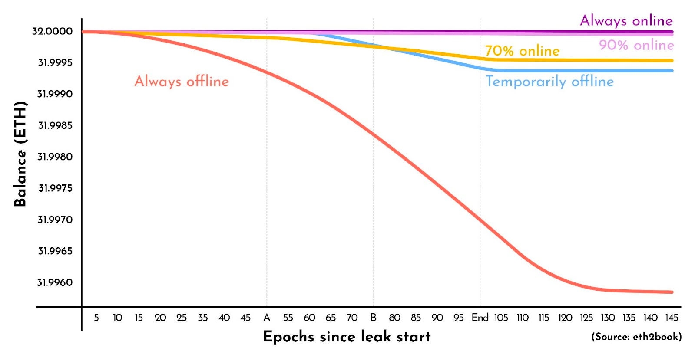
[图片来源](https://eth2book.info/altair/part2/incentives/inactivity)

不作为惩罚的最终目的就是可以最终确定区块。

**区块提议者处罚**

区块提议者没有明确的惩罚。如果块提议者未能提议块，则我们在该slot中没有块，并且将继续下一个slot。

**同步委员会处罚**

同步委员会验证者在履行职责的每个slot都会获得奖励。如果他们对错误的区块头（head）签名或不参与，他们将受到与奖励相同金额的处罚。

在惩罚部分结束之前，我们应该澄清两件事。首先，所有惩罚都会从信标链上验证者的余额中扣除并进行销毁，从而减少ETH的净发行量。其次，惩罚并不像奖励那样随着参与程度的增加而增加。

##### 罚没（Slashing）

罚没是一种特殊的惩罚，值得单独一节描述。如果验证者参与作恶，他们将通过罚没受到严厉惩罚，即强制他们离开网络并处以严厉的惩罚。

验证者可以通过三种方式被罚没：
* 作为区块提议者并在同一个slot里签署两个不同的区块
* 作为验证者对另一个验证做验证
* 作为验证者对两个具有相同目标的不同验证做验证

验证者需要被举报才能触发罚没。举报者需要创建一条特殊消息并将其传播到网络，而区块提议者需要将其包含在区块中。

如果举报正确，那么区块提议者和举报者都有权获得奖励。如果区块提议者包含导致罚没的证据，他们将获得被罚没的验证者有效余额除以512的奖励。举报人奖励尚未纳入协议，所以他们不会收到奖励。起码截止目前还没有奖励。

验证者一旦被罚没，他就会受到初始惩罚，排队等待大约36天（8192个epoch）退出协议。该验证者会持续受到证明惩罚直到退出协议。这就像牢房——他们无法参与验证，但由于他们仍然是验证者，所以会因不参与验证与而受到惩罚。如果这36天内发生不作为惩罚，他们将像不活跃验证者一样受到处罚。这个惩罚是相当严厉的！

和其他惩罚一样，罚没的金额被销毁，从而减少了以太币的总体净发行量。

##### 反相关惩罚（Anti-Correlation Penalties）

罚没中有一个非常有意思的内容叫反相关惩罚——如果许多验证者同时执行相同的攻击，那么他们会因相同的攻击而受到更多的惩罚。

反相关惩罚有两种类型：
* 不作为惩罚:如果验证者证明失败将会收到少量惩罚，但是如果在不作为惩罚期间证明失败，受到的惩罚就会大很多。
* 罚没:在验证者被罚没进入退出协议期（36天）的过半后，验证者会被第二次处罚，第二次惩罚是根据验证者罚没之前和之后18天内被罚没的权益总额计算的。这样就加大了惩罚力度，如果验证者被罚没一次，他们只会受到轻微的惩罚，但如果在此期间有大量验证者被罚没，他们就都会损失很多钱。

这样做有几个原因：
* 设置与行为造成的损害成比例的惩罚可以抑制验证者集体破坏网络的动机。
* 它激励验证者尝试将他们的失败与其他验证者的关联减少；例如，不运行相同的客户端，不属于同一个质押池，或者不在同一个云服务上运行。

让我们看一下实践中反相关惩罚的例子。

假设有3个质押池，一个拥有5%的股份，一个拥有10%的股份，一个拥有20%的股份。我们还假设所有这些都具有相同的可靠性（即在任何给定时间段内出现故障的可能性相同）。

由于不作为惩罚规模取决于离线验证者的数量，因此，拥有20%权益的验证者将受到比拥有5%权益的验证者多4倍的惩罚，比10%权益的多2倍惩罚。换句话说，由于反相关性惩罚，验证者会被激励加入较少的权益池中，而不是跟随潮流加入最多的权益池中。

**验证者可以随时退出**

验证者通过以下任一方式退出协议之前都会获得奖励：
* 自愿选择退出
* 因为罚没被强制退出前
* 由于处罚导致余额低于16ETH时

也就是说，验证者可以随时离开。要自愿退出，他们所要做的就是签署链上包含的“VoluntaryExit”消息。退出队列的处理方式与激活队列类似，具有四个epoch的延迟。

如果验证者不是因为罚没而退出，他们可以在退出一天后提取以太币余额。但是如果被罚没，就需要等待4个eek（译者注：上文提到一个eek约9.1天，4个eek约36.4天）。

## 合并（The Merge）是如何进行的？

尽管正式合并发生在2022年9月，但合并真正开始要追溯到2020年10月存款合约推出时。**存款合约**（deposit contract）是以太坊质押合约的地址，这标志着PoS成为现实的第一步。一旦信标链启动，用户就可以开始存入ETH，以便作为验证者参与其中。

几个月后，即2020年12月，**信标链**（Beacon chain）正式启动，在生成和验证空块的过程中始终与主链一起运行。事实上，在以太坊主链与信标链合并之前，信标链已经启动并运行了大约一年零九个月。

这使得以太坊核心开发人员能够对新的共识引擎进行实战测试，并进行各种升级，为正式合并做好准备。与此同时，以太坊用户可以继续按原样使用以太坊。

我们使用 **“难度炸弹”**（difficulty bomb）一词来指挖矿难度突然增加，这样会导致开采新区块变得效率低。难度增加导致出块时间更长，进而导致ETH奖励减少。以太坊在准备启用PoS之前对难度炸弹进行了多次升级，目标是在准备就绪时将矿工过渡到PoS。

事实上，难度炸弹一直是以太坊协议的一部分，因为以太坊希望能过渡到PoS。只是这个时间比最初预期的要长得多。因此，协议进行了多次升级推迟难度炸弹，直到PoS准备好启动。

还有一些其他升级工作，例如要求节点运营商更新其客户端软件以及在测试后合并各种测试网络。

为了测试信标链，还运行了二十个 **“影子分叉”**（shadow forks）。影子分叉是一种使用历史区块链数据（不同于使用测试数据的测试网）来模拟在受控环境中从PoW到PoS的转变的分叉。换句话说，目标是运行模拟并解决以太坊主链与信标链合并时可能出现的问题。

在修复各种bug后，当链达到预先指定的终端总难度（TTD）时，合并被正式触发。一旦链达到TTD，就没有额外的PoW块被添加到链中。

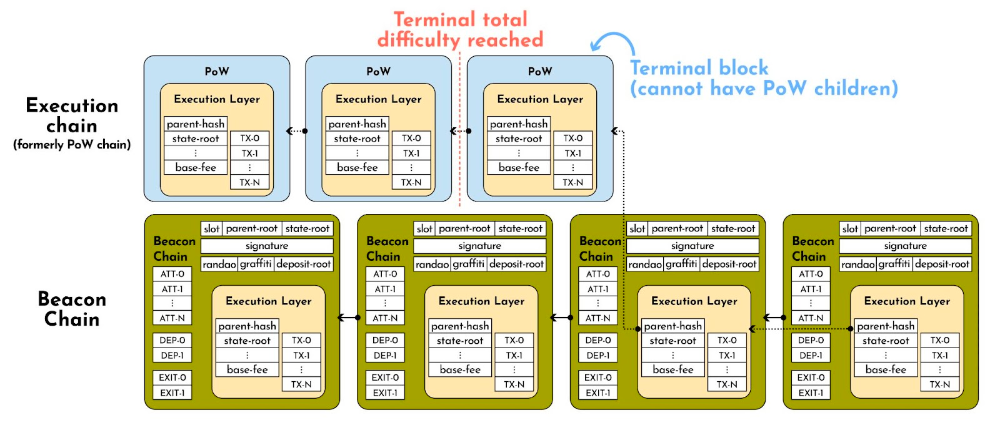
[图片来源](https://blog.ethereum.org/2021/11/29/how-the-merge-impacts-app-layer)

## 以太坊发生了哪些变化？

合并是以太坊的重大升级。尽管用户不会注意到任何差异，但开发人员和节点运营商在背后花费了大量时间和精力完成这次升级。

让我们来看看最大的变化。

### 1. 测试网
以太坊1.0的测试网（例如 Rinkeby和Ropsten）被Goerli和Sepolia取代。因此，使用以前的测试网的开发人员必须切换到新的测试网中。

### 2. 客户端
合并之前，主网上的节点运营商只需要运行一种客户端软件（例如Geth）。这在新的信标链中发生了变化——现在，节点运营商必须运行两种不同的客户端软件：执行层（Execution layer,EL）和共识层（Consensus layer,CL）。

执行层客户端监听并执行新的交易，而共识层客户端则实现PoS算法。虽然这对节点操作员来说比较麻烦，但好消息是这两种类型的客户端现在都可以使用各种编程语言，这意味着我们有了更多的客户端多样性。

现在有四种EL客户端实现和四种CL客户端实现（忽略市场份额不到1%的客户端实现）。这比以前Geth作为绝大多数节点使用的客户端而导致单点故障的风险要好得多。

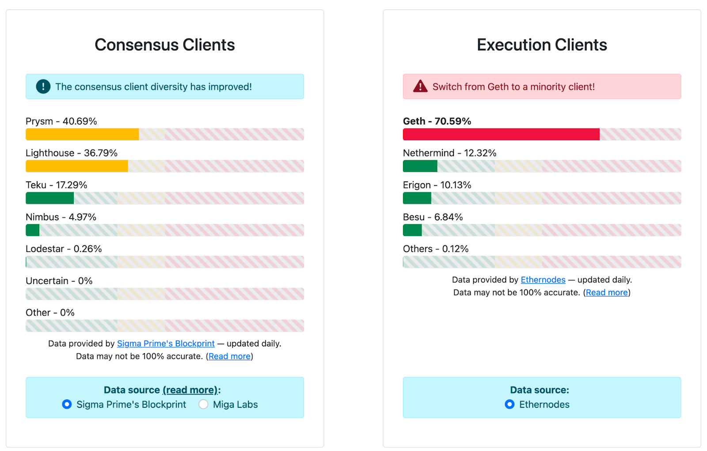

拥有多个客户端实现使网络适应性更强。请记住我们之前所讨论的，信标链通过相关性惩罚明确地激励客户多样性。

### 3. 区块字段的变化
合并后，基于PoW生成的区块将不再存在。相反，这些区块的内容成为信标链创建的区块的组成部分。

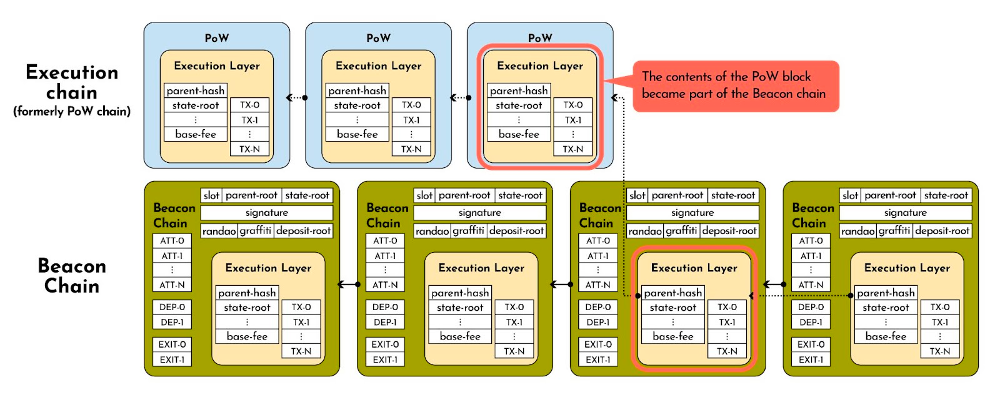

信标链上的区块将包含“ExecutionPayloads”，它将代表新PoS链中旧Pow链上的区块。

旧区块结构中还有一些字段与新链不相关。不相关的字段将被设置为零，而不是删除它们（这会导致中断）。

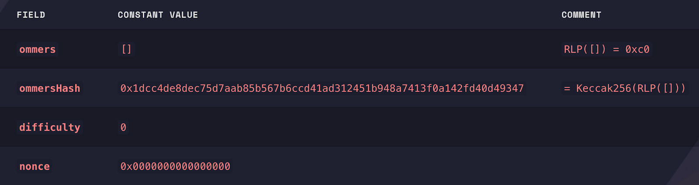
[图片来源](https://blog.ethereum.org/2021/11/29/how-the-merge-impacts-app-layer)

下面是被设为零值的四个字段：
* Ommers：由于PoS不会产生ommers（即叔块），因此每个区块的ommers中的列表现在为空。
* ommersHash：ommers列表的哈希现在是空列表的RLP编码哈希。
* Difficulty：PoS不再需要，被设为0。
* Nonce：PoS不再需要，被设为0。

**"mixHash"** 是另一个只与挖矿相关的字段，但该字段现在将包含信标链的 **"RANDAO"** 值（我们将在下文中解释），没有被设置为0。

### 4. 操作码的变化

关于操作码的变化，首先是 **"BLOCKHASH"**，它对应用开发者很重要，很多时候被当成随机数用。由于许多智能合约都在使用它，因此它不会被移除。相反，它现在的随机性值会更弱，以鼓励采用“PREVRANDOA”。

**“DIFFICULTY”** 操作码在PoS中也无关紧要。它将更名为 **“PREVRANDOA”**。该操作码的值是信标链提供的随机性信标的输出，比**BLOCKHASH**随机性更强。鼓励开发者使用PREVRANDOA替换BLOCKHASH。

PREVRANDAO的值将存储在PoW块中mixHash存储的位置，同时，“mixHash”字段也将被重命名为“prevRandao”。

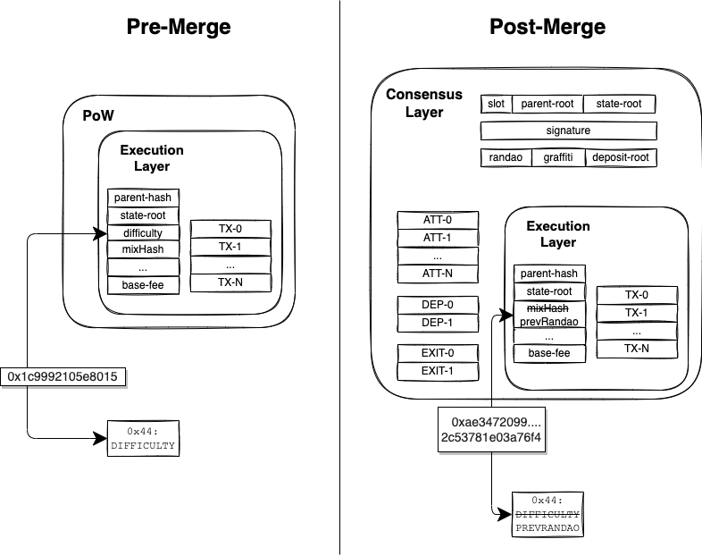

### 5. 区块时间
另一个值得注意的变化是出块时间略有减少，从PoW中的平均约13秒减少到PoS的12秒。

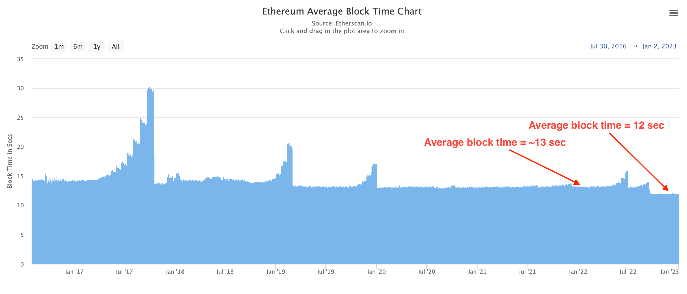

我们之前提过，一个slot为12秒，每个slot产生一个区块。唯一的例外是，如果区块生产者延迟或不在线而无法在slot中生成区块时，该slot就会被错过。但这种情况发生的概率不到1%，因此我们可以假设出块时间为12秒。

### 6. 最终确定的区块 & 安全的头块（Safe Head）

最后一个值的注意的变化是用户如何知道块已经最终确定，在PoW中，我们使用六次确认规则，如果在当前头块上构建了六个区块，那么就认为该块已经最终确定了。这只能说是大概率不变了，并不是100%可靠，虽然可能性很小但是仍然有可能发生重组。

在PoS中，通过检查该块是否“finalized”或“justified”来确定该块是否固化。在PoS的以太坊JSON RPC中会返回“finalized”标志或者“justified”标志。相比之下，PoW没有“finalized”或者“justified”之类的东西。相反，它有“已确认”（confirmed）和“头部”（head）区块。

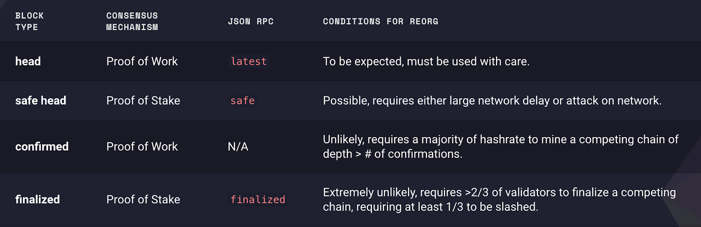
[图片来源](https://blog.ethereum.org/2021/11/29/how-the-merge-impacts-app-layer)

## 对以太坊的长期影响
上面我们介绍了合并，现在，我们来谈谈对它以太坊的宏观影响。目前，ETH的年通胀率约为4.62%，大部分都给了矿工挖矿。合并升级后，ETH的年通胀率将降低90%到达0.49%左右。

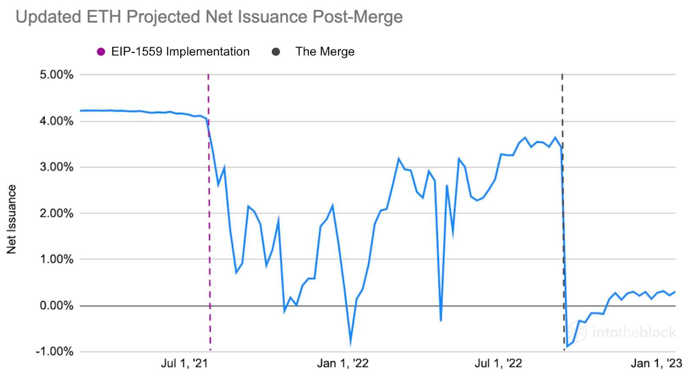
[图片来源](https://twitter.com/LucasOutumuro/status/1550328190278766593?s=20&t=H9YI3lVcbuhBBh8CuEp3Og)

这些变化将对ETH价格产生积极影响，进而可能有助于提高网络的安全性。另一方面，发行量的减少可能会导致人们囤积ETH。这不是个好事，因为虽然它可能会提高价格，但会损害底层以太坊平台的实用性。

时间会证明ETH发行量的减少对以太坊平台的长期成功有何影响。

## 结论

唷！如果你已经看到这一步，你简直太厉害了。如果您对阅读的任何内容有任何疑问，或者对我所写的内容有任何更正，请在评论中分享。我期待着您的回音！

在你看完的时候，让我们附加一些有用的内容。

### 附加内容：消除对合并的四个误解

#### 误解1：合并降低交易手续费

这不太对。合并只是改变了共识机制，决定如何验证新区块并添加区块到链中。它不会增加网络吞吐量，因此交易费用几乎保持不变。

#### 误解2：合并大幅提高了交易速度

PoS只是让出块时间保持一致，从13-14秒减少到12秒。这并不是速度上的实质性改进。

#### 误解3：用户只有拥有32个ETH才能参与PoS

小于32个ETH的用户仍然可以通过加入质押池来参与共识。

#### 误解4：合并允许质押提款

众所周知，自2020年信标链首次推出以来，用户就可以开始在信标链上进行质押。但是，质押用户在合并之后才能被允许提取ETH。事实上人们认为合并上线时质押者就可以提款是错误的，上海升级计划上线后才可以质押提款。

相关资料：

https://eth2book.info/altair/contents
https://notes.ethereum.org/@adiasg/weak-subjectvity-eth2
https://github.com/ethereum/annotated-spec/blob/master/phase0/beacon-chain.md#attestationdata
https://ethereum.org/en/developers/docs/consensus-mechanisms/pos/
https://www.gsr.io/insights/ethereums-roadmap-a-guide-to-the-merge-and-beyond/
https://blog.ethereum.org/2021/11/29/how-the-merge-impacts-app-layer 

