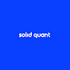
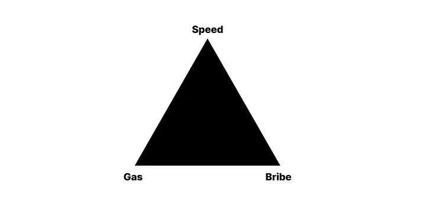
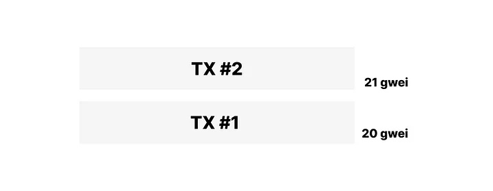
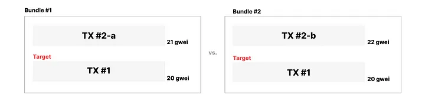
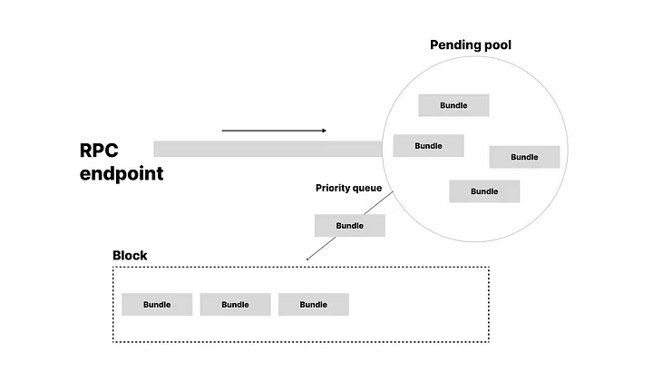
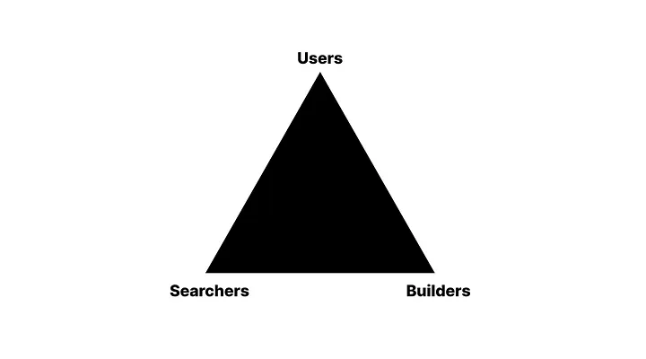

# 我不在乎是否会被夹在中间，更大的事情即将发生在 MEV 中。

## MEV 的内部运作和行业如何转变

[][1] [Solid Quant][2] · [Follow][3] 13 min read · Dec 23, 2023 [][4]

  
  
生成自 Fotor AI：任务是拯救世界的时髦吉娃娃 🌎

在过去的几个月里，对于搜索者来说，提取 MEV 变得越来越具有挑战性。

是的，工具变得更好了，所以似乎技术障碍终于消失了，我们所有人都可以平等竞争。但是，尽管任何人都可以轻而易举地加入其中，**但保持领先地位的竞争却变得比以往任何时候都激烈**。

你可能会经历这样一种情况：你连续几个晚上都没有睡觉，EVM 模拟结果开始在你的控制台上显示多个有利可图的三明治/套利捆绑：

  
  

    
🥪🥪🥪🥪🥪🥪🥪🥪 发现三明治套利机会 🥪🥪🥪🥪🥪🥪🥪🥪 

    
- 优化后的金额为：1.27463 WETH 

    
- 潜在利润: 💎💎💎💎💎💎💎💎  

  

  

    
🥪🥪🥪🥪🥪🥪🥪🥪 发现三明治套利机会 🥪🥪🥪🥪🥪🥪🥪🥪  

    
- 优化后的金额为: 1.27463 WETH  

    
- 潜在利润: 💎💎💎💎💎💎💎💎  

  

  

     
 🥪🥪🥪🥪🥪🥪🥪🥪 发现三明治套利机会 🥪🥪🥪🥪🥪🥪🥪🥪  

    
- 优化后的金额为: 1.27463 WETH  

    
- 潜在利润: 💎💎💎💎💎💎💎💎 

  

然后你在想着，

>“啊，为了这个而连夜奋战。现在我是王了。”

但很快你会发现，所有这些捆绑交易都被 EigenPhi 的顶级搜索者插队了。无论你如何观察你的捆绑交易并将其与他们的进行比较，你会意识到你根本无法赢得：无论从**速度、燃气还是贿赂**方面来看。如果一切都反过来运作，你将始终是赢家。

  
  
我只需要这些来赢得胜利…

现在，你在想

> “啊，那么多夜晚就为了这个？我现在很痛苦”

_当然，在这种情况下，你可能正在寻找一个竞争非常激烈的短尾机会，因此你需要把目光投向竞争较小的市场。我们将在以后的文章中讨论这个话题_。

今天，我想谈谈 MEV 行业是如何转变的，以及作为搜索者，我们如何才能在即将到来的牛市中保持领先地位。通过了解潮汐的变化，我们可以找到与顶级搜索者竞争的方法，并成为一名绅士 _（直接引自行业明星 libevm）_：

**如果你不想错过大浪淘沙的机会，请继续阅读 🌊🌊🌊**。

# 目录

在这两部分的系列文章中，我们将讨论以下主题：

## 📍**** 第一部分：MEV 世界如何演变***

1.  **公共存储库的内部***
2.  **了解区块构建器的作用** 3.
3.  **私人订单流： 它们是什么，以及我们如何利用 POF 赢得更多**

## 📍***第二部分：作为搜索者如何赢在当下***

1.  **新地铁机器人： 建立一个像样的三明治机器人**
2.  **从理论上探讨如何赢得更多**
3.  **IDCMEV：提交捆绑/私人交易的新方法** 4.

要真正把握 MEV 领域的发展轨迹，让我们回过头来，深入了解 MEV 行业的起源和发展，了解它是如何演变到目前的状态的。

读完这篇文章后，你可能会想： > '我真的不在乎：

>"我也不在乎是否会被夹伤。现在有更大的问题。

在下一篇文章中，我将为大家提供一个高效的玩具三明治机器人，让大家亲身体验所有部件是如何组合在一起的。此外，我还将介绍一项目前处于测试阶段的新服务--在内部对部分 MEV 搜索者进行测试--名为**“我不在乎 MEV ”**（[https://idcmev.oopy.io/][6]）。这项服务旨在帮助用户和搜索者像经验丰富的专家一样提交他们的捆绑包。

欢迎加入我们的社区，共同探讨 MEV 的未来：

<a href="https://medium.com/coinmonks/trusted-setup-in-zksnarks-powers-of-tau-vs-lagrange-basis-7f12978f1eb9" style="text-decoration: none; color: inherit;">
  
  
    

      <h3>加入 Solid Quant Discord 服务器</h3>
      
从事量化工作的爱好者 - 目前主要从事与 MEV 相关的工作。| 1219 名成员

      
discord.com

    

  

</a>

我知道大家都很兴奋。那我们走吧 🔥

# 1\. 公共内存池内部一览

这一切都源于一个待处理的事务。

## 🌐 第一代 MEV：Mempool 监控

可能是 Uniswap 订单交易，也可能是其他交易，谁知道呢。但人们很快就发现，这些订单可以通过公共内存池进行**监控，而且他们可以利用气体费用，使他们的交易要么在目标交易之前，要么在目标交易之后。

**这怎么可能呢？** 因为区块的构建在很大程度上依赖于基于气体价格的交易排序。假设有两个不同的交易，其燃气价格如下：

  

在这种情况下，由于 **_TX #2_** 比 **_TX #1_** 多支付 1 gwei，因此在建造区块时，**_TX #2_**将优先于**_TX #1_**。而且，在新区块建成之前有接近 12 秒的时间，你有足够的时间来确定油价，以确保你能在目标交易的前面（**frontrun**）或后面（**backrun**）着陆。

第一代 MEV 搜索者曾在雷达下这样玩过一段时间，但消息传开后，更多的人想加入其中。

## ⚔️ 第二代 MEV：gas 竞价战

这就是天然气竞价战出现的时候。

回到上面的例子，现在假设另一方也加入了这个领域，他也能够访问相同的内存池数据。

这一次，这两个 MEV 搜索者都试图在支付 20 gwei 的相同目标交易（**TX #1**）前置交易。

这两个搜索者分别提交了不同天然气价格的交易（21 gwei、22 gwei），因为他们最初不知道对方。

然后交易顺序看起来会是这样的：

  

然而，这引发了多个不同搜索者之间的天然气竞价战。

搜索者将不断监视内存池，以寻找竞争者的交易，并出价更高的天然气价格，以便站在竞争对手之上。

## 🤖 **第三代 MEV：Flashbots 和私有内存池**

进入 Flashbots。

Flashbots 主动提供了两项对 MEV 搜索者至关重要的服务：

1. **私有内存池**
2. **捆绑交易**

这两个概念标志着一个新时代的开始，因此值得详细讨论一下。

## 私有内存池

与公共内存池不同，人们现在可以将私有交易提交给 Flashbots。不同之处在于，公共内存池位于区块链网络上，因此任何人都可以访问数据。这种可访问性存在前置交易或后置交易的风险。

然而，私有内存池是在由 Flashbots 管理的单独服务器上运行的，确保数据对公众视而不见。向 Flashbots 发送私有交易的人不再需要担心 MEV。

这个解决方案相当巧妙，除了它实际上并没有真正解决 MEV。

Flashbots 的出现本来应该消除通过内存池流动的敏感公共交易，但实际上并没有。

正如你下面所看到的，仍然有很多交易通过公共内存池发送：

  
  
公开交易尝试在 Uniswap V2/V3 上进行交换

**❗快速测验❗**

**Q: 你认为人们为什么仍然提交到公共内存池？** **是因为他们不知道 MEV 和 Flashbots 吗？**

我不再相信这是情况。我相当肯定人们现在已经意识到了 MEV 是什么。但是，这当然不意味着所有公共交易都是有意提交到公共内存池的。

如果你监视内存池数据一段时间，你会注意到大多数，如果不是全部的公共交易都被 MEV 搜索者拾取，并因此在下一个区块中得到确认。

如果这些人有意将公共交易发送，以便它们安全地在下一个区块中得到确认，该怎么办呢？如果你愿意承担滑点成本，那么这样做是有道理的。

## 捆绑交易

Flashbots 还为我们带来的另一个巧妙功能是被称为捆绑交易。

捆绑交易确保某些交易的顺序固定不变。

**确保交易顺序意味着什么？**

让我们回到我们的例子，交易的顺序如下：

  
  
公开交易尝试在 Uniswap V2/V3 上进行交换

在这种情况下，由于天然气竞价战的结果，这两笔前置交易都将落在**TX #1**之前。然而，这可能会有问题，因为这两笔交易可能会使代币价格发生过大变动，导致**TX #1**被撤销。搜索者需要确保他们正在前置或后置的交易不会被撤销，这样他们才能从这种 MEV 中获利。

捆绑交易将有助于解决这个问题，现在的竞争看起来像这样：

  

现在，这两个不同的搜索者将交易批量打包成一个捆绑交易，并将捆绑交易提交给 Flashbots。

如果顺序不被保持，捆绑交易将被撤销。但是正如你所看到的，**TX #1**只能被使用一次，因此只有一个捆绑交易会生存下来，并在下一个区块中得到确认。

这种新型的交易处理机制引入了另一种称为**贿赂战**的战争，我们将在下一节中详细了解。

# 2. 理解区块构建者的工作

## ⛓️ 第四代 MEV：区块构建和贿赂战

在考虑私有交易时，一个常见的词是：**集中化**。

事实上，从区块链中删除公共订单流在一定程度上是有益的，因为它可以通过确保用户隐私来缓解 MEV。然而，这是以集中化为代价的，这创造了一个相当有趣的进退两难的局面。

一旦我们的私有交易或捆绑交易被发送到私有内存池中，我们如何确定它们是否被公平处理呢？答案是：**我们不知道**。

因此，下一个显而易见的步骤是开放区块构建空间，让任何愿意参与的人都可以参与。而这正是发生的事情。

现在，验证者负责：

-   **区块构建**
-   **区块提议**

但大多数验证者无法构建非常有利可图的区块，因此，他们将这项任务外包给区块构建者。

区块构建者将使用一系列优化技术来构建更好的区块，并希望下一个验证者将他们的区块提议为下一个区块。

**我知道这一切都相当模糊，所以我们将尝试通过自己构建一个区块来形象地展示什么是区块构建。**

🚀 让我们将我们的服务称为：**Solid Builder**。我们希望直接与 Flashbots 竞争，并构建更好（更有利可图）的区块。

让我们回到使用来自公共内存池的待处理交易 **TX #1** 的原始示例。同样，有两个搜索者竞争使用相同的待处理交易 **(TX #1)** 来构建他们的捆绑交易：

  

搜索者 #1 提交了 **Bundle #1**，这个搜索者想要前置 TX #1，并向区块构建者支付了 0.01 ETH 作为贿赂。

搜索者 #2 提交了 **Bundle #2**，这个搜索者想要使用 TX #3-a、TX #3-b 将 TX #1 夹在中间，并向区块构建者支付了 0.011 ETH 作为贿赂。

通过这个设置，我们可以理解搜索者 #2 可能更有利可图，因此能够支付更多的贿赂给区块构建者。因此，构建者将选择 Bundle #2。

在只有一个区块构建者存在的世界中，Bundle #2 很可能会获胜。

## 搜索者 + 构建者的力量

然而，由于新成员 **Solid Builder** 的加入，动态发生了一些变化。现在搜索者有了将捆绑交易发送到现有构建者中的一个或两个的选择。

例如，搜索者 #1 只发送给 Flashbots，搜索者 #2 只发送给 Solid Builder，因为实际上搜索者 #2 就是 Solid Builder。

在这种情况下，Flashbots 将使用 Bundle #1 构建一个区块。

而 Solid Builder 将使用 Bundle #2 构建一个区块。

最终结果是第二个区块更有利可图，因此 Bundle #1 将无法被包含在内，Flashbots 将失去区块竞标。

现在，搜索者 + 构建者身份的 **Solid Builder** 可以在两个方面获利：

-   MEV 搜索，
-   区块构建。

这些身份不会使用简单的 **按贿赂排序** 方法来选择最有利可图的捆绑交易。对于他们来说，利润计算为：**MEV 利润 + 区块贿赂**。因此，他们自己的捆绑交易很可能会被选择，而不是其他搜索者的捆绑交易。

## 搜索者声誉

最大化区块价值的另一种方法是通过历史盈利能力对 MEV 搜索者进行评分，并优先考虑他们的捆绑交易。这是通过使用所谓的 **搜索者声誉** 实现的：

<a href="https://docs.flashbots.net/flashbots-auction/advanced/reputation?source=post_page-----d1dca7dedf30--------------------------------" style="text-decoration: none; color: inherit;">
  
  
    

      <h3>搜索者声誉 | Flashbots 文档</h3>
      
为了保持可靠的性能，我们引入了搜索者声誉，以提供对...

    

    

      
    

  

</a>

这是非常必要的，因为如果声誉不重要，搜索者将盲目地提交捆绑交易，并用他们的请求堵塞网络。构建者受计算能力的限制，因此他们只能在构建区块之前模拟一定数量的捆绑交易。因此，他们将惩罚任何以任何方式损害他们网络的搜索者。

对于所有构建者，实施逻辑略有不同，但构建者将基本上保持一个从 RPC 终端点连接到尚未模拟的捆绑交易的内存池的队列，如下所示：

  

从这里开始，他们将按以下方式对捆绑交易进行排序：

- **时间：**先到先得，
- **优先级：**较高的优先级（声誉）

然后开始模拟它们，看它们是否盈利。

有人说时间不是一个因素，但我认为这并不是事实。构建者受计算能力的限制表明，你提交捆绑交易的速度越快，它就越有可能被考虑为“候选”进入下一个区块。

为了构建最有利可图的区块，构建者必须进一步解决一个背包问题：**我们应该如何选择和排序这些捆绑交易，以最大化我们的利润。**

通过生成大量的交易和捆绑交易组合，构建者将对整个组合进行模拟，看哪个组合将最大程度地增加他们的 ETH 余额。

正如你所看到的，区块构建本身就是一种策略。

希望这一切都说得通，并帮助你了解区块构建者在做什么。

如果你愿意开始一个构建者业务，有一些非常好的资源可以帮助你入门：

<a href="https://github.com/ralexstokes/mev-rs?source=post_page-----d1dca7dedf30--------------------------------" style="text-decoration: none; color: inherit;">
  
  
    

      <h3>GitHub - ralexstokes/mev-rs: 一个连接到区块构建者网络的网关</h3>
      
一个连接到区块构建者网络的网关。通过在…上创建一个账户来贡献 ralexstokes/mev-rs 的开发。

    
github.com

    

    

      
    

  

</a>

我还建议任何对区块构建感兴趣的人阅读这篇文章：

<a href="https://crypticwoods.com/blog/what-does-it-take-to-be-a-block-builder/?source=post_page-----d1dca7dedf30--------------------------------" style="text-decoration: none; color: inherit;">
  
  
    

      <h3>Cryptic Woods 研究</h3>
      
一个连接到区块构建者网络的网关。通过在…上创建一个账户来贡献 ralexstokes/mev-rs 的开发。

    
crypticwoods.com

    

    

      
    

  

</a>

# 3\. **私密订单流：它们是什么，以及我们如何利用POF来赢得更多**

## 🤝 第五代 MEV：私密订单流战争

阅读有关区块构建者的内容会让你认为，对于构建者来说，以下几点非常重要：

-   **建立一个庞大的社区**，以获取更多用于区块构建的捆绑数据，
-   **了解强大的 MEV 搜索者**，使其捆绑数据更有价值。

这意味着**“访问私密订单流”**是区块构建的最关键方面之一。构建者应该要么拥有一个庞大的独特搜索者池，要么拥有能力强大的搜索者。

如果每个构建者都可以访问相同的交易（公开订单流）和具有相同优化技术的相同搜索者，那么构建者将轮流赢得区块。这将停止整个 MEV 供应链的发展。幸运的是，现实情况非常动态。

因此，争夺私密订单流是一个持续存在的趋势，无处不在。

有：

## **半私密 Mempools**

这是一种通过返回用户产生的某些 MEV 机会来为用户提供 MEV 保护的方法。用户可以将他们的交易提交到半私密的 mempool，在那里他们可以披露关于他们的交易的一些信息，并允许搜索者回溯他们的交易。

如果搜索者成功回溯了交易，那么该搜索者有责任为促成这个机会而向用户退款。通过以这种方式构建半私密 mempools，为所有参与方创造了双赢局面。

以下是一些用户和搜索者都可以利用的流行的半私密服务：

1.  **MEV-Share**（Flashbots）
2.  **MEVBlocker**（CoW DAO）
3.  **BackRunMe**（bloXroute）

## **基于意图的交换**

另一种消除 MEV 的有效方法是建立一个匹配订单的开放市场。这些带有如下目标的订单：

-   “我想用 x 个 WETH 购买代币 A，”
-   “我想出售代币 B 并获得 y 个 ETH，”

被称为 **‘意图’**，因为它们代表了用户的意图。

这个概念类似于中心化交易所（CEX）上的限价订单，但有一个小小的不同 —— 搜索者或 **‘求解器’** 之间存在着竞争，以尽可能最优的方式来满足意图。最有效地完成这项任务的个人将执行用户的订单。

以下是一些利用私密订单流程提供 MEV 保护的流行基于意图的交换：

1.  **CoW Swap**
2.  **Uniswap X**
3.  **限价订单协议** _(有些人可能不会将限价订单协议视为基于意图的交换，但我不知道，它们对我来说都很相似)_

**感到眩晕吗？对需要学习的信息感到不知所措吗？** 别担心，因为你不是一个人。我们将在后续文章中更深入地探讨半私密服务和基于意图的交换，因为它们非常有趣。但现在，只需知道有一个由产品构建者组成的社区正在努力实现 MEV 的圣三位一体：

  

一个每个人都赢得的世界：**用户、搜索者、构建者。**

**大家圣诞快乐！🎄**

我已经离开了几个月，与一些令人振奋的人一起努力开发我非常喜爱的产品，我在这个过程中学到了更多关于 MEV 的知识。

我希望继续创作高质量的内容，让我们所有人都能学到一些关于 MEV 的知识，并真正开心起来。

_如果有任何问题，请随时通过 Twitter 或 X… 与我联系：_

[https://twitter.com/solidquant][11] 🙏

[1]: /@solidquant?source=post_page-----d1dca7dedf30--------------------------------
[2]: /@solidquant?source=post_page-----d1dca7dedf30--------------------------------
[3]: /m/signin?actionUrl=https%3A%2F%2Fmedium.com%2F_%2Fsubscribe%2Fuser%2Fa7020cdc995&operation=register&redirect=https%3A%2F%2Fmedium.com%2F%40solidquant%2Fi-dont-care-if-i-get-sandwiched-bigger-things-are-coming-to-mev-d1dca7dedf30&user=Solid+Quant&userId=a7020cdc995&source=post_page-a7020cdc995----d1dca7dedf30---------------------post_header-----------
[4]: /m/signin?actionUrl=https%3A%2F%2Fmedium.com%2F_%2Fvote%2Fp%2Fd1dca7dedf30&operation=register&redirect=https%3A%2F%2Fmedium.com%2F%40solidquant%2Fi-dont-care-if-i-get-sandwiched-bigger-things-are-coming-to-mev-d1dca7dedf30&user=Solid+Quant&userId=a7020cdc995&source=-----d1dca7dedf30---------------------clap_footer-----------
[5]: /m/signin?actionUrl=https%3A%2F%2Fmedium.com%2F_%2Fbookmark%2Fp%2Fd1dca7dedf30&operation=register&redirect=https%3A%2F%2Fmedium.com%2F%40solidquant%2Fi-dont-care-if-i-get-sandwiched-bigger-things-are-coming-to-mev-d1dca7dedf30&source=-----d1dca7dedf30---------------------bookmark_footer-----------
[6]: https://idcmev.oopy.io/
[7]: https://discord.com/invite/e6KpjTQP98?source=post_page-----d1dca7dedf30--------------------------------
[8]: https://docs.flashbots.net/flashbots-auction/advanced/reputation?source=post_page-----d1dca7dedf30--------------------------------
[9]: https://github.com/ralexstokes/mev-rs?source=post_page-----d1dca7dedf30--------------------------------
[10]: https://crypticwoods.com/blog/what-does-it-take-to-be-a-block-builder/?source=post_page-----d1dca7dedf30--------------------------------
[11]: https://twitter.com/solidquant