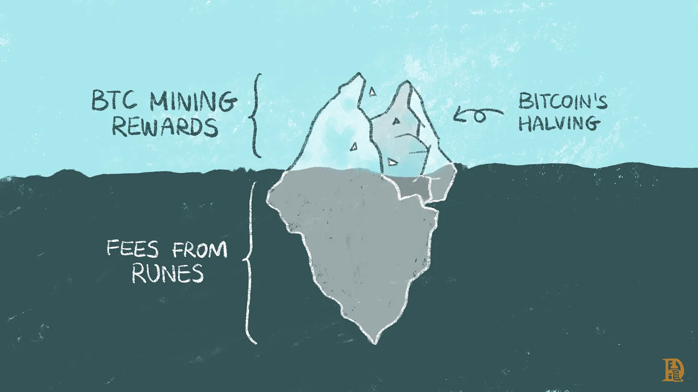
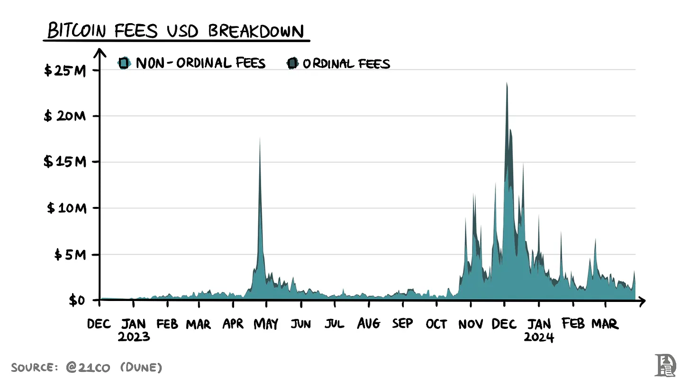
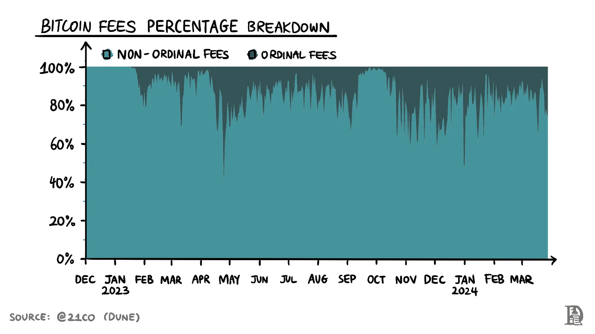
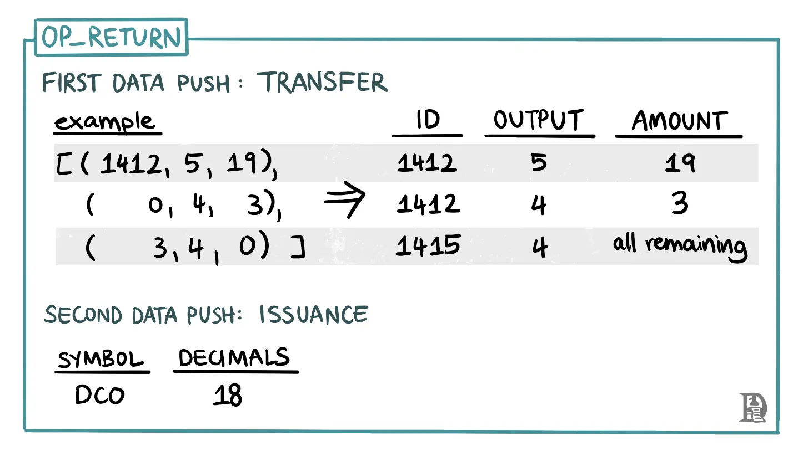
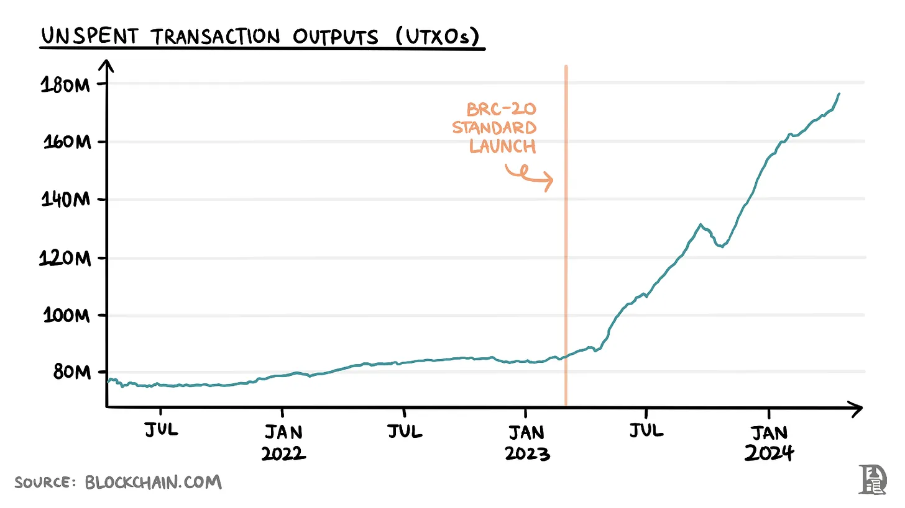
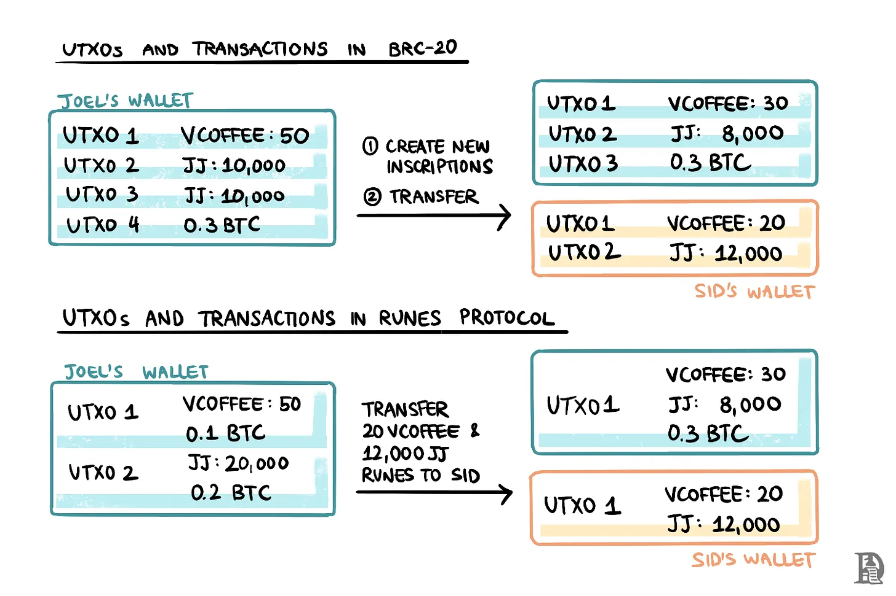

# 让 Runes 游戏开始吧

### 一种全新的比特币原生投机工具

[][1] [Saurabh][2] 2024.4.19 

嘿,  

减半时钟再次转动。趁这个机会写一些与比特币相关的东西是再合适不过的了。通过 Runes，凯西给了我们足够的素材来谈论。
  
Tldr； Runes 协议带来了比特币上的 MEME 币交易。

_致谢 - 谢谢你， [Web3\_Lord | Potato][5], 负责所有输入和审查文档。_

_给读者的一个小提示：我们发表这篇文章是因为距离减半只有几个街区了。周五的播客将于周一发布。现在进入文章……_

  

2023年8月，我们 [认为][7] 投机仍然是加密货币的核心主张之一。从这个周期迄今为止的表现来看，这一点显而易见。 MEME 币的表现优于许多所谓的蓝筹代币。但这种猜测也给区块链带来了帮助。如何？当有人想要通过由“信任我的兄弟”开发商推出的新推出的、未经审计的代币赚取 10,000 倍的收益时，他们通常会提高费用。

如果他们不这样做，他们将无法以 20 万美元 FDV（完全摊薄估值）购买代币。相反，一段时间后他们可能不得不以 500 万美元的 FDV 价格购买它。这些费用是区块生产者的收入来源。这也为他们带来了大量的MEV收入。因此，如果我们认为除了区块奖励或补贴之外，区块生产者的收入也是安全性的代表，那么高度的链上投机有利于区块链的安全。

无论是交易 NFT 还是 MEME 币，投机都在提升 L1 安全性方面发挥了重要作用。Solana 的复兴就是一个很好的例子。除了像 Jito 等严肃的 DeFi 协议之外，像 Bonk Inu、Dogwifhat 和 Jeo Boden 这样的 MEME 币也为 Solana 生态系统的发展做出了贡献。每个主要的区块链都有自己的一套 MEME 资产。MEME 币的表现超越了市场，带来了自我反馈，这意味着人们继续购买或交易它们，因为它们在历史上表现良好。

关键是，从迄今为止观察到的活动来看，很明显人们会在任何可能的地方交易 MEME 币，如果是在流动行更高的链上，进入门槛就更低，更多的人参与 MEME 币的投机活动。

在 Ordinals 协议[推出][9]之前，没有一种 _(简单的)_ 方法在比特币上启动和交易 MEME 币。在 Ordinals 之后，[Domo][10] 为一种新标准——BRC-20 铺平了道路，该标准允许在比特币上创建可互换的代币。可互换性意味着两个代币是相同的。想象一下两张 1 美元的钞票（对于我们的美国朋友来说是这样）。如果你和我交换一张 1 美元的钞票，我们所持有的价值不会改变。

但是，BRC-20 是在 ordinals 和 inscriptions 的基础上构建的，因此它继承了那种复杂性并添加了自己的复杂性。我们将看到为什么 BRC-20 不是在比特币上创建可互换代币的最有效方法。BRC-20 代币很快就获得了人们的青睐。一些代币，比如 [ORDI][11]，甚至在推出几个月后就突破了十亿美元的市值界限。

市场清楚地表明了对于（MEME 币）的交易需求。如果不在比特币上交易，它们将在其他地方进行交易，而那个链将从手续费中受益。那么，为什么不构建一种更高效的方式来在比特币本身上创建和交易可互换的资产呢？这就是 Casey Rodarmor 创建一个名为 Runes 的新协议的动机。它提供了一种更容易的方式——更符合比特币的 UTXO 结构——来交易可互换的代币。

此外，它还可以帮助为比特币带来更多的手续费，这对于其长期安全至关重要。在本文中，我们探讨了即将到来的比特币减半如何带来长期的安全预算问题，以及 Runes 协议以及 ordinals 和 inscriptions 如何带来一波新的活动，为矿工支付手续费，保障他们免受安全预算补贴的下降。

## 减半

比特币减半是行业中最引人注目的事件之一。尽管每个人都对即将到来的供应冲击感到兴奋，但每次减半都使我们更接近比特币安全预算的潜在问题。**随着区块奖励减半，矿工对费用作为收入的依赖程度增加。要想让矿工继续获得相同金额的美元收入，要么价格必须翻倍，要么费用必须大幅增加。**

美元收入很重要，因为我们生活在一个法定货币的世界中，比特币的挖矿成本（如电费和设备费用）以法定货币计价。简而言之，比特币网络安全，即矿工的总收入 = 区块补贴 + 费用收入。费用收入来自于支付给矿工以包含交易在区块中的费用。

在所有加密资产中，BTC 已经确立了其作为价值储存的地位。矿工需要费用，而当有活动时就会产生费用。到目前为止，BTC 还不是最佳支付方式。下图显示了稳定币的流通速度远高于 BTC。 (_流通速度是指资产更换手的频率_)。

BTC 的较低波动性表明人们将其用作价值储存，并将稳定币视为支付方式。这是直观的。

[][12]

在2023年1月之前的一年中，单个 BTC 的转移次数约为 30 次。在同一时期，USDT 和 USDC 的转移次数分别约为 60 次和 100 次。

低流通速度，也就是相对较少的转移次数，意味着矿工的费用较低。因此，“_BTC 是最佳的货币形式_”对于矿工来说并不足以维持对网络提供相同水平的安全性。在这种背景下，需要其他方法来在比特币上带来活动，从而产生费用。2023年，Casey Rodarmor [推出了][13] 序数协议，并且铭文开始在比特币上交易。这为比特币矿工带来了收入。

通过2024年，比特币矿工从费用中获得的平均月收入约为7700万美元。通常，序数带来的费用收入占比20%，在某些活动繁忙的日子甚至超过50%。

[][14]

[][15]

这些费用足够吗？在这次减半中，区块奖励将从6.25个 BTC 减半至 3.125 个 BTC。每天 144 个区块，以 70000 美元的 BTC 价格计算，需要的费用来弥补每天 3,276 万美元的挖矿收入，这相当于每月 9.288 亿美元。然而，实际的费用远远无法承担减半挖矿奖励的负担。

这需要新的方式为矿工创造收入。

## Runes 协议

Casey Rodarmor，Ordinals 协议的发明者，计划在比特币的第 840,000 个区块高度上推出他的 Runes 协议，这也是奖励减半的区块。它有什么作用呢？它允许在比特币之上创建可互换的代币。虽然 Ordinals 协议允许以不同的方式查看每个 Sat（比特币的最小单位，10^9 sats = 1 BTC），但 Runes 协议允许在 OP_RETURN 空间中创建具有不同名称和数量的可互换代币。

通过 Runes 协议创建的可互换代币称为 Runes。

在深入了解 Runes 是如何创建和转移之前，让我们简要回顾一下 OP_RETURN。它是比特币脚本中的一种操作码（opcode）之一。它允许用户在每个交易中插入高达 80 字节的任意数据。这些数据对用户转移的比特币没有实质影响。OP_RETURN 数据只是作为交易的一部分存在于链上。

并非每个交易都使用 OP_RETURN 空间。矿工不需要特别处理这些数据，他们将 OP_RETURN 交易视为普通交易并进行挖矿或中继。钱包、市场和浏览器等第三方服务提供商可以通过不同的透镜查看这些数据。简而言之，这个操作码提供了一种将定制数据附加到标准比特币交易上的方法。

### 它是如何工作的？

Runes 并不是允许在比特币上创建可替代代币的第一次尝试。[Counterparty][16]、[彩色硬币实现][17]，以及最近的 BRC-20 是一些旨在在比特币上创建新代币的努力。这些尝试与 Runes 的区别在于 —

-   它仅依赖于链上数据
    
-   它保持链上印记最小化
    
-   它不需要本地代币；

[][18]

这是 Runes 协议的工作方式 —

Runes 由未花费的交易输出（UTXOs）持有。该协议有两种操作：转移和发行。所有这些都将在 OP\_RETURN 空间中进行。该协议在 OP\_RETURN 空间中寻找两种类型的数据推送。第一个数据推送是转移。这些数据以 (ID, OUTPUT, AMOUNT) 元组的形式出现。

_一个元组是有限的、有序的元素集合。更简单地说，Microsoft Excel 函数的输入可以被视为元组。例如，当你在 Excel 中使用 VLOOKUP 函数时，你提供的所有值（lookup\_value、table\_array、col\_index\_num、[range\_lookup\]）都被视为元组的形式。_

1. **ID** 指的是分配给 Runes 的 ID。这相当于 ERC-20 代币的合约地址。
   
2. **OUTPUT** 通常可以被视为目标地址。
   
3. **AMOUNT** 是要转移的 Runes 数量。

如果解码后的输出不是三的倍数，则该消息被丢弃。如果存在第二个数据推送，则 Runes 协议将其视为发行交易。它被解码为两个整数 SYMBOL 和 DECIMALS。

1. **SYMBOL** 是基于 26 进制编码的人类可读符号，类似于序数号 sat 名称中使用的符号。有效字符仅限于 A 到 Z。

2. **DECIMALS** 是应在小数点后显示的数字位数，用于显示发行的 Rune。

没有两个 Runes 可以具有相同的符号或名称 BITCOIN、BTC 或 XBT。 

## BRC-20 与 Runes

在之前所有尝试在比特币上创建可互换标准的尝试中，基于 Ordinals 协议的 BRC-20 在采用和交易量方面是最成功的。Runes 相对于 BRC-20 更优越的两个方面是 —

1. 它具有更高效的 UTXO 管理
    
2. 它需要更少的链上交易来执行转账
    

每个 BRC-20 代币转账都需要创建一个新的 UTXO，这导致了 UTXO 的增加。这并不好，因为比特币节点需要维护所有这些数据。庞大的 UTXO 集增加了完整节点的负担。以下图表显示了在 BRC-20 标准发布后 UTXO 数量的增加情况。

[][19]

为什么会创建这么多的 UTXO 呢？BRC-20 代币是基于 Ordinals 协议的。当你铸造一个 BRC-20 代币时，你实际上是铭刻了特定的 sat（Satoshi）。所以，你拥有的代币在技术上是铭文。每当你想要进行转账时，你会销毁你的铭文并创建两个新的铭文。

例如，假设 Joel 拥有 50 个 VCoffee、20,000 个 JJ 代币和 0.3 BTC 在他的地址上，并且他想要将 20 个 VCoffee 和 12,000 个 JJ 代币转移到 Sid。我们将看到在 BRC-20 和 Rune 下这些转账是如何工作的。

根据 BRC-20 标准，地址不能在同一个 UTXO 中持有不同的 BRC-20 代币。每个代币必须在单独的 UTXO 中。如果这些转账发生在 BTC-20 系统中，将创建新的铭文 —

1. 第一个，包含 20 个 VCoffee 代币
    
2. 第二个，包含 30 个 VCoffee 代币
    
3. 第三个，包含 12,000 个 JJ 代币
    
4. 第四个，包含 8,000 个 JJ 代币
    

Sid获得了 20 个 VCoffee 代币和 12,000 个 JJ 代币，而 Joel 则获得了他的找零（30 个 VCoffee，8,000 个 JJ 和 0.3 BTC）。

使用 Runes 协议，这些转账变得简单得多。假设 Joel 在一个 UTXO 中持有他的 50 个 VCoffee、10,000 个 JJ 和 0.1 BTC，另一个 UTXO 中持有 10,000 个 JJ 和 0.2 BTC。他可以通过 Runes 协议在一个交易中发起相同的转账。由于输出不能仅由一个 UTXO 满足，Joel 的两个 UTXO 都会产生两个新的 UTXO：

1. 转移给 Sid 的 20 个 VCoffee 和 12,000 个 JJ
    
2. 返回给 Joel 的 30 个 VCoffee，8,000 个 JJ 和 0.3 BTC
    

BRC-20 标准很复杂，因为我们最终创建了许多新的 UTXO 和中间交易。Runes 协议的工作方式与比特币相同，保持了 UTXO 管理的整洁。

可以这样想。假设你有一个装满弹珠的袋子。如果你想和朋友分享一些弹珠，你会拿出一些放到另一个袋子里。因此，每次想要和朋友分享弹珠时，你都需要额外的袋子，这就需要额外的交易。这个袋子就像 BRC-20 实现中的铭文一样。

而在 Runes 的情况下，你可以将弹珠放在同一个袋子里，但改变弹珠的颜色，这样它们就可以很容易地区分开来。

[][20]

现在，让我们看看用户需要等待多长时间才能完成转账。让我们考虑一个完整的交易周期，用户购买和出售一个代币。对于 BRC-20 代币，用户可以在 1 个区块确认的情况下购买上市的代币。在出售时，他们必须创建一个新的铭文并将其转移到去中心化交易所，这需要 3 个区块确认。因此，整个周期需要 4 个区块确认。

以平均每 10 分钟一个区块的速度来计算，这就是 40 分钟。而对于 Runes，整个周期可以在 2 个区块或 20 分钟内完成。

由于这两种协议的最大用例都是在比特币上创建和交易可互换的代币，Runes 协议可能会比 BRC-20 占据优势。

## Runes 生态系统

Runes 协议目前是比特币生态系统中最受追捧的协议之一。它在减半时刻开始运行。各种项目正在使用 Ordinals 来公平分配他们的 Runes。 Runestone、RSIC 和 Rune Pups 是即将推出 Runes 的较受欢迎的 ordinal 之一。

由 [Leonidas][21] 领导的 Runestones 已经分发给了持有 3 个或更多铭文的约 112,000 个地址。当 Runes 协议上线时，Runestone 铭文持有者将获得 Runestone Runes。

Runecoin（_RSIC 背后的项目_）努力成为首批雕刻（铸造或发行）的 Runes 之一。21000 个 Rune Specific Inscription Circuit（RSIC）铭文随机分发给了超过 9000 个钱包。这些钱包是比特币傀儡、Nodemonkes、比特币青蛙等的持有者。每个钱包中持有的 RSIC 铭文都将获得每个比特币区块 21 个 Runes。每个 [boosted][22] 的 RSIC 都将获得每个区块 42 个 Runes。

Rune Pups 是一种铭文，而 $PUPS 是 BRC-20 代币，其将切换为 Runes，其中 23% 的供应量将分配给 Rune Pups 持有者。

大多数钱包，如 Leather、XVerse、Unisat 等，以及 Magic Eden 和 OKX 等市场将支持 Runes 协议。考虑到 BRC-20 代币迅速升至 [超过 20 亿美元的总市值][23]，以及对 Runes 的关注程度，整体的 Runes 生态系统很可能价值数十亿美元。

## 发布

Runes 协议将在区块高度 840,000 上启动，与减半同时进行。最初的计划是通过 0 到 9 硬编码前 10 个符文。但现在，只有第一个符文 [UNCOMMON•GOODS][24] 将被硬编码。请注意，它有 13 个字符（不包括点）。所有符文将有 13 个或更多字符，而具有较少字符的符文将逐渐可用。逻辑是在下一次减半（210,000 个区块或 4 年）之前，应该有 1 个字符的符文可用。为了实现这一点，每隔 4 个月就会有一个字符少的符文名称可用。因此，从减半开始的 4 个月后，具有 12 个字符的符文将可用。

来源始终在加密货币中很重要。因此，当许多交易者在硬编码的第一个符文后立即发行符文时，预计比特币区块链上的费用将增加。

## 二阶效应

如果比特币的情况如同现在，Runes 协议对比特币的金融应用意义不大。为什么？因为 Runes 允许在比特币上创建和转移具有最佳链上占用空间和无链外联系的可互换代币。虽然这很好，但是否足够呢？新的比特币区块大约需要10分钟来挖掘。这意味着每次买卖一个Rune，都需要大约10分钟来确认。而在以太坊上，这个时间是12秒，在Solana上是400毫秒。

Runes协议可能会与闪电网络整合，随着所有活动都转移到那里，情况可能会改变。但闪电网络在比特币交易量方面存在限制。每当有人想要在那里交易时，他们都需要至少一笔链上交易将资金转移到闪电网络上。

因此，目前很有可能会建立一种解决方案，帮助并行处理交易并规避比特币的区块时间。现在有了激励，这种解决方案是有意义的，而在Runes之前是没有的。是的，铭文将活动带到了比特币上，但交易NFT和代币之间总是有区别的。对于代币，交易频率通常更高。因此，等待10分钟来观察代币价格的变化实在是太长了。此外，内存池动态可能会发生显著变化，并且费用可能会大幅上涨，甚至使比特币上的普通转账变得过高。

在评估Runes协议的重要性时，我想了解它（_以及扩展的比特币_）与其他交易 MEME 币的场所有何不同。答案是流动性。**比特币拥有超过1万亿美元的本地流动性，而以太坊只有3600亿美元，Solana只有600亿美元**（不包括稳定币）。

目前，Runes协议解锁的唯一功能是创建和交易 MEME 币。**如果有一种方法在比特币上创建本地可编程性，代币可以代表的不仅仅是梗，那么Runes协议将是基础性的**。我们不想就DeFi协议是否需要代币进行辩论。关键是代币存在，一些为DeFi启用链增添价值的项目如果没有代币就不会存在。

无论你对以太坊有何看法，它都是一个可持续的协议。我的意思是，手续费足够多，使验证者不必依赖于验证者收益（发行量）。但是比特币在达到这一点之前还有很长的路要走。L2是否解决了这个问题还有待观察。但比特币社区并不喜欢任何强迫他们扩展比特币安全假设的东西。

因此，我们需要比特币本地的方式来利用BTC（_和其他资产_）。**Runes协议在不改变协议的情况下促进了比特币的可替代性。这是一个很大的优点，因为通过软分叉或硬分叉对比特币进行更改非常具有挑战性。达成对此的社会共识可能需要几个月，甚至几年的时间。**

[Arch Network][25]和[Mezo][26]声称他们将为比特币带来本地的可编程性。像这样的东西，再加上Runes，无疑是解决比特币长期安全预算问题的重要一步。我个人对这些基础构件如何融合在一起感到非常激动。
   
钻石手持着减半前的低谷，  
[Saurabh Deshpande][27]  
  
_声明：Decentralised.co是Mezo的投资者。_

我喜欢关于Runes的一些阅读或观看内容 - 

1.  [@0xCygaar][29] 的[ Runes 初学者指南][28]
    
2.  [@0xren\_cf][31] 的[ Runes 是什么以及未来][30]
    
3.  [@LeionadsNFT][33] 的[ Runes 词汇表][32]
    
4.  [Casey的关于Runes的播客][34]
    

[1]: https://substack.com/profile/134411682-saurabh
[2]: https://substack.com/profile/134411682-saurabh
[3]: https://www.decentralised.co/p/let-the-rune-games-begin/comments
[5]: https://twitter.com/web3_lord
[6]: https://substackcdn.com/image/fetch/f_auto,q_auto:good,fl_progressive:steep/https%3A%2F%2Fsubstack-post-media.s3.amazonaws.com%2Fpublic%2Fimages%2F19a9b81b-4e5a-487e-b621-0cb2170a51b8_1600x900.png
[7]: https://www.decentralised.co/p/volatility-as-a-service
[8]: https://www.decentralised.co/p/mev-on-solana
[9]: https://www.decentralised.co/p/from-jpegs-to-ai-models
[10]: https://twitter.com/domodata
[11]: https://www.coingecko.com/en/coins/ordi
[12]: https://substackcdn.com/image/fetch/f_auto,q_auto:good,fl_progressive:steep/https%3A%2F%2Fsubstack-post-media.s3.amazonaws.com%2Fpublic%2Fimages%2F9cac6f30-2fa7-4bf2-962d-e3a5eeaa177a_1600x900.png
[13]: https://www.decentralised.co/p/from-jpegs-to-ai-models
[14]: https://substackcdn.com/image/fetch/f_auto,q_auto:good,fl_progressive:steep/https%3A%2F%2Fsubstack-post-media.s3.amazonaws.com%2Fpublic%2Fimages%2F8ac788dc-e874-4fd3-ad03-15c9cd46943f_1600x900.png
[15]: https://substackcdn.com/image/fetch/f_auto,q_auto:good,fl_progressive:steep/https%3A%2F%2Fsubstack-post-media.s3.amazonaws.com%2Fpublic%2Fimages%2F5b09ee11-2ef2-4f5b-b7ed-f73cc37a7555_1600x900.png
[16]: https://www.counterparty.io/platform
[17]: https://www.youtube.com/watch?v=r2FaaLS9vqE
[18]: https://substackcdn.com/image/fetch/f_auto,q_auto:good,fl_progressive:steep/https%3A%2F%2Fsubstack-post-media.s3.amazonaws.com%2Fpublic%2Fimages%2F291486c4-9b93-4759-a1c3-48174f207e84_1455x823.png
[19]: https://substackcdn.com/image/fetch/f_auto,q_auto:good,fl_progressive:steep/https%3A%2F%2Fsubstack-post-media.s3.amazonaws.com%2Fpublic%2Fimages%2F5a5479db-4800-4d1c-8529-a42491be623d_1600x900.png
[20]: https://substackcdn.com/image/fetch/f_auto,q_auto:good,fl_progressive:steep/https%3A%2F%2Fsubstack-post-media.s3.amazonaws.com%2Fpublic%2Fimages%2F988fff5d-f64b-4c7d-905c-e7d19cbf4549_1500x1000.png
[21]: https://twitter.com/LeonidasNFT
[22]: https://www.ord.io/57066799
[23]: https://www.coingecko.com/en/categories/brc-20
[24]: https://twitter.com/ord_io/status/1780686294907052252
[25]: https://arch-network.gitbook.io/arch-documentation/fundamentals/how-it-works
[26]: https://mezo.org/about
[27]: https://twitter.com/desh_saurabh
[28]: https://twitter.com/0xCygaar/status/1780810840725409938
[29]: https://twitter.com/0xCygaar
[30]: https://twitter.com/0xren_cf/status/1773397548222337468
[31]: https://twitter.com/0xren_cf
[32]: https://twitter.com/LeonidasNFT/status/1775149982523252745
[33]: https://twitter.com/LeonidasNFT
[34]: https://www.youtube.com/watch?v=ysoxbnqiCgQ
[35]: https://www.decentralised.co/p/let-the-rune-games-begin/comments