# zkSNARKs的内部机制 — PLONK 协议：第一部分

 [Crypto Fairy](https://medium.com/@cryptofairy)
Published in [Coinmonks](https://medium.com/coinmonks) · 8 min read · Nov 2, 2023

PLONK 是属于 SNARK 群体的零知识证明系统之一。与较早的系统 Groth16 相比，PLONK 具有通用和可更新的可信设置等优势。在 Groth16 中，在 Groth16 中，需要针对特定电路（或特定任务，对于不熟悉该术语的人）进行可信设置，而在 Plonk 中，相同的设置可以重用于任何电路。术语 "可更新" 指的是任何人都可以向设置添加随机性，从而增强其完整性的信任。

然而，PLONK 的一个缺点是会导致证明规模增大，从而影响以太坊网络上的gas成本。这也是 Groth16 仍被认为具有竞争力的潜在原因。

PLONK 协议封装了各种不同的技术，在深入研究协议本身之前，必须先了解其中的一些技术。让我们从基础知识开始。

## 多项式

多项式是零知识证明系统的基础元素之一，我们中的许多人在学校里都学过多项式，但它们在这种情况下的应用可能并非显而易见。为什么会使用多项式？

多项式提供了一种形式，使我们能够在单个函数内封装特定过程的状态。这是我对多项式作用的简化理解。因此，当我们想要证明某些事情，比如程序执行的正确性或语句的验证，我们可以使用多项式来表示这些过程。这个显著的特征使我们能够构建复杂的证明系统。

## KZG/Kate多项式承诺模式

简而言之，Plonk 利用了 KZG（Kate、Zaverucha、Goldberg）模式进行验证。让我们考虑一个简单的例子来理解承诺模式是如何工作的。

**设置阶段**:

-   Alice 有自己想做的事情，比如她决定去哪里吃晚饭。假设她选择了“意大利菜”
-   她把她的选择写在了一张纸上

**承诺阶段**:

-   Alice 把纸放在一个盒子里。
-   她用挂锁锁上了盒子，并保管好钥匙。
-   她把上锁的盒子交给了 Bob ，向他保证她的晚餐选择就在里面。
-   此时，Bob 拿到了装有承诺书的盒子，但由于盒子上了锁，他无法打开。

**揭示阶段**:

-   到了揭晓她的晚餐选择的时候，Alice 把钥匙交给了 Bob 。
-   Bob 打开盒子的锁，拿出那张纸，读出了 Alice 的晚餐选择："意大利菜"。
-   Bob 现在知道了 Alice 的承诺，而且他确信 Alice 在把上锁的盒子交给他之后并没有改变主意，因为盒子一直被牢牢地锁着。

在 KZG 承诺模式中，证明者承诺一个多项式（例如，代表程序执行的正确性）。

假设证明者需要提交一个度数为`n`的多项式`P(x)`。为此，他需要一个可信设置。有关可信设置的更多信息，请参阅以下资料：

<a href="https://medium.com/coinmonks/trusted-setup-in-zksnarks-powers-of-tau-vs-lagrange-basis-7f12978f1eb9" style="text-decoration: none; color: inherit;">
  
  
    

      <h3>zkSNARKs中的可信设置 — Tau幂 vs 拉格朗日基础</h3>
      
本着揭开被称为 "零知识证明 "的黑箱之谜的精神，本文旨在

    

    

      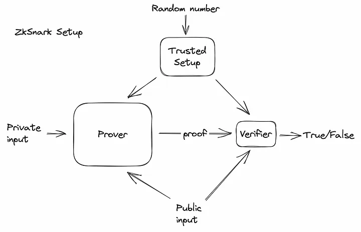
    

  

</a>

这里所说的可信设置是指生成随机保密值 τ (tau) 的幂次，最高可达 n-th 度。然后将这些幂 "涂层 "或表示为椭圆曲线上的点。如果你对椭圆曲线上的点不熟悉，你可以把它们看成是秘密值 τ 与曲线上一个基点的乘积，这样就模糊了 τ 的实际值。

  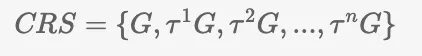
  
可信任设置

对我们的多项式的承诺是这样的:

  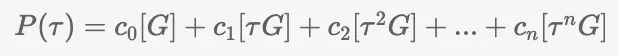
  
[…] — 表示椭圆曲线上的点

  
  
如果我们使用 τ 并将计算结果乘以 [G]，就会得到相同的结果 P(τ)。这就是为什么使用 CRS 进行求值是有效的。

证明者使用从可信设置中获得的通用参考字符串计算多项式 P(τ) 的承诺，并将该承诺（即椭圆曲线上的一个点）发送给验证者。

这是因为曲线基点 [G] 的标量倍数（如 cτ）会导致曲线上的另一个点。验证者会收到对 P(τ) 的承诺，但为了保持零知识属性，实际的多项式 P(x) 不会被透露。

取而代之的是，验证者向证明者发送一个随机值 r，然后证明者在该点评估 P(x)，并继续执行协议。

  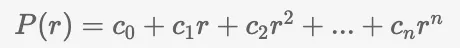
  
按值 r 进行评估

证明者将求值 P(r) 返回给验证者。验证者现在有了承诺 P(τ)、求出的 P(r)，以及多项式余数定理（在这里经常与贝祖特定理混淆）的知识，该定理指出：

  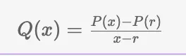
  
多项式商

如果从 P(x)减去 P(r)，再除以 x-r，除法应该没有余数，从而得到商多项式 Q_(x)。除了 P(r) 之外，证明者还向验证者发送了对 Q(τ) 的承诺。现在验证者有 P(τ)、Q(τ)、r 和 P(r) 。由于除法本身并没有在椭圆曲线上定义，因此承诺 P 和 Q（它们是椭圆曲线上的点）要经过一系列变换，才能使验证者确认等式的有效性。

  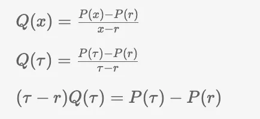
  
多项式商

验证者不知道 τ，但他从证明者那里得到了承诺 Q(τ) 和 P(τ)。当我们把等式两边都乘以生成点 G时，情况就变得更简单了。

  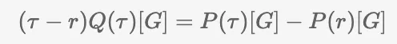
  
注：符号 P(τ)[G] 与 [P(τ)] 相同。

验证者知道 [Q(τ)] 和 [P(τ)] --对应于 Q(τ) 和 P(τ) 乘以 [G] 的承诺。验证者也可以计算 P(r)[G]，因为 P(r) 是已知的。为了解决 (τ-r)[G] 的问题，我们采用了椭圆曲线配对技术。

  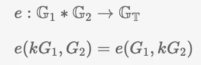
  
e - 配对函数。G1 和 G2 是已知点。

函数 e 表示双线性配对，它从两个独立的椭圆曲线组中各取一个点，并将它们 "配对 "生成第三个目标组中的一个元素。这个配对函数的双线性特性是 e(k⋅G1, G2)=e(G1, k⋅G2)，其中 k 是一个标量，G1,G2 分别是两个组中的点。这一性质意味着，在应用配对函数之前，先将一组中的点乘以 k，相当于先应用配对函数，然后将其结果乘以目标组中的 k。

  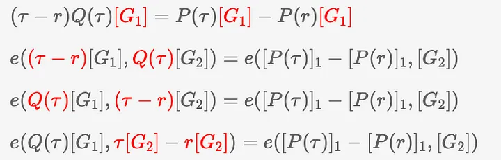

在双线性配对的背景下：

1. 我们确定所有先前评估过的元素都与曲线 G1 上的一个点相关联。
2. 当我们提到配对过程中的 "乘法 "时，为了使 (τ-r)Q(τ) 项与配对函数 e 相互作用，我们首先将 (τ-r) 与 G1 的生成点相乘，将其映射到曲线 G1 上，同样，将 Q(τ) 映射到曲线 G2 上。
3. 配对函数的交换性质允许我们将标量 (τ-r) 与承诺_Q(τ) 翻转，而不影响结果。
4. 然后，我们应用分配律来 "打开括号"，也就是将乘法分配到配对运算中的各个项上。

所以现在我们可以说验证者知道承诺 [Q(τ)]1、[P(τ)]1 和 [P(r)]1，也可以计算 r[G2]，因为 r 是已知的。至于 τ[G2]--这个值（点）应该来自可信设置，它是通用参考字符串（CRS）的一部分。

  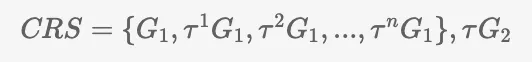
  
更新信任设置

  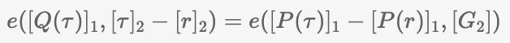
  
最终方程 如果没有椭圆曲线部分，方程将如下所示： Q(τ)(τ-r) = P(τ) - P(r)

  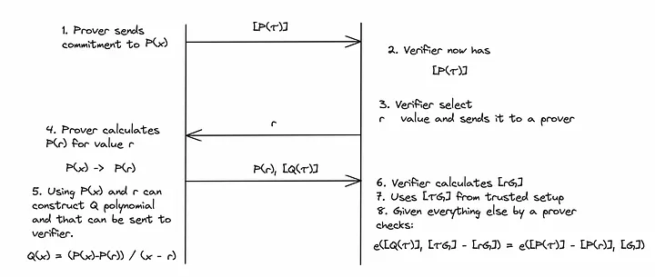
  
KZG 模式

有了这些元素，验证者就能检查体现知识证明的最终等式是否成立。

## 沐浴多项式承诺模式

在 PLONK 中，证明者不仅需要承诺一个多项式，还需要承诺多个多项式。虽然理论上证明者和验证者可以使用上述模式逐一处理所有承诺，但 PLONK 的创建者设计了一种经过修改的模式，允许在一个步骤内承诺多个多项式。这种方法被称为 "线性独立"（Linear Independence）。

假设我们有三个多项式 P1(x)、P2(x) 和 P3(x)，我们的目标是证明每个多项式在某个值 r 时的值都为零。为了在一个步骤内高效地证明这一点，我们可以构造一个新的多项式来封装 P1(x)、P2(x) 和 P3(x)。

  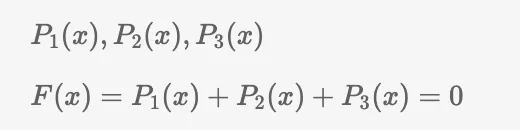

新多项式 F(x) 是 P1(x)、P2(x) 和 P3(x) 的组合。如果我们选择一个值 r，使 P1(r)、P2(r) 和 P3(r) 在求值时分别得到 2、3 和 -5 的结果，我们就会遇到一个问题。这些求值的总和为零，这可能会错误地暗示每个多项式在 r 处的求值都为零，而实际上它们都不是。这是一个潜在的问题，因为我们的目的是证明每个多项式在 r 处都等于零，而不仅仅是它们的和。

  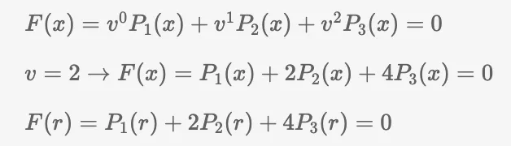

为了保证每个多项式 P1(x)、P2(x) 和 P3(x) 在特定的点 r 上分别等于零，我们选择一个非零常数 v（例如 v=2），并用它来以增大的幂来缩放多项式。然后，我们定义新的多项式 F(x) 为 F(x)=v⁰P1(x)+v¹P2(x)+v²P3(x) 。当对 F(r)求值且结果为零时，意味着 P1(r)、P2(r) 和 P3(r) 都必须为零，因为 v 不为零，而且多项式是按 v 的不同幂缩放的，这使得它们线性独立。通过这种巧妙的方法，我们可以在一个综合方程中确认 P1、P2 和 P3 的各个零点。

在下一篇文章中，我们将讨论其他几个值得关注的方面，然后再开始协议的详细工作。