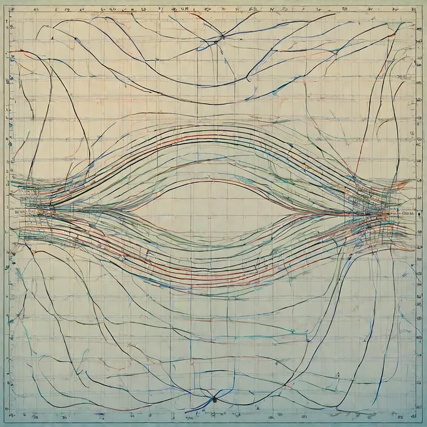
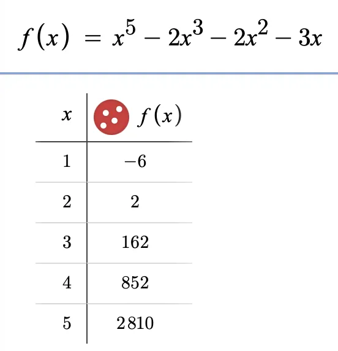
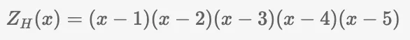
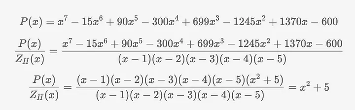
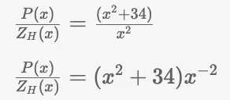
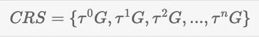
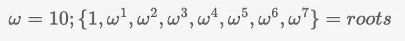
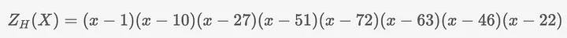
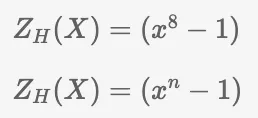

<div align="center">
  
  <p style="font-size: 12px">多项式 — OpenAI所见</p>
</div>

# zkSNARKs的内部机制 — PLONK 协议：第二部分


[](https://medium.com/@cryptofairy)[](https://medium.com/coinmonks) [Crypto Fairy](https://medium.com/@cryptofairy)
Published in [Coinmonks](https://medium.com/coinmonks) · 8 min read · Nov 2, 2023


在 PLONK 系列的上一篇文章中，我们介绍了协议的核心--KZG 承诺模式，以及多项式线性独立性如何帮助评估单个方程中的多个多项式。

在这里，我想讨论 PLONK 中使用的另一个重要优化方法，它与消失多项式有关。

## 消失多项式

注：本章的解释基于我对消失多项式作用的理解。如果你发现任何不准确的地方，我非常乐意处理和纠正。

在上一篇文章中，我提到多项式是将特定进程的状态编码成一个函数的有效方法。请看下面这个简单的例子：在状态 #1 时，进程值为 -6；在状态 #2 时，进程值变为 2；在状态 #3 时，进程值变为 162，以此类推。

<div align="center">
  
</div>

这个概念可以应用到程序执行的例子中。在一个特定的执行点，程序的状态值为-6，而在另一个执行点，状态值为 852，以此类推。在零知识证明的背景下，我们的目标是证明程序执行的正确性或验证一个事实。为此，我们需要捕捉所有状态。深入探讨零知识证明，尤其是 PLONK，我们构建多项式的方式是使其在所有状态下的求值都等于零（下一篇文章将提供一个非常具体的例子）。如果一个程序需要执行 5 个步骤，这就意味着我们将有一个多项式，其在每个步骤中的求值结果都为零。


这就是消失多项式--它是最简单的多项式类型，在 1 到 5 的所有点上求值时都等于零。


<div align="center">
  
  <p style="font-size: 12px">所有 x（1，......5）的消失多项式</p>
</div>


正如你所看到的，如果从 1 到 5 中任选一个 x，求值结果将为零。我们为什么需要它？假设我们有一个多项式 P(x) 需要证明：

<div align="center">
  
</div>


多项式 P(x) 在 1 到 5 的所有给定点上也等于零。因此，如果我们用多项式除法 P(x)除以 Zh(x)，结果应该没有余数；多项式 Zh(x)应该 "消失"。在 PLONK 中，多项式消失在多处使用，因此，如果你在构建证明时，在需要除法的地方应用除法后，你的多项式仍有余数，这意味着你的计算存在错误。


除法后不应有余数的另一个原因是，证明者无法使用可信设置中的通用参考字符串（CRS）来构建证明。

<div align="center">
  
  <p style="font-size: 12px">有提示的除法</p>
</div>

如果除法运算后还有余数 x²，我们就无法在椭圆曲线上进行运算，因为椭圆曲线不支持除法运算。或者，我们可以将除法表示为乘法的逆运算，实际上就是将除法乘以 (-1) 的幂。这里的问题是，给定的 CRS 是针对正幂值计算的：


<div align="center">
  
</div>

## 消失多项式优化

前面我们说过，如果一个程序需要 5 个步骤来计算或验证某项内容，那么我们就需要构建一个消失多项式，该多项式在所有相应的状态下都等于零。平均而言，zk-SNARK 程序可能需要 100 万步（门）才能生成一个证明。因此，如果证明者要构造并使用如此冗长的多项式，就会对证明者的性能产生重大影响，例如 (x-1)(x-2)...(x-1000000) 这样的多项式。Groth16 协议正是这样做的。另一方面，PLONK 利用的是乘法子群，而乘法子群也是建立在统一根的基础上的。听起来是不是很复杂？我将通过以下几点进行简单解释：


1\. 所有计算都是在某个素数 p 的有限域中使用模运算进行的，例如 23。这意味着只有从 0 到 22 的数字，任何超出这个范围的计算都将通过 23 的模运算进行调整。最直观的解释可以在下面的链接中找到。在实际应用中，我们会用一个大得多的质数来表示 p。


<a href="https://curves.xargs.org/?source=post_page-----ee00d6accb4d--------------------------------#finite-field-math" style="text-decoration: none; color: inherit;">
  <div style="display: flex; justify-content: flex-start; border: 1px solid black; padding: 10px;">  
    <div style="text-align: left;">
      <h3>动态椭圆曲线</h3>
      <div>用动画示例直观展示椭圆曲线密码学</div>
    </div>
  </div>
</a>


2\. 该程序需要 5 步来计算证明。要使用统一根进行求值，我们需要将程序扩展到 8 步，因为 8 是最接近 5 的下一个 2 的幂次（因为 2³=8），而不存在等于 5 的 2 的幂次。现在我们的程序将有 8 步，但最后三步不会影响程序的状态。

3\. 不幸的是，我们不能继续使用之前的有限域 _p_\=23 的例子，因为这个集合的元素太少，无法覆盖程序执行的所有 8 个步骤。因此，我们必须使用更高阶的有限域，比如 _p_\=73。在这个有限域中，应该有一个数（我们把它命名为 omega - _ω_）使得 _ω⁸_ 等于 1。在 _p_\=73 的情况下，这个数就是 10。

4\. 接下来，我们需要利用作为生成器的 10 生成其他数值。这些生成的值称为合一根。


<div align="center">
  
</div>


```python
import galois
Fp = galois.GF(73)

omega = Fp.primitive_root_of_unity(8)
roots = [omega**i for i in range(8)]
print(roots)
# ---- roots ---
# [1, 10, 27, 51, 72, 63, 46, 22]
```

因此，现在我们不再在每个程序步骤中使用从 1 到 8 的指数，而是使用这些值，得到的消失多项式应如下所示：


<div align="center">
  
</div>

你可能会问，为什么这个多项式比原来的多项式更长，而且比原来的多项式更有效？但有一个问题：它可以用更短的形式表示：


<div align="center">
  
  <p style="font-size: 12px">第 1 行 - 8 个步骤/门的消失多项式；第 2 行 - 消失多项式的一般公式。</p>
</div>


这就是证明者在生成证明时可以节省时间的消失多项式。


此外，使用统一根作为评估点还具有性能优势。在协议中，有许多多项式乘法，这是证明生成的性能瓶颈之一。执行这些乘法的最有效方法是使用快速傅立叶变换（FFT），而只有使用统一根作为评估点时，FFT 才是可行的。下面的视频很好地解释了为什么会出现这种情况：

现在就到此为止。在下一篇文章中，我们将开始深入研究 PLONK 协议。
