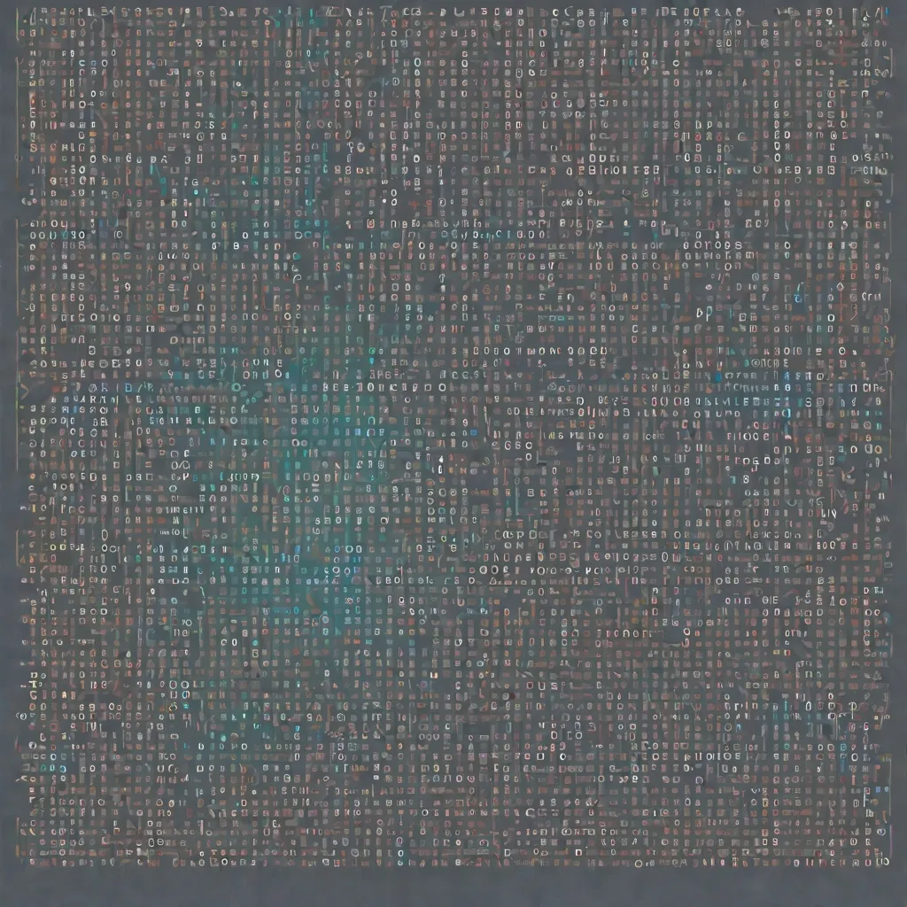

<div align="center">
  
</div>

<!-- more -->

# zkSNARKs的内部机制 — PLONK 协议：第五部分

[.png)](https://medium.com/@cryptofairy) [Crypto Fairy](https://medium.com/@cryptofairy)
8 min read · Nov 19, 2023


PLONK 系列的前几篇文章是我们开始实施协议前的准备工作。如果直接深入代码，就很难理解我们将要实现的东西背后的推理和原理。在继续之前，我们需要解释的最后一个重要概念与非交互式证明有关。


在第一部分中，我们深入探讨了 PLONK 协议的核心--KZG 多项式承诺模式，该模式在设计上具有交互性：

-   证明者通过向验证者发送承诺，对多项式做出承诺。
-   作为回报，验证者会收到一个由验证者选择的随机值 _r_ 。
-   根据这个随机值 _r_，验证者生成下一个承诺，并将其发送回验证者。
-   然后，验证者根据从证明者那里收到的所有信息和随机值 _r_ 检查证明者是否提供了正确的承诺。

得益于 PLONK 中的 Fiat-Shamir 启发式，KZG 变成了非交互式的，这意味着证明是唯一发送给验证者的数据。证明者和验证者无需进行任何交互，就能就随机值 _r_ 达成一致。这是通过散列函数实现的：

-   证明者会生成一个多项式的承诺，例如用字母 C 表示。
-   为了获得随机值 _r_，验证者使用哈希函数 _H_，其中 _r_=_H_(_C_)，并使用值 _r_ 生成剩余承诺 _Q_，然后将 _C_ 和 _Q_ 发送给验证者。
-   验证者使用相同的哈希函数 _H_，生成值 _r_\=_H_(_C_)，并在获得所有必要数据后，能够验证承诺 _C_。

## 准备阶段

PLONK 协议的最终实现可在此处找到：

<a href="https://github.com/tarassh/zkSNARK-under-the-hood/blob/main/plonk_latest.ipynb?source=post_page-----4819dd56d3f1--------------------------------" style="text-decoration: none; color: inherit;">
  <div style="display: flex; justify-content: flex-start; border: 1px solid black; padding: 10px;">  
    <div style="text-align: left;">
      <h3>zkSNARK-under-the-hood/plonk_latest.ipynb at main · tarassh/zkSNARK-under-the-hood</h3>
      <div>零知识证明协议的实现 - Groth16, Plonk. 用于教育目的。非生产准备代码...</div>
    </div>
  </div>
</a>


我们使用 Python，因为这种语言特别适合教育目的。我们将在很大程度上依赖 [Galois][8] 库，因为它为处理多项式提供了一个非常方便的界面：


```python
import galois

P = galois.Poly([1, 4], field=galois.GF(7))
print(f"P = {P}")
print(f"P(1) = {P(1)}")
# --- prints ---
# P = x + 4
# P(1) = 5
```

此外，通过使用猴子补丁技术，我们还可以扩展评估函数，使多项式可以与椭圆曲线点配合使用：

```python
def new_call(self, at, **kwargs):
    # class SRS - Elliptic curve points from Trusted Setup
    if isinstance(at, SRS):
        coeffs = self.coeffs[::-1]
        result = at.tau1[0] * coeffs[0]
        for i in range(1, len(coeffs)):
            result += at.tau1[i] * coeffs[i]
        return result

    return galois.Poly.original_call(self, at, **kwargs)

galois.Poly.original_call = galois.Poly.__call__
galois.Poly.__call__ = new_call

```

这一巧妙的技巧帮助我们使代码同时兼容有限域（未加密形式）和椭圆曲线（加密形式）。这种方法背后的原理很简单：通过选择一个阶数较低（在我们的例子中为 p=241）的有限域，更容易以非加密形式实现协议。这使得调试、定位和排除故障更加容易。

```python
import galois
import numpy as np
from utils import generator1, generator2, curve_order, normalize, validate_point

G1 = generator1()
G2 = generator2()


class SRS:
    """Trusted Setup Class aka Structured Reference String"""
    def __init__(self, tau, n = 2):
        self.tau = tau
        self.tau1 = [G1 * int(tau)**i for i in range(0, n + 7)]
        self.tau2 = G2 * int(tau)

    def __str__(self):
        s = f"tau: {self.tau}\n"
        s += "".join([f"[tau^{i}]G1: {str(normalize(point))}\n" for i, point in enumerate(self.tau1)])
        s += f"[tau]G2: {str(normalize(self.tau2))}\n"
        return s

def new_call(self, at, **kwargs):
    if isinstance(at, SRS):
        coeffs = self.coeffs[::-1]
        result = at.tau1[0] * coeffs[0]
        for i in range(1, len(coeffs)):
            result += at.tau1[i] * coeffs[i]
        return result

    return galois.Poly.original_call(self, at, **kwargs)

galois.Poly.original_call = galois.Poly.__call__
galois.Poly.__call__ = new_call
```

接下来，我们需要定义阶数 p = 241 的有限域，并找到多项式求值所需的统一根（[如第二部分][9] 所述）。

```python
# to switch between encrypted (ECC) and unencrypted mode (prime field p=241)
encrypted = False

# Prime field p
p = 241 if not encrypted else curve_order
Fp = galois.GF(p)

# We have 7 gates, next power of 2 is 8
n = 7
n = 2**int(np.ceil(np.log2(n)))
assert n & n - 1 == 0, "n must be a power of 2"

# Find primitive root of unity (generator)
omega = Fp.primitive_root_of_unity(n)
assert omega**(n) == 1, f"omega (ω) {omega} is not a root of unity"
# ω = 30

roots = Fp([omega**i for i in range(n)])
print(f"roots = {roots}")
# roots = [  1  30 177   8 240 211  64 233]
```


注：在证明者开始生成证明之前，应事先知道电路布线和排列方式。因此，以下代码中包含的见证数据（a、b 和 c 向量）可能会给人造成错误印象。见证数据用于证明与实值的排列关系。在实际情况中，编译器会生成一个包含 a、b 和 c 的占位符的电路。

电路由 7 个门组成。由于之前文章中解释过的原因，我们需要将向量扩展到 8 个门：

```python
def pad_array(a, n):
    return a + [0]*(n - len(a))

# witness vectors
a = [2, 2, 3, 4, 4, 8, -28]
b = [2, 2, 3, 0, 9, 36, 3]
c = [4, 4, 9, 8, 36, -28, -25]

# gate vectors
ql = [0, 0, 0, 2, 0, 1, 1]
qr = [0, 0, 0, 0, 0, -1, 0]
qm = [1, 1, 1, 1, 1, 0, 0]
qc = [0, 0, 0, 0, 0, 0, 3]
qo = [-1, -1, -1, -1, -1, -1, -1]

# pad vectors to length n
a = pad_array(a, n)
b = pad_array(b, n)
c = pad_array(c, n)
ql = pad_array(ql, n)
qr = pad_array(qr, n)
qm = pad_array(qm, n)
qc = pad_array(qc, n)
qo = pad_array(qo, n)

# --- padded vectors ----
a = [2, 2, 3, 4, 4, 8, -28, 0]
b = [2, 2, 3, 0, 9, 36, 3, 0]
c = [4, 4, 9, 8, 36, -28, -25, 0]
ql = [0, 0, 0, 2, 0, 1, 1, 0]
qr = [0, 0, 0, 0, 0, -1, 0, 0]
qm = [1, 1, 1, 1, 1, 0, 0, 0]
qc = [0, 0, 0, 0, 0, 0, 3, 0]
qo = [-1, -1, -1, -1, -1, -1, -1, 0]
```


现在，我们必须为 a、b 和 c 创建排列向量 (sigma)：


```python
ai = range(0, n)
bi = range(n, 2*n)
ci = range(2*n, 3*n)

sigma = {
    ai[0]: ai[0], ai[1]: ai[1], ai[2]: ai[2], ai[3]: ci[0], ai[4]: ci[1], ai[5]: ci[3], ai[6]: ci[5], ai[7]: ai[7],
    bi[0]: bi[0], bi[1]: bi[1], bi[2]: bi[2], bi[3]: bi[3], bi[4]: ci[2], bi[5]: ci[4], bi[6]: bi[6], bi[7]: bi[7],
    ci[0]: ai[3], ci[1]: ai[4], ci[2]: bi[4], ci[3]: ai[5], ci[4]: bi[5], ci[5]: ai[6], ci[6]: ci[6], ci[7]: ci[7],
}

k1 = 2
k2 = 4
c1_roots = roots
c2_roots = roots * k1
c3_roots = roots * k2

c_roots = np.concatenate((c1_roots, c2_roots, c3_roots))

check = set()
for r in c_roots:
    assert not int(r) in check, f"Duplicate root {r} in {c_roots}"
    check.add(int(r))

sigma1 = Fp([c_roots[sigma[i]] for i in range(0, n)])
sigma2 = Fp([c_roots[sigma[i + n]] for i in range(0, n)])
sigma3 = Fp([c_roots[sigma[i + 2 * n]] for i in range(0, n)])

print_sigma(sigma, a, b, c, c_roots)
# print_sigma outputs
 w | value  | i      | sigma(i)
a0 |      2 |      1 |      1
a1 |      2 |     30 |     30
a2 |      3 |    177 |    177
a3 |      4 |      8 |      4
a4 |      4 |    240 |    120
a5 |      8 |    211 |     32
a6 |    -28 |     64 |    121
| a7  | 0   | 233 | 233 |
| --- | --- | --- | --- |
| b0  | 2   | 2   | 2   |
| b1  | 2   | 60  | 60  |
| b2  | 3   | 113 | 113 |
| b3  | 0   | 16  | 16  |
| b4  | 9   | 239 | 226 |
| b5  | 36  | 181 | 237 |
| b6  | 3   | 128 | 128 |
| b7  | 0   | 225 | 225 |
| --  | --  | --  | --  |
| c0  | 4   | 4   | 8   |
| c1  | 4   | 120 | 240 |
| c2  | 9   | 226 | 239 |
| c3  | 8   | 32  | 211 |
| c4  | 36  | 237 | 181 |
| c5  | -28 | 121 | 64  |
| c6  | -25 | 15  | 15  |
| c7  | 0   | 209 | 209 |

--- Sigma ---
sigma1 = [  1  30 177   4 120  32 121 233]
sigma2 = [  2  60 113  16 226 237 128 225]
sigma3 = [  8 240 239 211 181  64  15 209]
```

正如[上一篇文章][10]中解释的那样，为了得到正确的排列证明，我们需要给每根导线标上唯一的索引，而这些索引必须从统一根中产生。输出结果清楚地显示了排列的编码方式：例如，a0 线（值 2）的索引为 1，它与其他任何门都没有连接，因此它的排列索引 sigma 也是 1；例如，a5 线（值 8）的索引为 211，它的排列索引为 32，属于 c3 线（也是值 8）。


现在排列图已经准备就绪，我们可以开始创建多项式了。让我们从门多项式开始：

```python
def to_galois_array(vector, field):
    # normalize to positive values
    a = [x % field.order for x in vector]
    return field(a)

def to_poly(x, v, field):
    assert len(x) == len(v)
    y = to_galois_array(v, field) if type(v) == list else v
    return galois.lagrange_poly(x, y)

QL = to_poly(roots, ql, Fp)
QR = to_poly(roots, qr, Fp)
QM = to_poly(roots, qm, Fp)
QC = to_poly(roots, qc, Fp)
QO = to_poly(roots, qo, Fp)
# --- Gate Polynomials ---
# QL = 187x^7 + 38x^6 + 119x^5 + 60x^4 + 70x^3 + 22x^2 + 106x + 121
# QR = 64x^7 + 8x^6 + x^5 + 211x^4 + 177x^3 + 233x^2 + 240x + 30
# QM = 57x^7 + 211x^6 + 73x^5 + 211x^4 + 168x^3 + 211x^2 + 184x + 91
# QC = 24x^7 + 90x^6 + 217x^5 + 151x^4 + 24x^3 + 90x^2 + 217x + 151
# QO = 240x^7 + 8x^6 + 177x^5 + 30x^4 + x^3 + 233x^2 + 64x + 210
```


注：为了获得更好的性能，我们需要将多项式转换成求值形式，并使用 FFT 变换进行多项式乘法运算。这将增加代码的复杂性。但是，为了与 PLONK 论文中的公式更加一致，我们将坚持使用系数形式。

我们已将 q 个向量编码为多项式，如果我需要从多项式 QL 中获取索引 8 的值（统一根），结果将是 2：

```python
#   i = [  0   1   2   3   4   5  6    7]
roots = [  1  30 177   8 240 211  64 233]
ql =    [  0   0   0   2   0   1   1   0]

# QL(8) = 2
```

我们应该用同样的方法来处理置换多项式：

```python
S1 = to_poly(roots, sigma1, Fp)
S2 = to_poly(roots, sigma2, Fp)
S3 = to_poly(roots, sigma3, Fp)

I1 = to_poly(roots, c1_roots, Fp)
I2 = to_poly(roots, c2_roots, Fp)
I3 = to_poly(roots, c3_roots, Fp)
```

消失多项式:

```python
def to_vanishing_poly(roots, field):
    # Z^n - 1 = (Z - 1)(Z - w)(Z - w^2)...(Z - w^(n-1))
    return galois.Poly.Degrees([len(roots), 0], coeffs=[1, -1], field=field)

Zh = to_vanishing_poly(roots, Fp)
for x in roots:
    assert Zh(x) == 0
# --- Vanishing Polynomial ---
# Zh = x^8 + 240 which translates to x^8 - 1 (240 == -1 in Prime Field p=241)
```


## 信任设置

要在代码中实现可信设置，我们不需要进行大量编码。需要强调的是，通过有效利用 `encrypted` 标记，我们的可信设置可以在加密和未加密两种模式下运行。

```python
def generate_tau(encrypted):
    """ Generate a random tau in Fp or G1 """
    return SRS(Fp.Random(), n) if encrypted else Fp.Random()

tau = generate_tau(encrypted)
```

下一篇文章将专门讨论 Prover 和 Verifier 的实现。


[1]: /@cryptofairy?source=post_page-----4819dd56d3f1--------------------------------
[2]: /@cryptofairy?source=post_page-----4819dd56d3f1--------------------------------
[3]: /m/signin?actionUrl=https%3A%2F%2Fmedium.com%2F_%2Fsubscribe%2Fuser%2Fb3a405d735c6&operation=register&redirect=https%3A%2F%2Fmedium.com%2F%40cryptofairy%2Funder-the-hood-of-zksnarks-plonk-protocol-part-5-4819dd56d3f1&user=Crypto+Fairy&userId=b3a405d735c6&source=post_page-b3a405d735c6----4819dd56d3f1---------------------post_header-----------
[4]: /m/signin?actionUrl=https%3A%2F%2Fmedium.com%2F_%2Fvote%2Fp%2F4819dd56d3f1&operation=register&redirect=https%3A%2F%2Fmedium.com%2F%40cryptofairy%2Funder-the-hood-of-zksnarks-plonk-protocol-part-5-4819dd56d3f1&user=Crypto+Fairy&userId=b3a405d735c6&source=-----4819dd56d3f1---------------------clap_footer-----------
[5]: /m/signin?actionUrl=https%3A%2F%2Fmedium.com%2F_%2Fbookmark%2Fp%2F4819dd56d3f1&operation=register&redirect=https%3A%2F%2Fmedium.com%2F%40cryptofairy%2Funder-the-hood-of-zksnarks-plonk-protocol-part-5-4819dd56d3f1&source=-----4819dd56d3f1---------------------bookmark_footer-----------
[6]: /coinmonks/under-the-hood-of-zksnarks-plonk-protocol-part-1-34bc406d8303?source=post_page-----4819dd56d3f1--------------------------------
[7]: https://github.com/tarassh/zkSNARK-under-the-hood/blob/main/plonk_latest.ipynb?source=post_page-----4819dd56d3f1--------------------------------
[8]: https://galois.readthedocs.io/en/v0.3.6/
[9]: /coinmonks/under-the-hood-of-zksnarks-plonk-protocol-part-2-ee00d6accb4d
[10]: /@cryptofairy/under-the-hood-of-zksnarks-plonk-protocol-part4-5e74bddebedb
[11]: /@cryptofairy/under-the-hood-of-zksnarks-plonk-protocol-part-6-5a030d15be68?source=post_page-----4819dd56d3f1--------------------------------