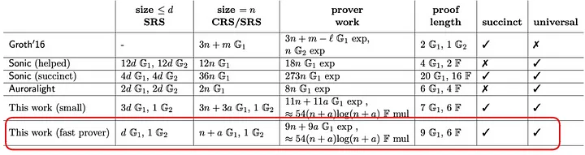
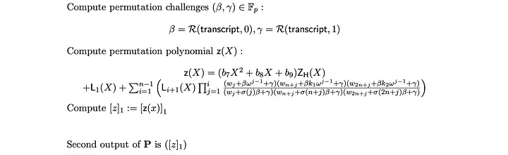
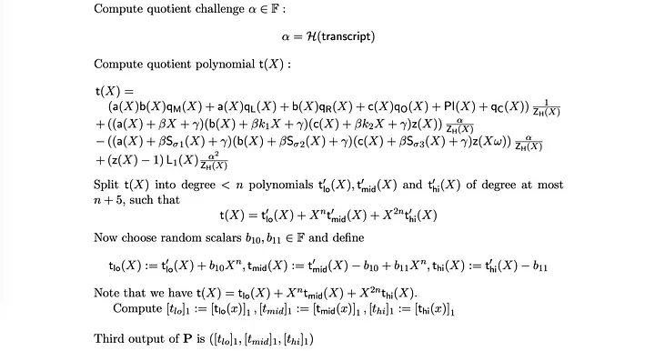
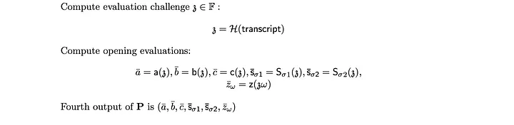
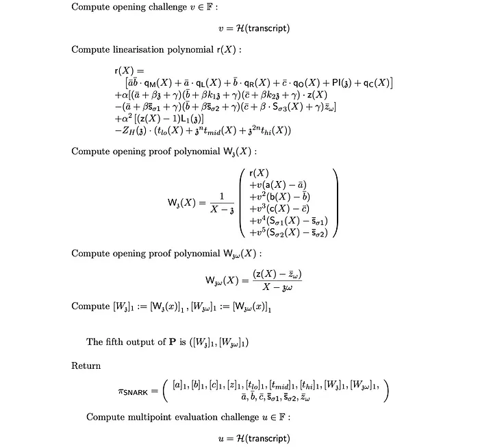
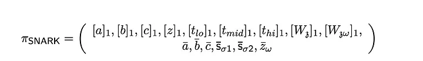

<div align="center">
  
</div>

<!-- more -->

# zkSNARKs的内部机制 — PLONK 协议：第六部分

[.png)](https://medium.com/@cryptofairy) [Crypto Fairy](https://medium.com/@cryptofairy)
10 min read · Nov 22, 2023


PLONK 系列的最后一篇文章。在这里，我们将实现 Prover 和 Verifier。在上一篇文章中，我们编写了可信设置、门和置换多项式，现在我们准备开始生成证明。


## 证明者

在 PLONK 协议中，验证者需要按照指定顺序完成五轮验证。这一过程的结果是创建一个包含 9 个椭圆曲线点和 6 个有限域值的证明。


<div align="center">
  
</div>

最终实施方案也可以在这里找到：

<a href="https://github.com/tarassh/zkSNARK-under-the-hood/blob/main/plonk_latest.ipynb?source=post_page-----5a030d15be68--------------------------------" style="text-decoration: none; color: inherit;">
  <div style="display: flex; justify-content: flex-start; border: 1px solid black; padding: 10px;">  
    <div style="text-align: left;">
      <h3>zkSNARK-under-the-hood/plonk_latest.ipynb at main · tarassh/zkSNARK-under-the-hood</h3>
      <div>零知识证明协议的实现 - Groth16, Plonk. 用于教育目的。非生产准备代码...</div>
    </div>
  </div>
</a>


## 第一轮

<div align="center">
  
</div>

在第一轮中，我们需要使用前一篇文章中计算门多项式的相同技术来计算导线多项式。这项技术包括通过拉格朗日插值法将向量转换为多项式。此外，还需要对导线多项式进行 "盲化"。对于 a、b 和 c 中的每一个，我们都必须生成盲多项式（如 b1x + b2 等）。使用致盲多项式的理由很简单。我们利用 KZG 承诺方案作为核心，其中每个多项式在随机值 `zeta` 上的评估都会揭示该多项式的某些信息，这与零知识证明的原则相矛盾。因此，我们在新生成的多项式中加入了这些盲多项式。盲多项式乘以消失多项式 _Zh_ ，生成正确的多项式承诺（[a]、[b]和[c]）。由于求值发生在合一根上，_Zh_ 的结果为0，因此致盲因子可以忽略不计。然而，当在第 4 轮中以随机值 `zeta` 对多项式进行求值时，多项式的盲法将对结果产生重大影响。

```python
random_b = [Fp.Random() for i in range(0, 9)]

# blinding polynomials
bA = galois.Poly(random_b[:2], field=Fp)
bB = galois.Poly(random_b[2:4], field=Fp)
bC = galois.Poly(random_b[4:6], field=Fp)

# wire polynomials
_A = to_poly(roots, a, Fp)
_B = to_poly(roots, b, Fp)
_C = to_poly(roots, c, Fp)

# Wire polynomials with blinding factor
A = _A + bA*Zh
B = _B + bB*Zh
C = _C + bC*Zh

# gate constraints polynomial
# g(x) = a(x)*ql(x) + b(x)*qr(x) + a(x)*b(x)*qm(x) + qc(x) + c(x)*qo(x)
G = A*QL + B*QR + A*B*QM + QC + C*QO

for i in range(0, len(roots)):
    assert G(roots[i]) == 0, f"G({roots[i]}) != 0"

assert G % Zh == 0, f"G(x) % Zh(x) != 0"

# commitments [a], [b], [c]
round1 = [A(tau), B(tau), C(tau)]
```

[在第三部分][8]中，我们讨论了如何约束门多项式，因此引入多项式 G 对读者来说并不奇怪。我们没有向 G 发送一个承诺，而是发送了三个承诺，因为 Q 多项式也是验证者已知的，使他们能够轻松地重构对 G 的承诺。此外，G 多项式用于验证它是否被正确约束--它在所有统一根处都应等于零，表明它可以被 Zh 除而没有余数。如果这一论断失败，就意味着多项式的构造有误。

## 第二轮

<div align="center">
  
</div>


Beta (β)和 gamma (γ)是在第一轮中从一个记录本中产生的第一个随机值（[a], [b],[c]）。[在第 5 部分][9]中，我提到了 Fiat-Shamir 启发式作为获取随机值的一种机制。[第四部分][10] 完全是关于置换多项式 z(x) 的。在这种情况下，致盲多项式的作用与第一轮中的作用相同。
  
```python
beta = numbers_to_hash(round1 + [0], Fp)
gamma = numbers_to_hash(round1 + [1], Fp)

_F = (A + I1 * beta + gamma) * (B + I2 * beta + gamma) * (C + I3 * beta + gamma)
_G = (A + S1 * beta + gamma) * (B + S2 * beta + gamma) * (C + S3 * beta + gamma)

acc_eval = [Fp(1)]
for i in range(0, n):
    acc_eval.append(
        acc_eval[-1] * (_F(roots[i]) / _G(roots[i]))
    )
assert acc_eval.pop() == Fp(1)
ACC = galois.lagrange_poly(roots, Fp(acc_eval))

bZ = galois.Poly(random_b[6:9], field=Fp)
Z = bZ * Zh + ACC

assert Z(roots[0]) == 1
assert Z(roots[-1]) == 1

round2 = [Z(tau)]
```


## 第三轮


<div align="center">
  
</div>

在第 3 轮中，我们遇到了一个重要的计算阶段。主要任务是计算多项式 t(x)，这是证明整个语句的关键。让我们来分解一下：

-   第一行涉及第一轮中的多项式 G，除以 Zh(x) - 消失多项式。这种除法旨在证明 G 在每个评估点（单位根）都等于 0。因此，如果 G(x)/Zh(x) 除法没有余数，就表明证明者可以为 G 提供正确的多项式承诺。
-   第 4 行的特征是 L1(x)，对于统一根中的第一个元素等于 1，对于其他元素等于 0。[第 4 部分][11] 中详述的置换检验公式从 `acc0=1` 开始。这就需要在 t(x) 多项式中解决这个问题。
-   中间的两个多项式可以简化为 f'(X)z(X) - g'(X)z(ωX) = 0，或者，f'(X)z(X) = g'(X)z(ωX) 。这种简化是为了验证排列的正确性。
-   α 值的作用至关重要。该协议不是证明多个不同的多项式在齐根处为零，而是将它们合并为线性独立项。这样就可以对所有这些多项式一起进行验证，详见 [第 1 部分][12]。
-   将 t(X) 多项式分成三部分是一种协议权衡。与其他多项式相比，由于 t(X) 的度数较高，证明者通常需要更多时间来计算对 t(X) 的承诺。此外，这也需要更大的可信设置。

```python
def shift_poly(poly: galois.Poly, omega: Fp):
    coeffs = poly.coeffs[::-1]
    coeffs = [c * omega**i for i, c in enumerate(coeffs)]
    return galois.Poly(coeffs[::-1], field=poly.field)

alpha = numbers_to_hash(round1 + round2, Fp)

Zomega = shift_poly(Z, omega=omega)

L1 = galois.lagrange_poly(roots, Fp([1] + [Fp(0)] * (n - 1)))

for i, r in enumerate(roots):
    # make sure L1 equal 1 at root[0] and 0 for the rest
    assert L1(r) == (Fp(1) if i == 0 else Fp(0))

T0 = G
assert T0 % Zh == 0, f"T0(x) % Zh(x) != 0"

T1 = (_F * Z - _G * Zomega) * alpha
assert T1 % Zh == 0, f"T1(x) % Zh(x) != 0"

T2 = (Z - galois.Poly([1], field=Fp)) * L1 * alpha**2
assert T2 % Zh == 0, f"T2(x) % Zh(x) != 0"

T = (T0 + T1 + T2)
assert T % Zh == 0, f"T(x) % Zh(x) != 0"

for r in roots:
    assert T(r) == 0, f"T({r}) != 0"

T = T // Zh

t_coeffs = T.coeffs[::-1]

Tl = galois.Poly(t_coeffs[:n][::-1], field=Fp)
Tm = galois.Poly(t_coeffs[n:2*(n)][::-1], field=Fp)
Th = galois.Poly(t_coeffs[2*(n):][::-1], field=Fp)

X_n = galois.Poly.Degrees([n, 0], coeffs=[1, 0], field=Fp)
X_2n = galois.Poly.Degrees([2*(n), 0], coeffs=[1, 0], field=Fp)
# make sure that T was split correctly
# T = TL + X^n * TM + X^2n * TH
assert T == (Tl + X_n * Tm + X_2n * Th)
assert T.degree == 3 * n + 5

b10 = Fp.Random()
b11 = Fp.Random()

Tl = Tl + b10 * X_n
Tm = Tm - b10 + b11 * X_n
Th = Th - b11
assert T == (Tl + X_n * Tm + X_2n * Th)

round3 = [Tl(tau), Tm(tau), Th(tau)]
```


## 第四轮


<div align="center">
  
</div>

This round is the simplest The prover now needs to evaluate polynomials at a specific random point, zeta.

这一轮最简单 验证者现在需要在一个特定的随机点 zeta 上求解多项式。

```python
zeta = numbers_to_hash(round1 + round2 + round3, Fp)

a_zeta = A(zeta)
b_zeta = B(zeta)
c_zeta = C(zeta)
s1_zeta = S1(zeta)
s2_zeta = S2(zeta)
z_omega_zeta = Zomega(zeta)

round4 = [a_zeta, b_zeta, c_zeta, s1_zeta, s2_zeta, z_omega_zeta]
```


**第五轮**


<div align="center">
  
</div>


在 PLONK 协议的第 5 轮中，我们重点构建**线性化多项式** r(X)。 [第 18 页][13] 上的 PLONK 论文介绍了一种名为“减少证明中的字段元素数量”的优化技术。该技术应用于 r(X) 多项式。 让我们考虑一个例子：

-   验证者的目的是检查身份 h1(X) · h2(X) − h3(X) ≠ 0。通常，证明者会发送在随机点 r 处评估的 h1、h2 和 h3 的值，验证者将 然后检查 h1(r) · h2(r) − h3(r) 是否等于 0。在这种情况下，证明者发送三个字段元素。
-   然而，证明者可以简单地发送单个值 c = h1(r)，然后验证者可以验证新多项式 L(X) = c · h2(X) − h3(X) 在同一点是否等于 0。 这里，L(X) 被称为**线性化多项式**。
-   在 KZG 的上下文中，我们可以将其表示为计算 [L] = c · [h2] − [h3]。 这种方法有效地减少了证明中所需的字段元素的数量。

接下来的两个 W 多项式充当 KZG 多项式承诺方案中的开口。 它们由我们旨在证明的其他多项式组成。 为了确保它们的线性独立性，我们使用值 v，该值用于将多个多项式批处理为一个，如[第 1 部分][14] 中详述。

```python
v = numbers_to_hash(round1 + round2 + round3 + round4, Fp)

R = (QM * a_zeta * b_zeta +
    QL * a_zeta +
    QR * b_zeta +
    QO * c_zeta +
    QC)
R += (Z * 
    (a_zeta + beta * zeta + gamma) *
    (b_zeta + beta * zeta * k1 + gamma) *
    (c_zeta + beta * zeta * k2 + gamma) * alpha)
R -= (z_omega_zeta *
    (a_zeta + beta * s1_zeta + gamma) *
    (b_zeta + beta * s2_zeta + gamma) * 
    (c_zeta + beta * S3 + gamma) * alpha)
R += (Z - Fp(1)) * L1(zeta) * alpha**2
R -= Zh(zeta) * (Tl + zeta**n * Tm + zeta**(2*n) * Th)

X_minus_zeta = galois.Poly([1, -zeta], field=Fp)

Wzeta = R + \
        (A - a_zeta) * v + \
        (B - b_zeta) * v**2 + \
        (C - c_zeta) * v**3 + \
        (S1 - s1_zeta) * v**4 + \
        (S2 - s2_zeta) * v**5

assert Wzeta % X_minus_zeta == 0, f"Wzeta(x) % X - zeta != 0"
Wzeta = Wzeta // X_minus_zeta

X_minus_omega_zeta = galois.Poly([1, -(omega*zeta)], field=Fp)

Womega_zeta = (Z - z_omega_zeta)
assert Womega_zeta % X_minus_omega_zeta == 0, f"Womega_zeta(x) % X - ω*zeta != 0"
Womega_zeta = Womega_zeta // X_minus_omega_zeta

round5 = [Wzeta(tau), Womega_zeta(tau)]

u = numbers_to_hash(round1 + round2 + round3 + round4 + round5, Fp)
```

最后证明由 9 个点和 6 个域元素组成：


<div align="center">
  
</div>

## **验证者**


首先，验证者需要做的证明是检查所有 9 个点是否确实在椭圆曲线上，以及这 6 个元素是否是有效的域元素。 虽然我不完全确定其原因，但这可能与减轻弱曲线攻击的可能性有关。 密码学中的弱曲线攻击是指通过利用所选椭圆曲线中的弱点来破坏椭圆曲线密码学（ECC）的方法。 因此，攻击者可能会尝试使用较弱曲线上的点来破坏协议。

```python
# Values provided by the prover (round 1 to 5) is a proof.
a_exp = round1[0]
b_exp = round1[1]
c_exp = round1[2]

z_exp = round2[0]

tl_exp = round3[0]
tm_exp = round3[1]
th_exp = round3[2]

# Note: verifier has to verify that the following values are in the correct Fp field
a_zeta, b_zeta, c_zeta, s1_zeta, s2_zeta, z_omega_zeta = round4

w_zeta_exp = round5[0]
w_omega_zeta_exp = round5[1]

# Note: verifier has to verify that the following values are on the curve
if encrypted:
    validate_point(qm_exp)
    validate_point(ql_exp)
    validate_point(qr_exp)
    validate_point(qo_exp)
    validate_point(qc_exp)
    validate_point(qpi_exp)
    validate_point(z_exp)
    validate_point(s1_exp)
    validate_point(s2_exp)
    validate_point(s3_exp)
    validate_point(tl_exp)
    validate_point(tm_exp)
    validate_point(th_exp)
    validate_point(a_exp)
    validate_point(b_exp)
    validate_point(c_exp)
    validate_point(w_zeta_exp)
    validate_point(w_omega_zeta_exp)
```


接下来，验证者必须使用证明中提供的元素计算挑战 β、γ、α、zeta、v 和 u。

```python
beta = numbers_to_hash(round1 + [0], Fp)
gamma = numbers_to_hash(round1 + [1], Fp)
alpha = numbers_to_hash(round1 + round2, Fp)
zeta = numbers_to_hash(round1 + round2 + round3, Fp)
v = numbers_to_hash(round1 + round2 + round3 + round4, Fp)
u = numbers_to_hash(round1 + round2 + round3 + round4 + round5, Fp)
```


All following steps are done according to paper:

```python
# evaluate vanishing and L1 polynomial ar zeta
Zh_z = Zh(zeta)
L1_z = L1(zeta)
# PI_z = PI(z) - for public input

# Compute constant part of r polynomials,
# r0 = PI_z - L1_z ...
r0 = (- L1_z * alpha**2 -
    (a_zeta + beta * s1_zeta + gamma) *
    (b_zeta + beta * s2_zeta + gamma) *
    (c_zeta + gamma) * z_omega_zeta * alpha)

# Compute first part of batched polynomial commitment 
D_exp = (qm_exp * a_zeta * b_zeta +
        ql_exp * a_zeta +
        qr_exp * b_zeta +
        qo_exp * c_zeta +
        qc_exp)

D_exp += (z_exp * (
        (a_zeta + beta * zeta + gamma) *
        (b_zeta + beta * zeta * k1 + gamma) *
        (c_zeta + beta * zeta * k2 + gamma) * alpha
        + L1_z * alpha**2 + u))

D_exp -= (s3_exp *
        (a_zeta + beta * s1_zeta + gamma) *
        (b_zeta + beta * s2_zeta + gamma) * 
        alpha * beta * z_omega_zeta)

D_exp -= ((tl_exp + 
        tm_exp * zeta**n  +
        th_exp * zeta**(2*n)) *
        Zh_z)


F_exp = (D_exp + 
        a_exp * v +
        b_exp * v**2 +
        c_exp * v**3 +
        s1_exp * v**4 +
        s2_exp * v**5)

E_exp = (-r0 +
        v * a_zeta +
        v**2 * b_zeta +
        v**3 * c_zeta +
        v**4 * s1_zeta +
        v**5 * s2_zeta +
        u * z_omega_zeta)

if encrypted:
        E_exp = G1 * E_exp

e1 = w_zeta_exp + w_omega_zeta_exp * u
e2 = (w_zeta_exp * zeta + w_omega_zeta_exp * (u * zeta * omega) +
    F_exp + (E_exp * Fp(p-1)))

if encrypted:
    pairing1 = tau.tau2.pair(e1)
    pairing2 = G2.pair(e2)

    print(f"pairing1 = {pairing1}")
    print(f"pairing2 = {pairing2}")

    assert pairing1 == pairing2, f"pairing1 != pairing2"
else:
    print("\n\n--- e1, e2 ---")
    print(f"e1 = {e1 * tau}")
    print(f"e2 = {e2}")
    assert e1 * tau == e2
```


更新：这篇文章最初是在没有考虑公众意见的情况下撰写的。 最终脚本现已更新，包含一个基于公众反馈的参数_。


最终实现：

<a href="https://github.com/tarassh/zkSNARK-under-the-hood/blob/main/plonk_latest.ipynb?source=post_page-----5a030d15be68--------------------------------" style="text-decoration: none; color: inherit;">
  <div style="display: flex; justify-content: flex-start; border: 1px solid black; padding: 10px;">  
    <div style="text-align: left;">
      <h3>zkSNARK-under-the-hood/plonk_latest.ipynb at main · tarassh/zkSNARK-under-the-hood</h3>
      <div>零知识证明协议的实现 - Groth16, Plonk. 用于教育目的。非生产准备代码...</div>
    </div>
  </div>
</a>

[1]: /@cryptofairy?source=post_page-----5a030d15be68--------------------------------
[2]: /@cryptofairy?source=post_page-----5a030d15be68--------------------------------
[3]: /m/signin?actionUrl=https%3A%2F%2Fmedium.com%2F_%2Fsubscribe%2Fuser%2Fb3a405d735c6&operation=register&redirect=https%3A%2F%2Fmedium.com%2F%40cryptofairy%2Funder-the-hood-of-zksnarks-plonk-protocol-part-6-5a030d15be68&user=Crypto+Fairy&userId=b3a405d735c6&source=post_page-b3a405d735c6----5a030d15be68---------------------post_header-----------
[4]: /m/signin?actionUrl=https%3A%2F%2Fmedium.com%2F_%2Fvote%2Fp%2F5a030d15be68&operation=register&redirect=https%3A%2F%2Fmedium.com%2F%40cryptofairy%2Funder-the-hood-of-zksnarks-plonk-protocol-part-6-5a030d15be68&user=Crypto+Fairy&userId=b3a405d735c6&source=-----5a030d15be68---------------------clap_footer-----------
[5]: /m/signin?actionUrl=https%3A%2F%2Fmedium.com%2F_%2Fbookmark%2Fp%2F5a030d15be68&operation=register&redirect=https%3A%2F%2Fmedium.com%2F%40cryptofairy%2Funder-the-hood-of-zksnarks-plonk-protocol-part-6-5a030d15be68&source=-----5a030d15be68---------------------bookmark_footer-----------
[6]: /@cryptofairy/under-the-hood-of-zksnarks-plonk-protocol-part-5-4819dd56d3f1?source=post_page-----5a030d15be68--------------------------------
[7]: https://github.com/tarassh/zkSNARK-under-the-hood/blob/main/plonk_latest.ipynb?source=post_page-----5a030d15be68--------------------------------
[8]: /@cryptofairy/under-the-hood-of-zksnarks-plonk-protocol-part3-821855e49ce6
[9]: /@cryptofairy/under-the-hood-of-zksnarks-plonk-protocol-part-5-4819dd56d3f1
[10]: /@cryptofairy/under-the-hood-of-zksnarks-plonk-protocol-part4-5e74bddebedb
[11]: /@cryptofairy/under-the-hood-of-zksnarks-plonk-protocol-part4-5e74bddebedb
[12]: /coinmonks/under-the-hood-of-zksnarks-plonk-protocol-part-1-34bc406d8303
[13]: https://eprint.iacr.org/2019/953.pdf
[14]: /coinmonks/under-the-hood-of-zksnarks-plonk-protocol-part-1-34bc406d8303
[15]: https://github.com/tarassh/zkSNARK-under-the-hood/blob/main/plonk_latest.ipynb?source=post_page-----5a030d15be68--------------------------------