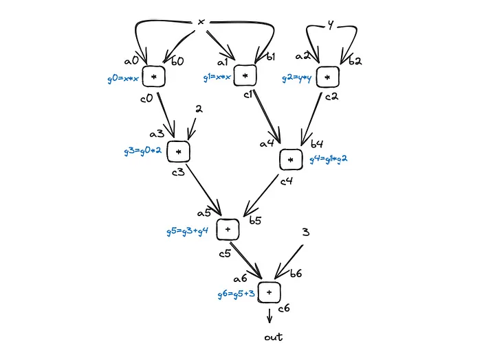
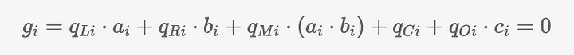
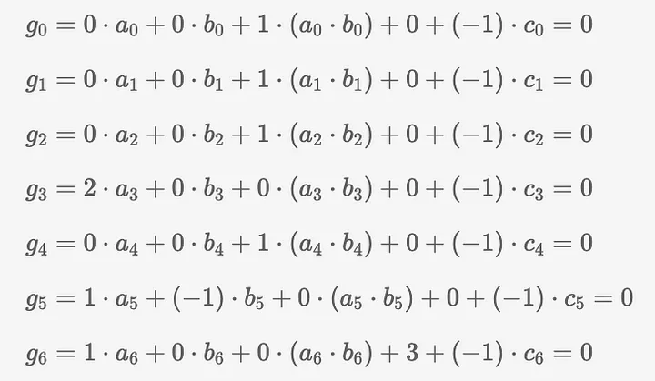
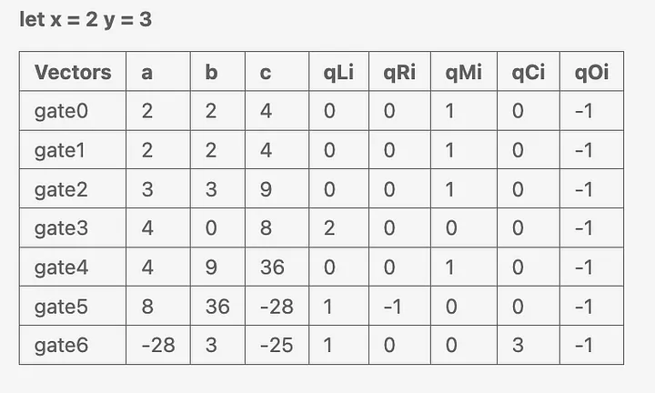

<div align="center">
  
</div>

<!-- more -->

# zkSNARKs的内部机制 — PLONK 协议：第三部分

[](https://medium.com/@cryptofairy) [Crypto Fairy](https://medium.com/@cryptofairy)
8 min read · Nov 2, 2023

Many materials available online explain the basics of the PLONK protocol, often referencing Vitalik’s example _P_(_x_)=_x³_+_x_+5=35 from his article:

网上有很多资料解释了 PLONK 协议的基本原理，通常会引用 Vitalik 文章中的例子 P(x)=x³+x+5=35 ：

<a href="https://vitalik.ca/general/2019/09/22/plonk.html?source=post_page-----821855e49ce6--------------------------------" style="text-decoration: none; color: inherit;">
  <div style="display: flex; justify-content: flex-start; border: 1px solid black; padding: 10px;">  
    <div style="text-align: left;">
      <h3>了解 PLONK</h3>
      <div>最近，Ariel Gabizon、Zac Williamson 和 Oana Ciobotaru 宣布了一种新的通用零知识证明...</div>
    </div>
  </div>
</a>


为了提供一个不同的视角，本文将探讨一个引入了额外复杂性的修正方程。我们将使用 _f_(_x_,_y_)=2x²-_x²y²_+3，并设置它等于-25，其中 _x_\=2，_y_\=3。这个等式有两个输入参数、一个减法运算、一个负结果、重复使用一个运算（_x²_）以及乘以一个常数（如 2x² 所示）。通过这些元素，你可以更广泛地了解 PLONK 如何处理各种计算情况。

## 算术化

将方程转化为零知识证明（ZKP）的第一步是算术化。如前文所述，要为语句生成正确的证明，必须捕捉程序执行过程中的所有状态。算术化通过将计算转换为多项式形式来实现这一点，从而在 ZKP 框架内高效生成和验证证明。


使用 Circom，我们可以将问题转化为这样的代码：

```python
pragma circom 2.1.6;

template Example () {
    signal input x;
    signal input y;
    signal output out;

    signal xx;
    signal yy;

    xx <== x * x; // Quadratic term: x squared
    yy <== y * y; // Quadratic term: y squared

    // Intermediate signal for x*x*y*y
    signal xxyy;
    xxyy <== xx * yy;

    // Final expression
    out <== xx * 2 - xxyy + 3;
}

component main { public [ x, y ] } = Example();

/* INPUT = {
    "x": "2",
    "y": "3"
} */
```


这种方法与普通开发人员使用 Python 等语言编写的内容有很大不同：


```Python
x = 2  
y = 3  
out = 2*x**2 - x**2*y**2 + 3
```

Circom 作为一种领域专用语言（DSL），有助于组织代码，以便编译成算术电路。这种结构化格式不仅能确保代码符合证明的数学要求，还能优化电路生成和证明计算过程。

Arithmetic Circuit


<div align="center">
  
  <p style="font-size: 12px">算术电路</p>
</div>

因此，电路结构中出现了一个清晰的模式：每个操作对应一个单独的门，用 _g0_、_g1_、......等表示。每个门都有两个输入（a、b）和一个输出（c）。以门 g0 和门 g1 为例，它们都表示相同的 _x²_ 运算。在 Circom 中，这种运算只进行一次，然后在需要的地方重复使用，如 _g0_ 和 _g1_。之所以要有两个完全相同的门，是因为要进行置换检查，确保导线的映射是 1 对 1 的（例如，输出 _c0_ 连接到输入 _a3_，_c1_ 连接到 _a4_，以此类推）。


另一个值得注意的地方是 _g3_ 门。在这里，你可能会注意到常数 2 的第二个输入端没有标注 "b"。这是因为在 PLONK 中，乘法只能涉及变量，因此在这种情况下 'b' 被设置为 0。但是，在加法门中可以使用常数。在 _g3_ 门电路中用于乘法运算的常量 2 来自一个选择器向量，我们稍后将讨论这个选择器向量。

最后，需要注意的是，这里没有减法门。所有计算均采用有限域运算。在这个系统中，负数通过模运算转化为正数，符合场的特性。

## 约束门

下一步是用多项式方程描述算术电路中的每个门。

<div align="center">
  
</div>

在这些等式中，变量 _a_、_b_ 和 _c_ 代表与每个门相关的导线，对应于它们的输入和输出。此外，我们还有选择器变量（用 _q_ 表示），它们的作用就像门的激活器。它们决定了在任何给定的点上，哪些导线和操作参与了电路。


<div align="center">
  
</div>


算术电路中的每个门都由特定的多项式方程表示，并受选择器变量的影响。例如，门 _g0_ 执行输入 _a0_ 和 _b0_ 的乘法运算。为了实现这一操作，乘法选择器变量 _qm_ 被设置为 1，门输出 _c0_。通过将输出选择器 _qo_ 设置为 -1，使输出激活变得容易，这也符合我们的多项式方程必须和为 0 的约束条件。门 _g1_、_g2_ 和 _g4_ 的配置与 _g0_ 类似。


在门电路 g3 中，为了将数值 _a3_ 乘以常数 2，我们将选择器变量 _ql_ 设置为 2。 这个门电路展示了常数是如何被纳入计算的。对于减法运算，如门 _g5_ 所示，右选择器 _qr_ 被设置为-1，以多项式形式表示减法运算。加法运算在 _g6_ 门中进行，通过常量选择器 _qc_ 可以将常量 3 加入运算。


我们已经有了门的所有值，因此可以将它们编码成以下向量：

<div align="center">
  
</div>

## 虚拟门

在上一篇文章中，我们讨论了涉及 PLONK 中消失多项式的优化技术，即使用统一根而不是连续数字来标记步骤。这种优化方法要求门的数量是 2 的幂次。

Currently, our circuit comprises 7 gates. However, to meet the 2^n requirement in PLONK, the closest power of 2 is 8 (2³ = 8). This means we need to add an additional gate to make the total number 8. This extra gate is a ‘dummy gate’ — it doesn’t perform any real computation but serves as a placeholder to satisfy the power of 2 structure. By adding this dummy gate, we ensure that our circuit adheres to the optimal structure for PLONK’s efficiency mechanisms.

目前，我们的电路由 7 个门组成。然而，为了满足 PLONK 中 2^n 的要求，最接近 2 的幂是 8（2³ = 8）。这意味着我们需要增加一个门，使总数达到 8。这个额外的门是一个 "虚拟门"--它并不执行任何实际计算，而是作为一个占位符来满足 2 的幂次结构。通过添加这个虚拟门，我们可以确保我们的电路符合 PLONK 效率机制的最佳结构。

```python
def pad_array(a, n):
    return a + [0]*(n - len(a))

# witness vectors
a = [2, 2, 3, 4, 4, 8, -28]
b = [2, 2, 3, 0, 9, 36, 3]
c = [4, 4, 9, 8, 36, -28, -25]

# gate vectors
ql = [0, 0, 0, 2, 0, 1, 1]
qr = [0, 0, 0, 0, 0, -1, 0]
qm = [1, 1, 1, 1, 1, 0, 0]
qc = [0, 0, 0, 0, 0, 0, 3]
qo = [-1, -1, -1, -1, -1, -1, -1]

# pad vectors to length n
a = pad_array(a, n)
b = pad_array(b, n)
c = pad_array(c, n)
ql = pad_array(ql, n)
qr = pad_array(qr, n)
qm = pad_array(qm, n)
qc = pad_array(qc, n)
qo = pad_array(qo, n)
# -- results ---
# a = [2, 2, 3, 4, 4, 8, -28, 0]
# b = [2, 2, 3, 0, 9, 36, 3, 0]
# c = [4, 4, 9, 8, 36, -28, -25, 0]
# ql = [0, 0, 0, 2, 0, 1, 1, 0]
# qr = [0, 0, 0, 0, 0, -1, 0, 0]
# qm = [1, 1, 1, 1, 1, 0, 0, 0]
# qc = [0, 0, 0, 0, 0, 0, 3, 0]
# qo = [-1, -1, -1, -1, -1, -1, -1, 0]
```


在下一篇文章中，我们将讨论置换约束。
