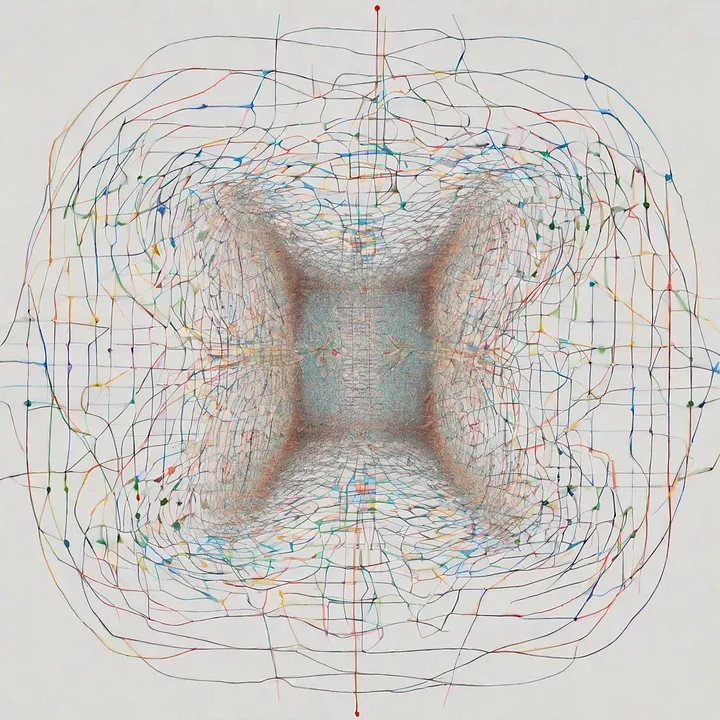

  
  
排列 - 由 Openai 查看

<!-- more -->

# zkSNARKs的内部机制 — PLONK 协议：第三部分

[

][1]

[Crypto Fairy][2]

·

[Follow][3]

6 min read

·

Nov 14, 2023

[

][4]

\--

1

[][5]

Listen

Share

This article will discuss the permutation check in PLONK, which I believe is the second most challenging aspect of the protocol. The most challenging part, in my opinion, is debugging and identifying errors in the code.

[

## Under the hood of zkSNARKs — PLONK protocol: part3

### Many materials available online explain the basics of the PLONK protocol, often referencing Vitalik’s example…

medium.com

][6]

In our previous discussion, we delved into the complexities of arithmetization in PLONK, exploring the details of gates and gate constraints. As the result we encoded all the states of the prover program into number of vectors:

Vectors ‘a’, ‘b’, and ‘c’ are referred to as the ‘witness vectors’. It’s crucial to maintain the confidentiality of these vectors, keeping them hidden from the verifier. On the other hand, vectors prefixed with the letter ‘q’ are known as ‘selector vectors’. These vectors function as a set of flags that enable the proper gating and wiring mechanisms within the system.

Vectors describe the program’s state, yet it doesn’t fully address the interconnection between gates. The creation of a robust proof in PLONK relies not only on the consistency of individual gates but also crucially on the consistency of wiring between these gates. This is where the real challenge lies:

In this visualization, the colors represent the wiring between gates, a critical component that we need to construct meticulously. It’s important to note that our focus here shifts from the values, as was the case with gate constraints, to both the wires and their values.

To ensure proper functioning, each wire is assigned a unique index. Our task then is to verify that each wire is connected only once. This challenge essentially reduces to comparing two lists: we need to check whether every element in one list is also present in the other. To facilitate this, we use the following formula:

This formula looks scary and ugly, which is one of the reasons why Zero-Knowledge Proofs (ZKPs) can be challenging to understand. So, let’s break it down with a simple example. Imagine we have two lists:

Now, let’s try to perform an element-wise division and then multiply the results together.

The result will be 1, and this is because the elements effectively cancel each other out. But what if the second list had two instances of 1, like this:

The result would then be 4. It’s a clever way to check if two lists contain the same elements, isn’t it? We can write down a formula for this:

Two lists: L and L’. We begin by dividing the first elements of each list and continue this process sequentially. The result of each division is multiplied by the result from the previous division. Since the first elements do not have a preceding division, we start with an initial value, setting `acc0 = 1` as a placeholder. After completing this process for all elements, the final result should be 1. Now, let’s consider another pair of lists:

Using the formula previously discussed, you’ll notice that the result will also be 1, even though the lists are different. To fix this issue, we introduce an offset to the elements in the list. This offset is denoted by the symbol gamma (γ), which is a randomly chosen number. For example, let’s assume γ=4:

Up to now, our focus has been on verifying whether all elements from one list are present in another. The next logical step is to associate values with their corresponding wire indexes. Let’s introduce a function, sigma (σ), which returns a permutation index for lists L and L’ as examples, where L = \[1, 3, 2, 4\] and L’ = \[1, 2, 4, 3\]:

-   σ(1) = 1, meaning the 1st element from L’ is also the 1st in L.
-   σ(2) = 3, meaning the 2nd element from L’ is the 3rd in L.
-   σ(3) = 4, meaning the 3rd element from L’ is the 4th in L.
-   σ(4) = 2, meaning the 4th element from L’ is the 2nd in L.

We can encode L and L’ into tuples, where firs item is a value, second is an index and a sigma function for L’:

Now substitute σ with the values it returns:

Using tuples (p, q), we can effectively represent the relationship between values and their corresponding indexes in the code. But for mathematicians this notation doesn’t make any sense so they would put it like this; take a random value beta (β) and encode L and L’ as (p + qβ):

So if we divide all values and multiply the results we will get 1:

And together with gamma (γ):

Now we can generalize it into the formula:

Do you see where we are going with this? We need to apply it to vectors a, b, and c.

So, if we now proceed to multiply these divisions, the result will not be 1. This outcome is due to a key point I mentioned earlier: each permutation, represented as (iβ) and (βσ(i)), must have unique indexes. Consequently, we cannot use the same index values in vectors ‘b’ and ‘c’.

Let’s assume that the permutations for vector ‘a’ are indexed from 1 to ’n’. For vector ‘b’, we’ll use indexes from ‘2n’ to ‘3n’, and for vector ‘c’, we’ll use indexes starting from ‘3n’. Additionally, the values ‘2’ and ‘3’ in this context can be denoted as ‘k1’ and ‘k2’, respectively.

Regarding the sigma function, we now introduce three distinct sigma functions Sσ1, Sσ2, and Sσ3:

Now, with these considerations in place, the original formula becomes less scary than before. The remaining step involves transitioning from plain indexes, such as 1, 2, etc., to roots of unity. This shift is part of an optimization process discussed in the second part of our previous article, where we explored the benefits of replacing plain indexes with roots of unity for efficiency:

[

## Under the hood of zkSNARKs — PLONK protocol: Part 2

### In the previous article of the PLONK series, we covered the core of the protocol, the KZG commitment scheme, and how…

medium.com

][7]

Thus, we need to take a primitive root of unity (ω) and generate a series of indexes from it. This step is essential for our formula to reach its final form:

In next article we start to code protocol:

[

## Under the hood of zkSNARKs — PLONK protocol: part 5

### Previous articles in the PLONK series served as preparations before we got our hands dirty and started implementing the…

medium.com

][8]

**References:**

-   Plonk Permutations by David Wong [https://www.youtube.com/watch?v=iY2ue8Kfsb0][9]
-   Plonk Paper [https://eprint.iacr.org/archive/2019/953/1599151811.pdf][10]

[1]: /@cryptofairy?source=post_page-----5e74bddebedb--------------------------------
[2]: /@cryptofairy?source=post_page-----5e74bddebedb--------------------------------
[3]: /m/signin?actionUrl=https%3A%2F%2Fmedium.com%2F_%2Fsubscribe%2Fuser%2Fb3a405d735c6&operation=register&redirect=https%3A%2F%2Fmedium.com%2F%40cryptofairy%2Funder-the-hood-of-zksnarks-plonk-protocol-part4-5e74bddebedb&user=Crypto+Fairy&userId=b3a405d735c6&source=post_page-b3a405d735c6----5e74bddebedb---------------------post_header-----------
[4]: /m/signin?actionUrl=https%3A%2F%2Fmedium.com%2F_%2Fvote%2Fp%2F5e74bddebedb&operation=register&redirect=https%3A%2F%2Fmedium.com%2F%40cryptofairy%2Funder-the-hood-of-zksnarks-plonk-protocol-part4-5e74bddebedb&user=Crypto+Fairy&userId=b3a405d735c6&source=-----5e74bddebedb---------------------clap_footer-----------
[5]: /m/signin?actionUrl=https%3A%2F%2Fmedium.com%2F_%2Fbookmark%2Fp%2F5e74bddebedb&operation=register&redirect=https%3A%2F%2Fmedium.com%2F%40cryptofairy%2Funder-the-hood-of-zksnarks-plonk-protocol-part4-5e74bddebedb&source=-----5e74bddebedb---------------------bookmark_footer-----------
[6]: /@cryptofairy/under-the-hood-of-zksnarks-plonk-protocol-part3-821855e49ce6?source=post_page-----5e74bddebedb--------------------------------
[7]: /@cryptofairy/under-the-hood-of-zksnarks-plonk-protocol-part-2-ee00d6accb4d?source=post_page-----5e74bddebedb--------------------------------
[8]: /@cryptofairy/under-the-hood-of-zksnarks-plonk-protocol-part-5-4819dd56d3f1?source=post_page-----5e74bddebedb--------------------------------
[9]: https://www.youtube.com/watch?v=iY2ue8Kfsb0
[10]: https://eprint.iacr.org/archive/2019/953/1599151811.pdf