

  
  
排列 - 由 Openai 查看

<!-- more -->

# zkSNARKs的内部机制 — PLONK 协议：第四部分

 [Crypto Fairy](https://medium.com/@cryptofairy)
8 min read · Nov 2, 2023

本文将讨论 PLONK 中的置换检查，我认为这是协议中第二大挑战。在我看来，最具挑战性的部分是调试和识别代码中的错误。

在之前的讨论中，我们深入探讨了 PLONK 算法的复杂性，探索了门和门约束的细节。结果，我们将证明者程序的所有状态编码成了若干向量：

  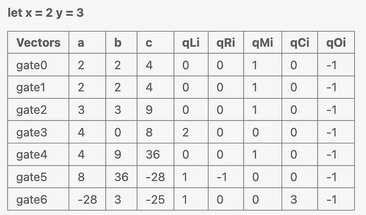

向量 a 、 b 和 c 被称为 witness vectors 。保持这些向量的机密性，使其不被验证者发现至关重要。另一方面，前缀为字母 q 的向量被称为 selector vectors。这些向量的作用是作为一组标志，在系统内启用适当的门控和布线机制。

向量描述了程序的状态，但它并没有完全解决门之间的互连问题。在 PLONK 中创建稳健的证明不仅依赖于单个门的一致性，关键还在于这些门之间连线的一致性。这才是真正的挑战所在：

  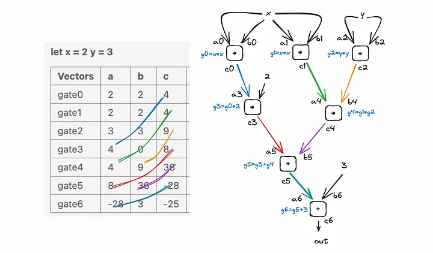

在这个可视化图中，颜色代表了门之间的连线，这是我们需要精心构建的关键部分。值得注意的是，我们在这里的关注点从门约束的值转移到了导线及其值。

为确保正常运行，每根导线都有一个唯一的索引。然后，我们的任务就是验证每条导线只连接一次。这一挑战本质上简化为比较两个列表：我们需要检查一个列表中的每个元素是否也出现在另一个列表中。为方便起见，我们使用以下公式：

  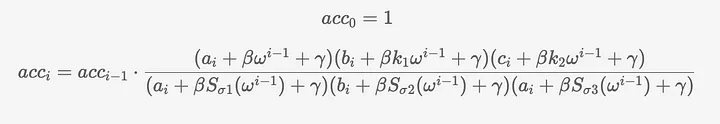

这个公式看起来既可怕又丑陋，这也是零知识证明（ZKPs）难以理解的原因之一。因此，让我们用一个简单的例子来解释它。假设我们有两个列表：

  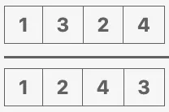

现在，让我们试着进行元素除法，然后将结果相乘。

  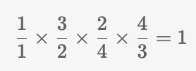

结果将是 1，这是因为这些元素实际上相互抵消了。但是，如果第二个列表中有两个 1 的实例呢？

  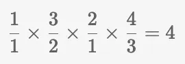

结果就是 4。检查两个列表是否包含相同元素的方法很巧妙，不是吗？我们可以为此写下一个公式：

  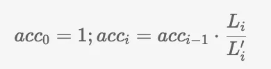

两个列表： L 和 L'。我们首先对每个列表的第一个元素进行除法运算，然后依次进行。每次除法的结果乘以前一次除法的结果。由于第一个元素前面没有除法，因此我们从初始值开始，设置 acc0 = 1 作为占位符。完成所有元素的除法后，最终结果应该是 1。现在，让我们考虑另一对列表：

  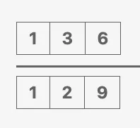

使用前面讨论过的公式，你会发现尽管列表不同，结果也是 1。为了解决这个问题，我们为列表中的元素引入了一个偏移量。这个偏移量用符号 gamma (γ)表示，它是一个随机选择的数字。例如，假设 γ=4：

  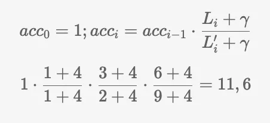

到目前为止，我们的重点是验证一个列表中的所有元素是否都存在于另一个列表中。下一个合乎逻辑的步骤是将值与相应的线性索引关联起来。让我们引入一个函数 sigma (σ)，它以列表 L 和 L' 为例返回 permutation 索引，其中 L = [1,3,2,4]，L' = [1,2,4,3]：

-   σ(1) = 1，即 L' 中的第 1 个元素也是 L 中的第 1 个元素。
-   σ(2) = 3, 即 L' 中的第 2 个元素是 L 中的第 3 个元素。
-   σ(3) = 4, 即 L' 中的第 3 个元素是 L 中的第 4 个元素。
-   σ(4) = 2, 即 L' 的第 4 个元素是 L 中的第 2 个元素。

我们可以将 L 和 L' 编码成元组，其中第一项是值，第二项是索引，L' 的 sigma 函数：

  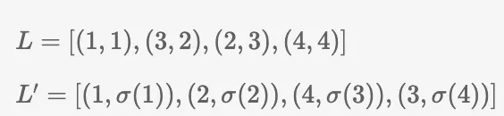

现在用它返回的值代替 σ：

  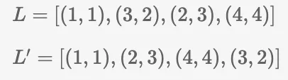

使用元组（p, q），我们可以在代码中有效地表示值与相应索引之间的关系。但对于数学家来说，这种符号没有任何意义，所以他们会这样说：取一个随机值 beta (β)，将 L 和 L' 编码为 (p + qβ)：

  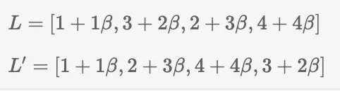

因此，如果我们将所有数值相除再相乘，就会得到 1：

  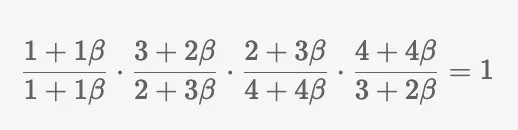

和 gamma(γ) 一起：

  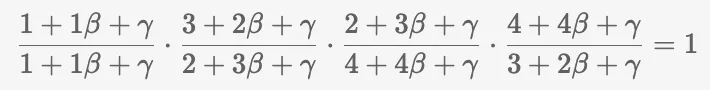

现在，我们可以将其归纳为公式：

  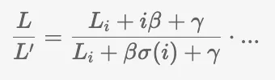

你明白我们要做什么了吗？我们需要将其应用于向量 a、b 和 c。

  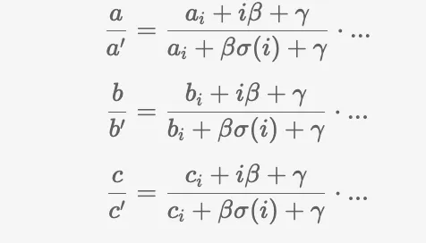

因此，如果我们现在将这些除数相乘，结果不会是 1。造成这种结果的原因是我前面提到的一个关键点：每种排列（表示为 (iβ) 和 (βσ(i)) ）必须有唯一的索引。因此，我们不能在向量 b 和 c 中使用相同的索引值。

假设向量 a 的排列索引从 1 到 n。对于向量 b ，我们将使用从 2n 到 3n 的索引，而对于向量 c ，我们将使用从 3n 开始的索引。此外，2 和 3 在这里可以分别表示为 k1 和 k2。

关于 sigma 函数，我们现在引入三个不同的 sigma 函数 Sσ1、Sσ2 和 Sσ3：

  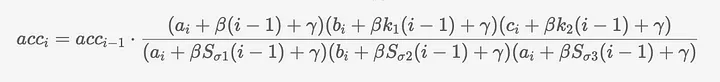

现在，有了这些考虑，原来的公式就不那么可怕了。剩下的步骤就是从普通索引，如 1、2 等，过渡到统一根。这一转变是优化过程的一部分，我们在上一篇文章的第二部分讨论了用统一根代替普通索引以提高效率的好处：

因此，我们需要取一个单位根的原根（ω），并从中生成一系列指数。这一步对于我们的公式达到最终形式至关重要。

  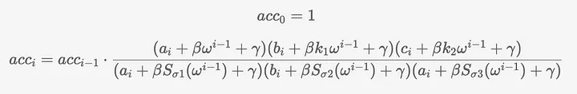

下一篇文章中，我们将开始编写协议代码：